# 班级小助手（Class Helper）

班级信息管理系统，采用 pnpm monorepo，包含**后端服务**、**Web 管理端**（教师/管理员）与
**桌面客户端**（学生）三端。核心链路：

```
教师在 Web 端发布内容
        │  REST API（JWT 鉴权）
        ▼
   后端服务（Express + Prisma）
        │  写入数据库 + 按班级房间广播
        ▼
 Socket.IO  ──►  class:{classId} 房间  ──►  学生桌面客户端实时更新 UI
```

## 当前交付范围

| 阶段 | 内容                                                                                                       | 状态                                                       |
| ---- | ---------------------------------------------------------------------------------------------------------- | ---------------------------------------------------------- |
| 1    | pnpm monorepo 脚手架、TypeScript / ESLint / Prettier / 环境变量                                            | ✅ 已完成                                                  |
| 2    | 后端：Prisma schema + 迁移 + 种子数据 + JWT 认证 + RBAC + 模块化 REST API + Socket.IO                      | ✅ 已完成                                                  |
| 3    | Web 管理端：登录、主布局、仪表盘、班级/学生/课表/作业/通知/成绩页面、Axios 封装、实时提示                  | ✅ 已完成                                                  |
| 4    | EXE 客户端：Electron 主进程/preload/渲染进程、登录、课表/作业/通知/成绩/设置、实时推送、IndexedDB 离线缓存 | ✅ 已完成（冒烟验证 71/71）                                |
| 5    | 三端联调脚本、打包命令、完整 README                                                                        | ✅ 已完成（三套安装包 + 两套 UI 回归测试）                 |
| 6    | 测试账号与种子数据说明                                                                                     | ✅ 已完成（见下文）                                        |
| 7    | 生产化：服务端安装程序（内置 Node）、Web 端 PWA 可安装、Docker + Nginx 部署、生产加固与运维文档            | ✅ 已完成（见 [`docs/production.md`](docs/production.md)） |
| 8    | 客户端灵动岛（通知浮窗，上课隐藏 / 下课弹出 / 紧急立即展开）与上课时段紧急通知二次确认                     | ✅ 已完成（见"上课时段策略"）                              |

> **与原始提示词的两处偏差（已与你确认）**
>
> 1. 桌面客户端采用 **Electron + Vue 3**（而非 Avalonia/FluentAvalonia）：正文 90% 的要求
>    （Socket.IO Client、Pinia、IndexedDB 离线缓存、electron-builder）都基于 Electron，
>    且本机没有 .NET SDK。
> 2. 数据库 **先用 SQLite（libSQL 内嵌）跑通 MVP，并预留 MySQL 切换**：本机没有可用 MySQL
>    实例；`docs/mysql.md` 给出云数据库切换的完整步骤，`deploy/` 提供 MySQL 版 Compose。

## 三套交付产物

| 产物                            | 文件                                                                            | 用途                                                                                         |
| ------------------------------- | ------------------------------------------------------------------------------- | -------------------------------------------------------------------------------------------- |
| **服务端 + Web 管理端安装程序** | `release-server/班级小助手服务端-0.1.0-x64-setup.exe`（34 MB）                  | 装到教师电脑/校服务器即完整系统，**内置 Node 运行时**，双击安装、开机自启、自动建库建号      |
| **学生客户端安装程序**          | `packages/desktop-client/release/班级小助手-0.1.0-x64-setup.exe`（107 MB）      | 学生机安装（NSIS 安装包）                                                                    |
| **学生客户端单文件版**          | `packages/desktop-client/release/班级小助手-0.1.0-x64-portable.exe`（106.9 MB） | 免安装直接运行（U 盘分发）                                                                   |
| Web 管理端（PWA）               | 由服务端在 `/` 直接托管                                                         | 浏览器打开即用，可在 Edge/Chrome 中「安装为应用」；**已适配手机小屏**（1Panel 风格抽屉导航） |

生产部署（Windows 安装包 / Docker + MySQL / 手动部署）请看
**[docs/production.md](docs/production.md)**。

## 目录结构

```
class-helper/
├── package.json                 # 根脚本（dev / build / db:* / verify:* / dist:* / icons）
├── pnpm-workspace.yaml          # workspace 定义 + allowBuilds（pnpm 11 依赖构建白名单）
├── tsconfig.base.json           # 共享 TS 基础配置
├── eslint.config.mjs            # ESLint 扁平配置（TS + Vue）
├── .dockerignore                # 容器构建上下文排除项
├── build/icon.{ico,png}         # 应用图标（由 pnpm icons 生成）
├── scripts/
│   ├── use-database.mjs         # SQLite ⇄ MySQL provider 切换助手
│   ├── generate-icons.mjs       # 用 Electron 渲染 SVG 生成 PNG/ICO 图标
│   ├── dist-server.mjs          # 服务端 + Web 管理端 打包（免安装目录 + NSIS 安装程序）
│   ├── lib/electron-env.mjs     # 启动 Electron 的公共处理（清理 RUN_AS_NODE + 定位可执行文件）
│   ├── nsis/server-installer.nsi# 安装程序脚本模板
│   └── ui-smoke/                # Web 管理端 UI 真实点击回归测试（Electron 驱动 + 上课时段探针）
├── deploy/                      # 生产部署：Dockerfile / docker-compose.yml / nginx.conf
├── docs/
│   ├── production.md            # 生产部署指南（三种形态 + 运维 + 安全清单）
│   └── mysql.md                 # MySQL 切换指南
└── packages/
    ├── shared/                  # 三端共享：类型契约、常量、工具函数
    │   └── src/{types,constants,utils,index}.ts
    ├── server/                  # 后端服务
    │   ├── prisma/schema.prisma         # 数据模型
    │   ├── prisma/migrations/           # 迁移历史（已生成并应用）
    │   ├── prisma/seed.ts               # 种子数据
    │   ├── prisma.config.ts             # Prisma 7 配置（迁移/种子/连接串）
    │   ├── scripts/verify-e2e.mjs       # 后端端到端验收脚本（148 项）
    │   └── src/
    │       ├── app.ts                   # Express 装配（静态托管 + 探针 + 限流 + 模块挂载）
    │       ├── index.ts                 # 启动入口（自检/初始化 + HTTP + Socket.IO + 优雅退出）
    │       ├── config/env.ts            # 环境变量校验（zod）+ 生产配置自检
    │       ├── lib/                     # db / db-bootstrap / web-static / http / jwt / access(RBAC) / mappers
    │       ├── middleware/              # auth / error / validate / security(helmet+限流+耗时日志)
    │       ├── realtime/                # socket.ts + bus.ts（事件总线）
    │       └── modules/                 # 功能模块 + registry.ts
    ├── web-admin/               # Web 管理端（Vue 3 + Vite + Element Plus + PWA）
    │   ├── public/                      # manifest / sw.js / 图标（由 pnpm icons 生成）
    │   └── src/{api,stores,router,layouts,views,styles}
    └── desktop-client/          # EXE 客户端（Electron + Vue 3）
        ├── electron-builder.yml         # 打包配置（nsis 安装包 + portable 单文件）
        ├── build/icon.ico               # 应用图标（electron-builder 自动使用）
        ├── vite.config.mts              # 渲染进程构建（base: './'，hash 路由）
        ├── scripts/{build-main,dev,smoke,dist-win}.mjs
        └── src/
            ├── main/                    # 主进程：窗口/单实例/配置持久化(IPC)/冒烟验证/灵动岛
            ├── preload/                 # contextBridge 安全桥（不暴露 ipcRenderer 本体）
            ├── island/                  # 灵动岛渲染进程（独立透明置顶窗口）
            ├── types/desktop.d.ts       # 主进程 <-> 渲染进程契约
            └── renderer/                # 渲染进程：api / stores / cache / router / layouts / views
```

## 技术栈

| 层         | 选型                                                                   | 版本                                                  |
| ---------- | ---------------------------------------------------------------------- | ----------------------------------------------------- |
| 包管理     | pnpm workspace                                                         | 11.8.0                                                |
| 语言       | TypeScript                                                             | 5.9.3（`typescript-eslint` 要求 < 6.1，因此未用 7.x） |
| 后端       | Node.js + Express                                                      | 24.18 / 5.2                                           |
| ORM        | Prisma + driver adapter                                                | 7.10（+ `@prisma/adapter-libsql`）                    |
| 实时       | Socket.IO                                                              | 4.8                                                   |
| 认证       | jsonwebtoken + bcryptjs                                                | 9.0 / 3.0                                             |
| 校验       | zod                                                                    | 4.6                                                   |
| Web 端     | Vue 3 + Vite + Element Plus + Pinia + Vue Router + Axios + ECharts     | 3.5 / 8.3 / 2.14 / 4.0 / 5.3 / 1.20 / 6.1             |
| EXE 客户端 | Electron + Vue 3 + Element Plus + Pinia + Socket.IO Client + IndexedDB | 44.3 / 3.5 / 2.14 / 4.0 / 4.8                         |
| 打包       | electron-builder（nsis / portable）                                    | 26.15                                                 |

> 运行环境要求：**Node.js ≥ 20.19**（Prisma 7 硬性要求，推荐 22/24）。

## 快速开始

```bash
# 1. 安装依赖（Node >= 20.19，pnpm >= 10）
pnpm install

# 2. 准备环境变量（后端）
cp packages/server/.env.example packages/server/.env
#    → 至少修改 JWT_SECRET；本地开发可直接使用仓库内已有的 .env

# 3. 生成 Prisma Client 并建库、写入种子数据
pnpm db:generate
pnpm db:migrate
pnpm db:seed

# 4. 启动（后端 4000 + Web 端 5173 一起启动）
pnpm dev
```

启动后访问：

| 服务                                       | 地址                             |
| ------------------------------------------ | -------------------------------- |
| Web 管理端（开发）                         | http://127.0.0.1:5173            |
| 后端服务首页（浏览器可读，列出已挂载模块） | http://127.0.0.1:4000            |
| 后端 API                                   | http://127.0.0.1:4000/api        |
| 健康检查                                   | http://127.0.0.1:4000/api/health |

> 后端只提供 REST API 与 WebSocket，没有业务网页界面。直接访问
> `http://127.0.0.1:4000/` 会返回服务首页（带 `Accept: application/json` 时返回结构化信息）；
> 其它未匹配路径统一返回 `{ "success": false, "code": "NOT_FOUND" }`。
> Web 管理端地址是 **5173** 端口，请勿访问 80 端口（会连接被拒绝）。

也可以分开启动：`pnpm dev:server`（仅后端）、`pnpm dev:web`（仅 Web 端）。

### 启动 EXE 客户端（学生端）

```bash
# 开发模式：自动构建主进程 + 启动 Vite 渲染进程(5174) + 打开 Electron 窗口（支持热更新）
pnpm dev:desktop

# 已构建产物的冒烟验证（不弹窗，跑完自动退出）
pnpm build:desktop
pnpm verify:desktop
```

客户端首次启动会带上默认服务器地址 `http://127.0.0.1:4000`，输入**班级码 + 班级密码**（种子数据：`G101` / `123456`）即可进入班级。
若要验证"断网可查看缓存"，登录并浏览过程序后关闭后端（`Ctrl+C` 停掉 `pnpm dev:server`），
客户端会在顶部提示「当前处于离线状态」，页面继续显示本地缓存数据；重新启动后端后会自动同步。

### 端到端验收脚本

```bash
# 另开一个终端先启动后端：pnpm dev:server
pnpm verify:e2e          # 后端 + REST + Socket.IO + RBAC + 上课时段拦截 + 紧急/普通叫人 + 单双周课表/ClassIsland 课程表导入 + 导入 + 班级账号：148 项
pnpm verify:web          # Web 管理端真实点击（含权限入口隐藏、手机适配、叫人入口 + 紧急/普通级别、紧急通知 + 成绩/时间配置导入弹窗）：20 项
pnpm verify:desktop      # Electron 客户端（含灵动岛收起常驻/命中兜底/展开收起再展开/胶囊类型汇总、圆角四角一致、开合不震动、紧急与普通叫人、真实链路、课表时间轴、个性化 10 项参数与托盘/退出无残留）：71 项
```

后端脚本验证**实时推送时延、作业完成、成绩下发、权限隔离、上课时段紧急通知拦截、导入与失败回滚、班级账号代全班操作、老师端导入不越权、单双周课表与 ClassIsland 课程表导入**等 148 项，
实测通知 37ms、作业 26ms、成绩 25ms 到达（要求 < 5 秒），紧急通知 409 拦截与二次确认后发布均通过；
客户端脚本验证 preload 桥接、渲染进程、IndexedDB 读写、断网回退、**灵动岛四种状态切换**与联网集成
（**班级账号登录** + 四类数据 + Socket.IO），实测 71/71 通过；退出后再启动一次校验单实例锁与文件锁已释放（离线复跑 65/65）。

## 默认账号与种子数据

`pnpm db:seed` 会清空业务表并写入一套完整演示数据（1 管理员 / 2 教师 / 3 班级 / 15 学生 /
15 课程 / 90 条课表 / 15 份作业 / 12 条通知 / 90 条成绩）。

| 角色   | 用户名                    | 密码         | 说明                                        |
| ------ | ------------------------- | ------------ | ------------------------------------------- |
| 管理员 | `admin`                   | `admin123`   | 可访问全部班级                              |
| 教师   | `teacher1`                | `teacher123` | 张老师：高一(1)班、高二(3)班班主任          |
| 教师   | `teacher2`                | `teacher123` | 李老师：高一(2)班班主任，高二(3)班协作教师  |
| 学生   | `student01`               | `student123` | 高一(1)班                                   |
| 学生   | `student02` … `student05` | `student123` | 高一(1)班                                   |
| 学生   | `student06` … `student10` | `student123` | 高一(2)班                                   |
| 学生   | `student11` … `student15` | `student123` | 高二(3)班                                   |
| 班级   | 班级码 `G101`             | `123456`     | 高一(1)班（**学生端班级登录**，非个人账号） |
| 班级   | 班级码 `G102`             | `123456`     | 高一(2)班                                   |
| 班级   | 班级码 `G203`             | `123456`     | 高二(3)班                                   |

- 学生初始密码可用 `DEFAULT_STUDENT_PASSWORD` 配置（默认 `123456`），
  教师也可在「学生管理」里一键重置为默认密码。
- **班级账号**（学生端主入口）用班级码 + 班级密码登录，默认密码由 `DEFAULT_CLASS_PASSWORD` 配置（默认 `123456`）；
  管理员可在「班级管理 → 班级账号」里改班级码或重置密码，详见
  [学生端班级账号](#学生端班级账号学生端主体--班级)。
- 教学周由 `TERM_START_DATE`（第 1 教学周的周一）换算，当前周次用于课表默认视图。

## 常用命令

| 命令                                        | 说明                                                                                                                                     |
| ------------------------------------------- | ---------------------------------------------------------------------------------------------------------------------------------------- |
| `pnpm dev`                                  | 并行启动 shared(tsc watch) + 后端 + Web 端                                                                                               |
| `pnpm dev:server` / `pnpm dev:web`          | 只启动后端 / 只启动 Web 端                                                                                                               |
| `pnpm dev:desktop`                          | 启动 EXE 客户端开发模式（Vite 5174 + Electron，热更新）                                                                                  |
| `pnpm build`                                | 构建 shared + 后端 + Web 端 + EXE 客户端                                                                                                 |
| `pnpm build:desktop`                        | 仅构建 EXE 客户端（esbuild 主进程/preload + Vite 渲染进程）                                                                              |
| `pnpm icons`                                | 生成应用图标（PNG/ICO，用 Electron 渲染 SVG）                                                                                            |
| **`pnpm dist:server`**                      | **打包服务端 + Web 管理端**（免安装目录 + NSIS 安装程序，内置 Node）                                                                     |
| `pnpm dist:dir`                             | 打包客户端免安装目录 `release/win-unpacked`（含可执行文件，最快）                                                                        |
| `pnpm dist:win`                             | 打包客户端 nsis 安装包 + portable 单文件 EXE                                                                                             |
| `pnpm dist:all`                             | 服务端安装程序 + 客户端安装程序一起打                                                                                                    |
| `pnpm verify:e2e`                           | 后端端到端验收（148 项，含角色权限矩阵、单双周课表与 ClassIsland 课程表导入、导入与班级账号，需服务端已启动）                            |
| `pnpm verify:web`                           | Web 管理端 UI 真实点击测试（Electron 驱动，20 项，含权限入口隐藏、叫人紧急/普通与导入弹窗）                                              |
| `pnpm verify:desktop`                       | EXE 客户端冒烟验证（71 项，含灵动岛圆角/收起常驻/命中兜底/展开收起再展开/开合不震动/已读/作业/紧急与普通叫人、课表时间轴、个性化全参数） |
| `pnpm typecheck`                            | 全仓库类型检查（含 `vue-tsc`）                                                                                                           |
| `pnpm lint` / `pnpm lint:fix`               | ESLint 检查 / 自动修复                                                                                                                   |
| `pnpm format` / `pnpm format:check`         | Prettier 格式化 / 检查                                                                                                                   |
| `pnpm db:generate`                          | 生成 Prisma Client（输出到 `packages/server/src/generated/prisma`）                                                                      |
| `pnpm db:migrate`                           | 创建并应用迁移                                                                                                                           |
| `pnpm db:seed`                              | 写入种子数据                                                                                                                             |
| `pnpm db:reset`                             | 重置数据库并重新执行 seed                                                                                                                |
| `pnpm db:studio`                            | 打开 Prisma Studio                                                                                                                       |
| `pnpm db:switch:mysql` / `db:switch:sqlite` | 切换数据库 provider                                                                                                                      |

## Web 管理端（含手机小屏适配）

布局沿用 **1Panel 风格**：固定深色侧边栏（`#1f2d3d` + 蓝色圆角选中态）+ 白色顶栏（当前页标题/连接状态/用户菜单）+
浅灰底 + 白色圆角卡片内容区。手机小屏下侧边栏收进抽屉，由顶栏汉堡按钮唤出。

### 圆角设计（统一设计令牌）

全站圆角与柔和投影集中定义在 `packages/web-admin/src/styles/index.css` 的 `:root` 令牌里，
组件层不写死数值；Element Plus 也通过对齐它的圆角变量（`--el-border-radius-*`）一并改造：

| 令牌                   | 值       | 用在哪                                                       |
| ---------------------- | -------- | ------------------------------------------------------------ |
| `--ch-radius-xl: 22px` | 22px     | 弹窗、抽屉、侧栏外缘                                         |
| `--ch-radius-lg: 18px` | 18px     | 卡片（`el-card`）、统计卡、消息框                            |
| `--ch-radius-md: 14px` | 14px     | 下拉/浮层/气泡、`el-alert`、描述列表、上传区                 |
| `--ch-radius-sm: 10px` | 10px     | 按钮、输入框、下拉框、日期选择、分页、侧栏菜单项、单选按钮组 |
| `--ch-radius-pill`     | 999px    | 标签 `el-tag`、开关、进度条、圆形按钮                        |
| `--ch-shadow-sm/md`    | 两级投影 | 卡片默认 / 悬停与弹窗                                        |

配套观感调整：卡片去掉 1px 灰边框（改用轻投影 + 悬停微浮起）、顶栏底部圆角、深色侧栏右侧圆角、
表头底色统一为 `#f7f9fc`、弹窗头部/底部留白加大。全部通过 CSS 变量与少量类选择器覆盖，未改组件源码。
`pnpm verify:web` 会在真实浏览器里点击各页面并断言这些视觉不破坏交互（含手机端截图）。

| 断点             | 布局行为                                                                                      |
| ---------------- | --------------------------------------------------------------------------------------------- |
| `> 992px` 桌面   | 常驻 210px 深色侧边栏 + 顶栏显示连接状态与"已接收 N 条实时事件"                               |
| `769–992px` 平板 | 保留侧边栏，内容区内边距压缩（14px）                                                          |
| `<= 768px` 手机  | 侧边栏**不渲染**，顶栏汉堡按钮 → 240px 深色抽屉菜单；顶栏显示当前页标题；用户菜单收成头像图标 |

手机端细节（1Panel 同款思路：控件纵向铺满、表格卡片内滚动、弹窗自适应）：

| 位置        | 小屏行为                                                                      |
| ----------- | ----------------------------------------------------------------------------- |
| 抽屉菜单    | 点汉堡滑出、点菜单项自动收起；`aria-expanded` 标记状态；桌面端侧边栏视觉不变  |
| 顶栏        | 只保留汉堡 + 当前页标题 + 连接状态圆点 + 头像；身份信息移入用户下拉菜单第一行 |
| 页面工具栏  | 选择器/搜索框/按钮全部铺满整行（`width: 100%`），方便拇指点击                 |
| 表格        | 卡片内横向滚动（`.table-card` + `overflow-x: auto`），页面本身不横向滚动      |
| 弹窗/消息框 | 宽度 `calc(100vw - 24px)`、贴近整屏；表单标签与输入框自适应                   |
| 详情抽屉    | 宽 86vw；`el-descriptions` 由 2~3 列自动降为单列，避免文字被压成竖排          |
| 统计卡片    | `.stat-grid` 两列；登录页卡片自适应宽度并保留安全内边距                       |

实拍（`pnpm verify:web` 自动留档到 `docs/screenshots/web-mobile/`）：

| 场景                                      | 截图                                                                  |
| ----------------------------------------- | --------------------------------------------------------------------- |
| 手机抽屉菜单                              | 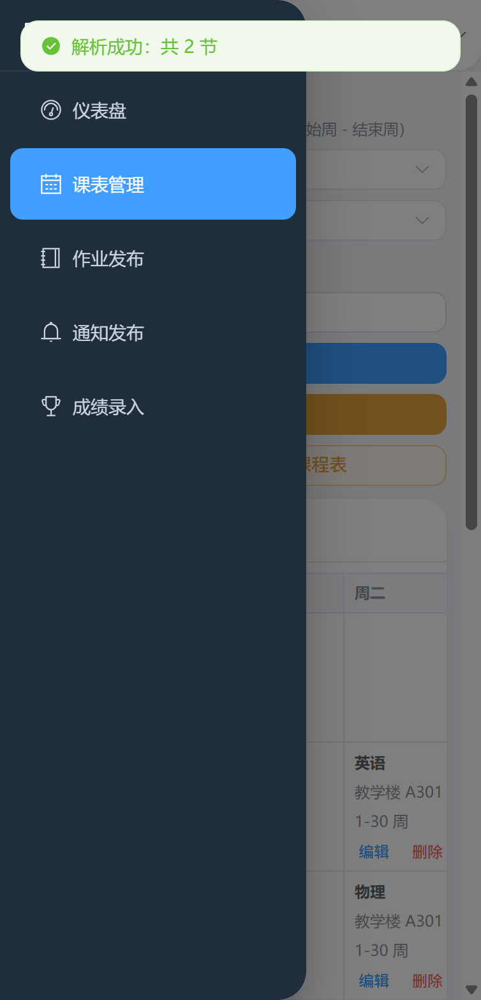      |
| 手机通知页（工具栏铺满 + 表格卡片内滚动） | 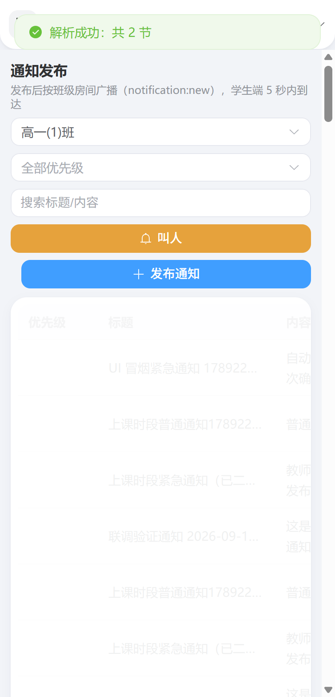 |
| 手机弹窗自适应                            | 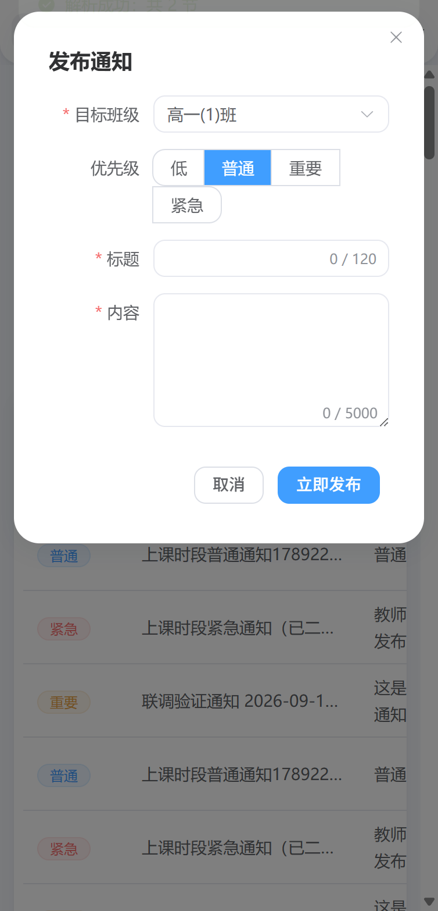          |

实现位置：`src/composables/useResponsive.ts`（断点 + resize 监听）、`src/layouts/AdminLayout.vue`（抽屉/顶栏）、
`src/styles/index.css`（全局响应式规则）、各视图表格卡片加 `.table-card`。

`pnpm verify:web` 的 20 项里，后半段专门验证权限入口隐藏、手机端、叫人入口（含紧急/普通两级）、成绩导入入口与 ClassIsland 时间配置导入弹窗（Electron 真实点击）：

| 校验项                                 | 实测结果                                                             |
| -------------------------------------- | -------------------------------------------------------------------- |
| 侧边栏收起、顶栏汉堡按钮出现           | ✅ `innerWidth=377` 汉堡=true 桌面侧边栏未渲染                       |
| 点汉堡滑出抽屉菜单（菜单项完整）       | ✅ 7 项、`left=0`、`transform=none`、遮罩进入动画已结束              |
| 抽屉里真实点击"通知发布"并自动收起抽屉 | ✅ `path=/notifications`、抽屉 `right=0`（已滑出屏幕）               |
| 页面无横向溢出                         | ✅ `scrollWidth=377 = innerWidth`，越界元素=无（表格自身滚动不计入） |
| 表格在卡片内横向滚动                   | ✅ 卡片可视 336px / 内容 576px / 表格 560px                          |
| 工具栏控件铺满整行                     | ✅ 控件宽 338px（视口 377px）                                        |
| 弹窗宽度自适应                         | ✅ 弹窗宽 353px、`left=12`（不超出视口且接近整屏）                   |

> 踩坑记录：这套检查必须让窗口**真正可见**（`win.showInactive()`）。
> Chromium 会冻结隐藏页面的 CSS transition，Vue 的 `<Transition>` 收不到 `transitionend`，
> Element Plus 抽屉会一直停在 `enter-from`（表现为"点了没反应"）——冒烟里已按"等抽屉滑到位"断言，避免误判。

> 手机访问：与电脑同一局域网时用 `http://<主机IP>:4000` 打开管理端；
> 支持「添加到主屏幕」（PWA manifest + Service Worker）。

## EXE 客户端（学生端）

### 进程结构与安全设置

| 进程     | 文件                                             | 职责                                                                                                           |
| -------- | ------------------------------------------------ | -------------------------------------------------------------------------------------------------------------- |
| 主进程   | `src/main/*` → `dist/main/index.js`              | 窗口/单实例锁、配置持久化（`safeStorage` 加密 token）、IPC、冒烟验证                                           |
| 预加载   | `src/preload/index.ts` → `dist/preload/index.js` | 通过 `contextBridge` 暴露最小 API（`getConfig/saveConfig/getAppInfo/openExternal`），不暴露 `ipcRenderer` 本体 |
| 渲染进程 | `src/renderer/**` → `dist/renderer/*`            | Vue 3 界面、Axios 请求、Socket.IO 实时、IndexedDB 离线缓存                                                     |

安全基线：`contextIsolation: true`、`nodeIntegration: false`、`sandbox: true`、`webSecurity: true`，
外部链接一律交给系统浏览器打开，禁止应用内导航到非本地地址。

### 功能页面

| 页面 | 功能                                                                                                                                                              |
| ---- | ----------------------------------------------------------------------------------------------------------------------------------------------------------------- |
| 登录 | 服务器地址 + **班级码 + 班级密码**，附带「测试连接」；已登录但服务器不可达时可「离线进入」                                                                        |
| 课表 | 按周展示 7 列课表，支持上一周/下一周/下拉选择周次，高亮"今天"，显示周次范围与地点；**单周/双周**的课带 `单周`/`双周` 标签                                         |
| 作业 | **看板模式**（按科目卡片、点击卡片放大全屏、可切换「显示时间」与**看板字号**、随时切回列表模式）＋ 列表模式、详情抽屉、附件链接；班级设备用**未交名单**勾选谁没交 |
| 通知 | 未读红点（侧边栏徽标）、优先级标签、点击自动标为已读、全部已读、未读过滤、详情抽屉                                                                                |
| 成绩 | 班级账号看到**全班成绩总览**：表格（分数/得分率/等级）+ ECharts 柱状图 + 等级分布 + 最近更新                                                                      |
| 设置 | 服务器地址（保存并测试）、账号信息、离线缓存条目统计与清空、客户端版本信息、退出登录                                                                              |

**作业看板（学生端）**：默认按科目分卡片（每张卡列该科作业，条目可点开详情），
工具栏可切「看板 / 列表」、开关「显示时间」、拖「字号」（11–28px 即时生效），
点卡片或「全屏看板」进入全屏放大视图；这些偏好写入客户端配置（`homeworkBoard`），重启后仍生效。

**未交名单（班级设备）**：作业列表/详情里点「未交名单」→ 勾选**没交作业**的同学 →
保存后其余同学自动标记为已完成（`PATCH /api/homeworks/:id/submissions`，
`GET .../submissions` 读名单）。教师端 Web 管理端的作业详情抽屉里也能看到未交名单并勾选保存，
普通学生调用该接口返回 403（只能标记自己）。

> 通知到达时还会由**灵动岛**在桌面中上方浮出提醒（见上一节），上课时段自动隐藏、紧急通知立即展开。

### 灵动岛（桌面通知浮窗）

客户端有一个独立于主窗口的**灵动岛**：一个无边框、透明、置顶、不占任务栏的窄条窗口。它是"消息到达"的第一现场。

> **视觉与排版参考 [WinIsland](https://github.com/WinIslandProject/WinIsland)（Rust/Direct2D 的 Windows 动态岛）重写**：
> 连续圆角（超椭圆 squircle）而不是 `border-radius`、纯黑／亚克力毛玻璃／主题色三种底、
> Apple 系统色强调色、白字 alpha 分级、**所有文本 = 基础字号 × 排版系数**、
> 胶囊 `h/2` 满圆角 + 展开卡 `min(48, w/2, h/2)`（WinIsland `expanded_island_radius`）、
> 顶/底 × 左/中/右 **6 个停靠位**、可选"空闲细缝"（WinIsland `hidden_width`）。
> 逐项从 WinIsland 源码提取的设计 token 见 **[docs/winisland-design-tokens.md](docs/winisland-design-tokens.md)**。
>
> **架构也照搬 WinIsland（同一套做法，而不是"仿个外观"）**：
> 窗口一次创建成**固定包围盒**（最大形态 + 阴影留白），开合过程中**一帧都不移动/缩放窗口**；
> 岛的全部形变（宽/高/圆角/内容交叉淡入）都发生在窗口内的渲染层，由 WinIsland 的弹簧驱动：
> `force=(target-value)*0.10*dt` → `velocity=(velocity+force)*0.68^dt` → `value+=velocity*dt`
> （dt 以帧为单位；换向只保留 35% 动量、单帧位移不超过剩余距离 20%），并额外加**零过冲钳制**（越过目标立即吸附）。
> 鼠标命中照搬 `set_cursor_hittest`：窗口默认 `setIgnoreMouseEvents(true, { forward: true })` 整块穿透，
> 渲染层做命中测试后只在指针进入岛体时打开命中——**大窗口不会吞掉桌面点击**（有专项断言）。
>
> **双保险**：Windows 下 `forward: true` 的 mousemove 转发并不总是可靠，"展开 → 收起"后一旦转发丢失，
> 窗口会永远停在穿透状态（用户反馈的"点开再收起就再也点不开"）。因此渲染进程会把**岛体矩形**上报主进程
> （`island:set-hit-rect`），主进程每 120ms 用 `screen.getCursorScreenPoint()` 与矩形比对校正命中——
> 命中不再依赖"必须先收到一次 mousemove"。冒烟通过 `setHitTestCursor()` 注入光标位置做确定性断言
> （细缝上可点 / 移开即穿透 / 展开收起再展开）。
>
> 由于窗口固定，Windows 那条"透明窗口最小高度约 36px"的限制不再作用于岛：空闲细缝可以真正做到 6px 宽。

| 场景                          | 灵动岛行为                                                                                                                                           |
| ----------------------------- | ---------------------------------------------------------------------------------------------------------------------------------------------------- |
| 收到通知（非上课时段）        | **直接出现胶囊**（无"上岛"入场动画）：`新消息 · 共 N 条` + 发送人 + `点击查看`                                                                       |
| 多条未处理消息                | 胶囊标题汇总类型：`新消息：叫人/作业/通知（共 3 条）` + `点击查看`，右侧附类型小标签（单条时显示具体类型名）                                         |
| 点击胶囊                      | 展开为**详情卡**（形变 + 淡入，无回弹）：标题、内容、时间、`打开应用 / 标为已读 / 知道了`                                                            |
| **上课时段的"普通叫人"**      | **不自动展开**（不打断课堂），但保留 `叫人` 胶囊并**允许学生主动点开**；下课自动展开（`isOpenable`：紧急消息与任何叫人都可点开）                     |
| **收起后胶囊常驻**            | 自动收起 / 手动收起只把卡片回缩为胶囊，**有未处理通知时胶囊不会消失** —— 随时都能再次点开（彻底消失只在"知道了 / 标为已读"、队列清空或进入上课时段） |
| **收起态点击命中**            | 收起瞬间窗口会保持可交互，且渲染进程在每次状态变化后都按**缓存的指针位置**重算命中并被固化为回归用例（"收起态点击可再次展开（指针未移动也算命中）"） |
| 点击卡片空白处                | 回缩为**胶囊**（不直接消失，仍可再次点开）                                                                                                           |
| **点击屏幕任意位置**          | 同样回缩为胶囊：展开时窗口临时可聚焦，点到别处即失焦收起（WinUI 同款"点击外部关闭"）                                                                 |
| **点"标为已读"**              | 通知中心同步标记已读、未读红点立即减少（此前只从灵动岛队列移除、列表仍显示未读）                                                                     |
| **新作业发布**                | 也上岛：胶囊显示"新作业"（青蓝描边 + 书本图标），展开可见作业要求（**截止时间功能已下线**）                                                          |
| **紧急叫人**（老师点名·紧急） | **上课时段也立即展开**：琥珀金卡片、`叫人` 徽标、"请 XXX 同学找 XXX 老师"、按钮为"收到"（`priority=URGENT`）                                         |
| **普通叫人**（默认级别）      | 课间先显示 `叫人` 胶囊、点击展开；**上课时段只进队列**（不打断课堂），下课后自动弹出详情（`priority=HIGH`）                                          |
| 卡片形变                      | 卡片是**固定尺寸、顶部居中锚定**的，窗口只负责露出/裁切透明区域 —— 收回时不会出现被拉伸的"方框"，图标也不会上下跳                                    |
| 点击右上角收起按钮            | 同上：回缩为胶囊                                                                                                                                     |
| 上课时间段收到普通通知        | **完全不显示**（窗口直接隐藏，不打扰课堂）并进入待发队列；下课后自动弹出详情 → 收起为胶囊                                                            |
| 上课时间段收到**紧急**通知    | **无论是否上课立刻展开**显示详情（带内部红色呼吸光晕与"紧急"角标，无需点击），45 秒后收起                                                            |
| 上课时间段内的任何点击        | 一律不显示（不会展开、也不会回缩出胶囊），只有紧急通知能出现在屏幕上                                                                                 |
| 多条约谈                      | 队列按时间排序，紧急通知优先插播；卡片底部提示"还有 N 条通知"                                                                                        |
| 退出/断开                     | 主窗口退出时灵动岛一并关闭；上课状态来自 `GET /api/schedules/current`（10 秒心跳 + 下课时长定时器）                                                  |

- 动画：窗口尺寸用逐帧缓动实现"形变"，**单调不过冲**——展开 300ms、收回 220ms，统一 `easeOutCubic`
  （早期版本用 `easeOutBack` 弹簧缓动 + 卡片 `cubic-bezier(0.34, 1.56, 0.64, 1)` 缩放入场，
  实测窗口会冲到 411×329（目标 404×316）、卡片放大到 400.6px 再回落，观感就是"开合时震一下"，现已移除）；
  卡片只做 180ms 淡入，形变完全交给窗口尺寸，未读点用 `dot-pulse`。
  尺寸与淡入使用**独立令牌**，互不打断（早前"淡入取消形变导致窗口卡在胶囊尺寸"的问题已修复）。
- 光晕：紧急形态的红色呼吸光晕**只用 inset 阴影**画在卡片内部。
  窗口只比卡片大 2~4px，任何向外的 box-shadow/光晕都会被窗口边界裁切，
  在屏幕上表现为"卡片周围一圈奇怪的光晕硬边"——冒烟测试里有一条像素断言守着这一点
  （截图最外圈偏红像素必须为 0）。
- 事件流：`notification:new` → `renderer/stores/realtime.ts` → `pushNotificationToIsland()` →
  主进程 `IslandController`（决定隐藏/胶囊/详情）→ 灵动岛渲染进程 `src/island/IslandApp.vue`。
- 相关文件：`src/main/island.ts`（控制器 + IPC）、`src/preload/island.ts`、`src/island/IslandApp.vue`、
  `src/renderer/island/bridge.ts`（上课状态轮询与通知转发）。

各形态实拍（由 `pnpm verify:desktop` 自动截取并归档到 `docs/screenshots/island/`，并做像素级校验）：

| 形态                   | 截图                                                                | 尺寸（逻辑 / 截图） | 说明                                      |
| ---------------------- | ------------------------------------------------------------------- | ------------------- | ----------------------------------------- |
| 下课后自动弹出详情     | 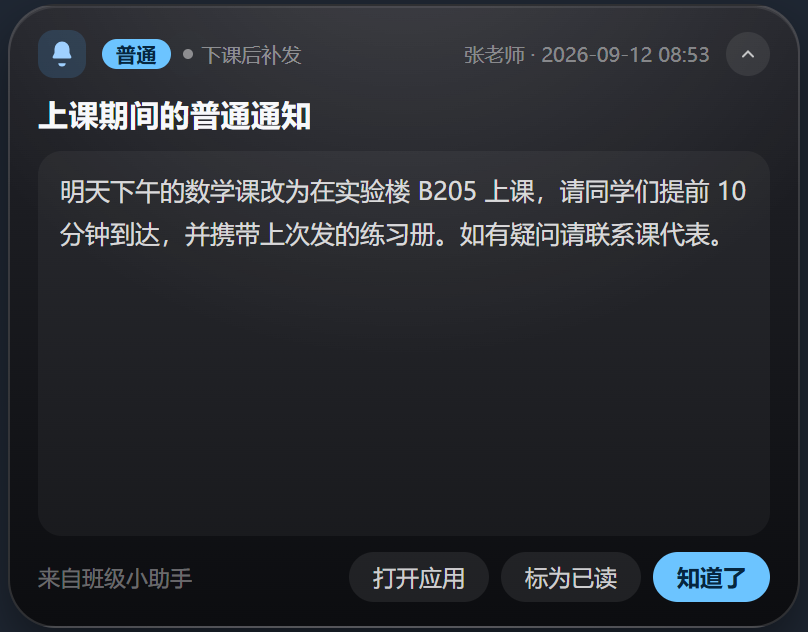 | 404×316 / 808×632   | 上课期间暂存的通知，下课后自动弹出        |
| 上课期间紧急通知       | 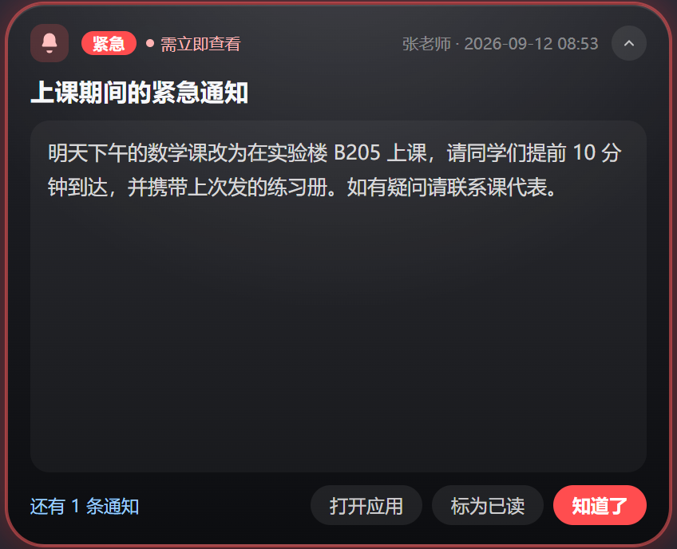    | 424×344 / 848×688   | 卡片**内部**红色光晕 + 紧急角标，无需点击 |
| 非上课时段"新消息"胶囊 | 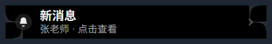            | 268×44 / 536×88     | 直接出现（无入场动画），点击后展开        |
| 点击胶囊后的详情       | 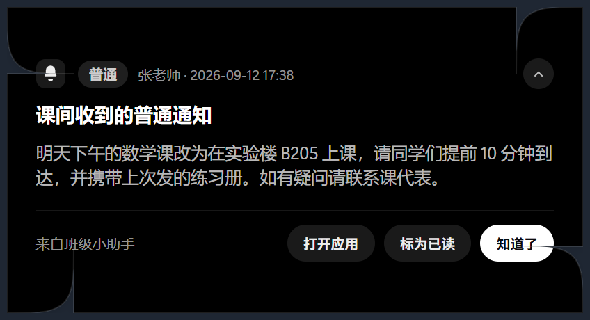         | 404×316 / 808×632   | 标题/内容/时间 + 打开应用/标为已读/知道了 |

**收起态胶囊会汇总消息类型**（用户需求）：当有多条未处理消息时，胶囊标题显示
`新消息：叫人/作业/通知（共 3 条）`、副标题 `点击查看`，并在右侧把三种类型做成小标签；
只有一条时仍显示具体类型名（`新消息` / `新作业` / `老师叫你`）。
多类型/多条的状态由渲染进程按 `state.active + state.queued` 现算，收起后在胶囊上就能看清"这堆消息里都有什么"。

> 设置页的「预览效果」走 `context.preview` 专用通道：示例岛**直接展开**、**失焦不收起**
> （用户拖滑块时主窗口一直是焦点）、30 秒后自行消失、点「知道了」不留残影。

> 截图路径可用 `ISLAND_SHOTS_DIR` 覆盖（默认 `.cache/island-shots/`）；
> 归档目录里的图就是打包后 EXE 跑自动化验证时产出的同一份文件。

### 界面风格（ClassIsland 同款 Fluent）

客户端整体视觉对齐 ClassIsland 的 Fluent / WinUI 观感：

- 浅色 Mica 底（`#f3f3f3`）+ **半透明亚克力卡片**（`rgba(255,255,255,.7)` + `backdrop-filter: blur(20px)`）
- 强调色 `#0F6CBD`（悬停 `#115EA3`）；选中导航项 = 强调色淡底 + **左侧 3px 强调条**
- 圆角统一：卡片 8px / 控件 4px；描边用半透明黑（`rgba(0,0,0,.06)`）代替灰线；阴影极轻
- 字体 `Segoe UI Variable / 微软雅黑 UI`；表格表头无底色、行分隔为 1px 细线；滚动条改为细圆角
- Element Plus 变量（`--el-color-primary`、`--el-border-radius-base` 等）整体对齐上述规范

**课表「今天」时间轴（ClassIsland 标志性观感）**，`今天 / 本周` 双标签：

| 元素       | 说明                                                                                                                                                              |
| ---------- | ----------------------------------------------------------------------------------------------------------------------------------------------------------------- |
| 大时钟     | 时:分 大字 + 秒小字（每秒刷新）+ 日期 / 星期 / 第 N 教学周                                                                                                        |
| 当前状态卡 | 「正在上 XXX」+ 时段地点 + **距下课 X 分钟**；无课时显示「今天的课都上完了 / 今天没有课程安排」                                                                   |
| 时间轴     | 左侧时间栏（开始/结束）+ 竖向轨道与节点 + 右侧课卡：**已结束**（置灰）、**正在上课**（强调色实底 + 进度条 + 距下课倒计时）、**下一节**（橙色标记 + 还有多久开始） |
| 周视图     | 保留原"节次 × 星期"表格（`本周` 标签）                                                                                                                            |

实拍（`docs/screenshots/client/`，时间轴图为造了"已结束/正在上/下一节"三节课后的抓图）：

| 页面                  | 截图                                                         |
| --------------------- | ------------------------------------------------------------ |
| 课表 · 今天（时间轴） | 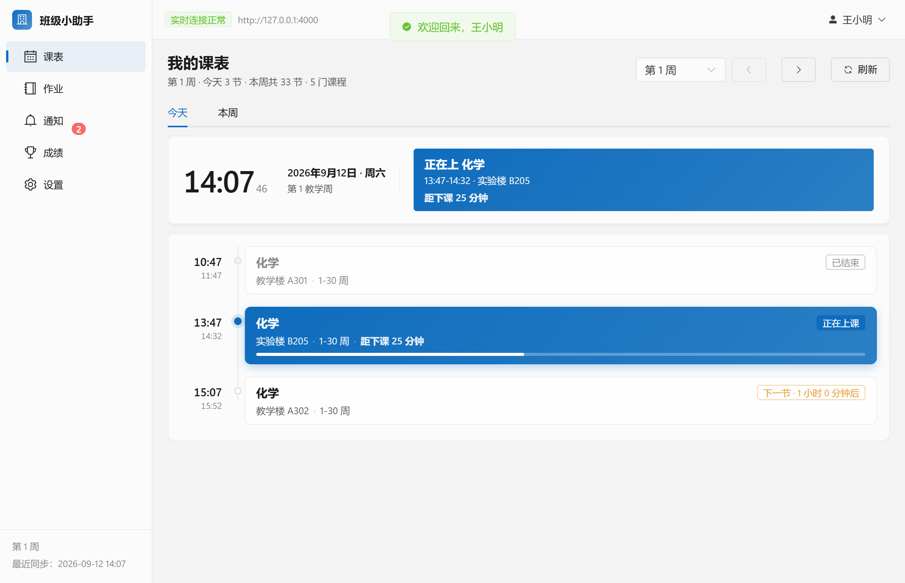 |
| 作业                  | 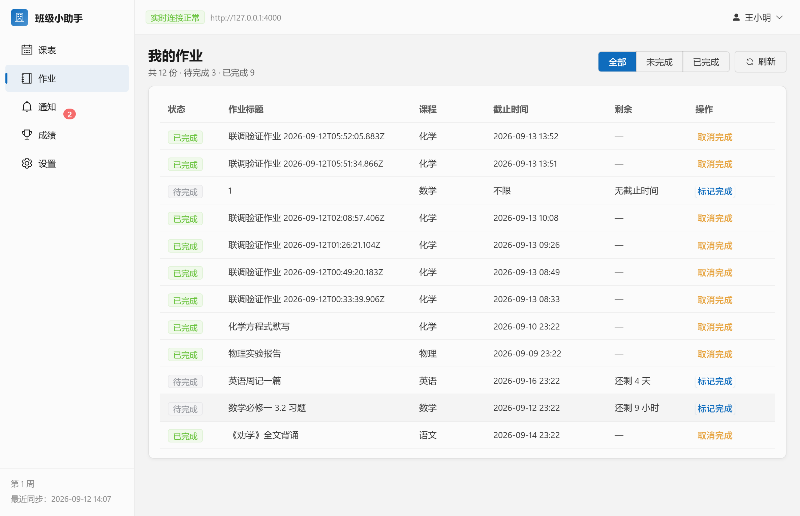      |
| 通知                  | 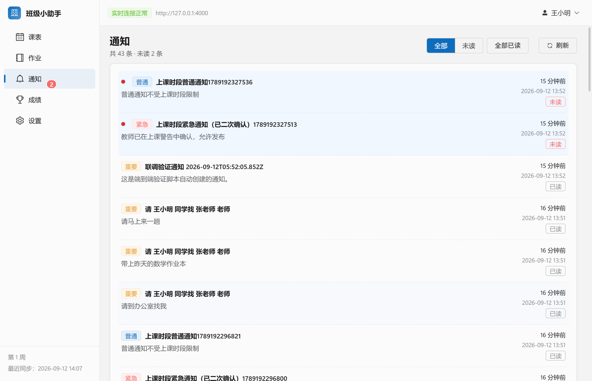  |
| 设置                  | 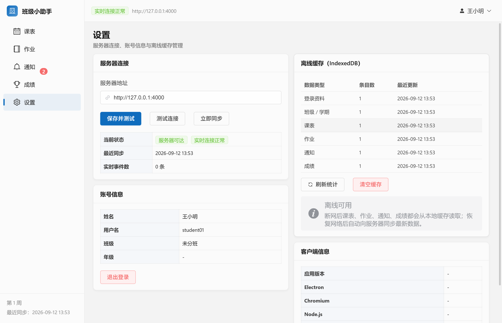       |

> 后续可继续深化：迷你悬浮课表窗口（ClassIsland 的桌面课表条）、上课/下课提醒动画与铃声。

### 个性化设置与系统托盘

**设置 → 灵动岛 · 个性化**（改动即实时生效，保存后写入本地配置，重启仍生效）：

| 设置项       | 区间/取值                               | 说明                                                                                                                                                        |
| ------------ | --------------------------------------- | ----------------------------------------------------------------------------------------------------------------------------------------------------------- |
| 灵动岛高度   | 36–72px                                 | 胶囊高度；展开卡按同差值联动（`+186/+202/+218px`），内容用 flex 承载且不溢出                                                                                |
| 灵动岛宽度   | 220–420px                               | 同上，展开卡按差值联动（`+156/+172/+188px`）                                                                                                                |
| 圆角         | 8–32px                                  | 胶囊取 `min(圆角, h/2)`（WinIsland 胶囊是满圆角）；展开卡取 `min(48×圆角/20, w/2, h/2)`                                                                     |
| 不透明度     | 40%–100%                                | 窗口整体不透明度（所有显示路径都会应用，含"隐藏后再弹出胶囊"）                                                                                              |
| **字号**     | **11–20px**                             | **基础字号**：岛内所有文本 = 基础字号 × 排版系数（标题 1.08 / 正文 0.95 / 次要 0.78 / 徽标与按钮 0.76 / 胶囊标题 0.92 / 胶囊副题 0.74），改一处整体等比缩放 |
| 动画速度     | 0.5×–2×                                 | 形变/淡入时长倍率                                                                                                                                           |
| 主题色       | 取色器（默认 Apple 系统蓝 `#0a84ff`）   | 用于高亮、按钮、进度条、主题色风格（CSS 变量下发到灵动岛渲染进程）                                                                                          |
| **视觉风格** | **纯黑 / 毛玻璃（亚克力）/ 主题色渐变** | 纯黑 = WinIsland `default`；毛玻璃调用 `win.setBackgroundMaterial('acrylic')`（真·桌面模糊，等价 HostBackdropBrush）                                        |
| **显示位置** | **顶部/底部 × 左/中/右（6 个锚点）**    | 按 `workArea` 计算；顶/底决定不动的是上边还是下边，左/中/右决定水平锚点                                                                                     |
| 动画开关     | 开/关                                   | 关闭后展开/收起瞬时生效（不再逐帧插值）                                                                                                                     |
| 始终置顶     | 开/关                                   | 对应 `setAlwaysOnTop`                                                                                                                                       |
| **空闲细缝** | **开/关（默认关）**                     | 参考 WinIsland `hidden_width`：开启后没有消息时不再完全隐藏，而是留一条 6px 宽的竖条（窗口是固定包围盒，不受 Windows 最小窗口高度限制）                     |

- 越界值在**主进程**统一夹紧（`normalizeIslandAppearance`），用户填坏配置也不会让布局错乱。
- 「预览效果」按钮会本地推一条通知，立刻看到当前尺寸/配色/动画。
- 落盘位置：客户端 `config.json` 的 `island` 字段（旧配置没有该字段时自动补默认值，向后兼容）。

**形变动画（需求 4 抖动修复 + 无震动）**：岛在**固定包围盒窗口内**由弹簧逐帧逼近目标尺寸/圆角
（`src/island/spring.ts`，照搬 WinIsland 的 `physics.rs` 参数），窗口本身全程不动；
胶囊层与展开层用 WinIsland 的几何进度交叉淡入（展开层 `progress²`、胶囊层 `1 - 1.5×progress`）；
展开动画结束后才取焦点。

为了让"开合"完全没有振动感，几何与缓动做了三件事（每一条都有实测断言）：

1. **缓动单调不过冲**：去掉 `easeOutBack` 与卡片 `cubic-bezier(…, 1.56, …)` 缩放入场，
   尺寸/位置只朝目标单向变化，窗口不再"超过目标再弹回来"；
2. **锚点取整数、且与窗口尺寸无关**：停靠位置决定"不动的那条边/中心"，动画开始前算一次，
   过程中不逐帧重算，避免 `Math.round` 在 0.5 边界上左右跳变；
3. **卡片宽度取偶数**：卡片在窗口内水平居中，偶宽保证卡片中心落在整数像素上。

冒烟实测（逐帧采样窗口矩形 + 卡片真实屏幕矩形）：展开时**卡片中心波动 0.00px、上边缘波动 0.00px**，
窗口最大 424×230（等于目标），卡片最大 414×220（重写前是 411×329 / 400.6×311.6 的过冲）；
收回时同样 0.00px / 0.00px、最小窗口 268，窗口宽度序列 `356→318→286→274→270→268…` 单调收缩无回跳；
连续 5 次快速开合后状态与尺寸稳定。

**系统托盘（需求 5）**：关闭主窗口不退出程序，而是隐藏到托盘后台继续接收通知；
托盘图标（左键单击/双击）恢复主窗口，右键菜单提供「显示主窗口 / 隐藏到托盘 / 退出班级小助手」。
退出时统一清理：销毁托盘 → 销毁灵动岛（含帧循环与定时器）→ 销毁全部窗口
（渲染进程随之结束，其中的 Socket.IO 连接、IndexedDB 句柄一并释放），并用 `app.exit(0)` 兜底，
任务管理器中不留残留进程。冒烟实测：关闭后 `visible=false / destroyed=false / 进程存活=true`，
清理后 `托盘=false / 灵动岛=false`。

**"退出无残留"是被实测出来的，不是只写在文档里**：冒烟脚本在 Electron 进程真正退出之后再做两件事 ——
① 删除该次运行独占的 `userData` 目录（含 Chromium `SingletonLock` 与 IndexedDB 文件句柄），
删得掉就说明没有进程还占着句柄；② 用**同一个配置目录再启动一次**，若还有残留进程占着单实例锁，
第二次启动会静默退出且不产出结果文件——实测第二次启动正常跑完并再次全绿
（`[smoke] [PASS] 退出后无残留：配置文件锁已释放，二次启动成功（41/41）`）。

### 离线缓存与自动同步

```
                     ┌────────────── 在线 ──────────────┐
请求 → fetchWithCache(store, key, loader, fallback)
                     └── 失败 → 读取 IndexedDB 缓存 → 返回旧数据（UI 标记"离线缓存"）
实时推送(notification:new / grade:updated ...) → 更新内存状态 + 写回 IndexedDB
服务器不可达 → 可达（health 轮询 20s 或任意请求成功）→ 触发 onServerRecovered → 各页自动重新拉取
```

- 缓存按业务域分为 6 个 object store：`profile` / `classes` / `schedules` / `homeworks` / `notifications` / `grades`。
- 缓存写入前统一做 JSON 纯化（Vue 响应式对象是 Proxy，直接写入 IndexedDB 会抛 `could not be cloned`）。
- 登录令牌由主进程用 Electron `safeStorage`（Windows 下为 DPAPI）加密后落盘，因此重启客户端可离线进入。
- 令牌缺失/失效时保持缓存资料可见，恢复网络后自动刷新个人资料。

### 打包 Windows EXE

```bash
pnpm dist:dir     # 免安装目录：packages/desktop-client/release/win-unpacked/班级小助手.exe
pnpm dist:win     # nsis 安装包 + portable 单文件（需联网下载 NSIS 工具，可用镜像）
```

打包脚本 `packages/desktop-client/scripts/dist-win.mjs` 做了三件事，规避常见网络问题：

1. **复用本地已解压的 Electron**：检测到 `node_modules/electron/dist/electron.exe` 时通过
   `--config.electronDist` 直接使用，不再重复下载 150MB+ 发行包；
2. 默认走国内镜像（可用环境变量覆盖）：
   `ELECTRON_MIRROR=https://cdn.npmmirror.com/binaries/electron/`、
   `ELECTRON_BUILDER_BINARIES_MIRROR=https://npmmirror.com/mirrors/electron-builder-binaries/`；
3. 构建缓存固定到仓库内 `.cache/`，不污染全局目录。

产物说明：`release/win-unpacked/班级小助手.exe`（约 235MB，Electron 运行时）+ `resources/app.asar`
（约 2.7MB，仅含 `dist/` 与 `package.json`，运行时不需要 node_modules）。
默认使用 Electron 内置图标（未提供 `build/icon.ico`）。

### 客户端冒烟验证（无需人工点击）

`pnpm verify:desktop` 以 `ELECTRON_SMOKE_TEST=1` 启动应用（不弹窗），主进程依次校验后自动退出：

| 校验项                                  | 实测结果                                                                                                                                                                                                                                  |
| --------------------------------------- | ----------------------------------------------------------------------------------------------------------------------------------------------------------------------------------------------------------------------------------------- |
| 渲染进程挂载 + 窗口标题                 | ✅ `children=1` / `title=班级小助手`                                                                                                                                                                                                      |
| 登录页渲染（三个输入框）                | ✅ 服务器地址 / **班级码** / 班级密码                                                                                                                                                                                                     |
| preload contextBridge 注入              | ✅ 9 个方法（含灵动岛 3 个）                                                                                                                                                                                                              |
| IPC 往返（getAppInfo/saveConfig）       | ✅ Electron 44.3.0                                                                                                                                                                                                                        |
| 配置文件写入用户目录                    | ✅ `%APPDATA%\@classhelper\desktop-client\config.json`                                                                                                                                                                                    |
| IndexedDB 缓存读写                      | ✅ 读写/统计/删除 + 6 个 store                                                                                                                                                                                                            |
| 断网时回退本地缓存                      | ✅ `fromCache=true`（请求不可达端口）                                                                                                                                                                                                     |
| 灵动岛窗口创建（置顶/透明/不占任务栏）  | ✅ `ready=true`                                                                                                                                                                                                                           |
| 上课期间普通通知自动隐藏                | ✅ `mode=hidden queued=1 visible=false`（窗口真的隐藏，不是只改状态）                                                                                                                                                                     |
| 上课期间点击不展开（严格不显示）        | ✅ `mode=hidden visible=false`                                                                                                                                                                                                            |
| 下课后自动弹出暂存通知详情              | ✅ `mode=expanded reason=after-class`                                                                                                                                                                                                     |
| 上课期间紧急通知立即展开（无需点击）    | ✅ `mode=expanded reason=urgent`                                                                                                                                                                                                          |
| **紧急通知带展开动画**                  | ✅ 16ms 采样 31 帧，出现 5 个中间尺寸，最终 `440x246`（岛在固定窗口内单调展开，无过冲）                                                                                                                                                   |
| 上课期间收起紧急通知                    | ✅ 回缩为**胶囊且保持可见** `mode=pill visible=true 岛=268x44`（不再整块隐藏）                                                                                                                                                            |
| **上课期间紧急通知可再次展开（回归）**  | ✅ 收起后点开 → `mode=expanded active=smoke-urgent-in-class 岛=440x246`                                                                                                                                                                   |
| **普通通知直接显示胶囊（无入场动画）**  | ✅ 推送前已隐藏，60ms 内窗口即为 `268x44`、`mode=pill`（无"上岛"动画）                                                                                                                                                                    |
| 胶囊 → 点击 → 展开详情                  | ✅ `新消息 · 共 2 条` → `expanded`（含真实 DOM 断言与截图）                                                                                                                                                                               |
| **点击卡片空白处回缩为胶囊**            | ✅ 真实点击 `.body` 空白区域 → `mode=pill`                                                                                                                                                                                                |
| **点击右上角收起按钮回缩为胶囊**        | ✅ 真实点击 `.icon-btn` → `mode=pill`                                                                                                                                                                                                     |
| **灵动岛截图留档 + 像素级校验**         | ✅ 6 张（848×460 / 880×492 / 536×88 / 848×460 / 848×460 / 912×524）；宽高比与状态机配置偏差 **0.000**；形态尺寸递增 pill < expanded < urgent < call                                                                                       |
| **连续圆角四角一致（缺一块 / 角画反）** | ✅ 四角沿对角线边界步进两两一致：展开 `[15,15,15,15]`、紧急 `[14,14,14,14]`、胶囊 `[5,5,5,5]`、叫人 `[14,14,14,14]`，与超椭圆理论值（0.153r）吻合，离散 **0**（旧实现四角共用同一偏移向量 → 左上/右下被切掉一块，此断言即为该回归的守卫） |
| **紧急红晕不外溢（窗口边缘无红光）**    | ✅ 截图最外圈（2px）偏红像素 = **0**（守住"卡片周围不出现光晕硬边"）                                                                                                                                                                      |
| 联网集成（`ELECTRON_SMOKE_ONLINE=1`）   | ✅ `login=高一(1)班 classSession=true` / 1 班级 / 30 节课 / Socket.IO 已连接                                                                                                                                                              |
| **个性化：尺寸联动不破坏布局**          | ✅ 高 56 / 宽 300 / 圆角 26 / 字号 14 → 窗口 `300x56`，CSS 变量同步，展开态内容溢出 **0px**                                                                                                                                               |
| **开合不震动：展开**                    | ✅ 逐帧采样 57 帧：岛中心波动 **0.00px**、上边缘 **0.00px**；**窗口冻结**（全程 `476x282@482,-2`）；岛最大 `440x246` = 目标无过冲                                                                                                         |
| **开合不震动：收回**                    | ✅ 逐帧采样 56 帧：岛中心/上边缘波动 **0.00px**；窗口全程冻结；岛 `386x230→…→268x44` 单调收缩无回跳                                                                                                                                       |
| **WinIsland 架构：窗口恒定 + 形状正确** | ✅ 逐帧窗口签名恒为 `476x282@482,-2`（只有 1 种）；SVG 形状 bbox 与卡片框一致（±2px）；**路径绕行 \|winding\| ≈ 2π**（凸、不自交，可抓出"角上往回折"）                                                                                    |
| **岛外鼠标穿透**                        | ✅ 指针在岛内 `interactive=true`、在岛外 `interactive=false`（固定大包围盒窗口不吞桌面点击）                                                                                                                                              |
| **收起后胶囊常驻（可再次点开）**        | ✅ 收起后等满 `TIMEOUTS.pill`（15s）超时：`mode=pill 可见=true`（有未处理通知就不消失）；显式把命中置为穿透后，一次状态变化即恢复 `interactive=true`，点击后 `mode=expanded active=smoke-collapse-reopen`                                 |
| **空闲细缝也可点开**                    | ✅ 光标注入到细缝上 → `interactive=true`；移开后 `interactive=false`（`mode=hidden 可见=true 细缝=6x22`）                                                                                                                                 |
| **展开 → 收起 → 再次展开（回归）**      | ✅ 真实点击往返：`expanded（命中框 424x230）→ pill（命中框 268x44）→ expanded`（此前第二步之后会卡在穿透状态，点了没反应）                                                                                                                |
| **命中兜底随形态更新**                  | ✅ 岛体矩形随形态上报主进程（展开 424x230 → 收起 268x44）；彻底隐藏时撤销命中框（`mode=hidden 命中框=无`），保证看不见的窗口不吞桌面点击                                                                                                  |
| **紧急叫人（URGENT + 叫人）**           | ✅ 上课中也立即展开：`mode=expanded kind=call reason=call 徽标=叫人 按钮=收到`                                                                                                                                                            |
| **普通叫人（HIGH + 叫人）**             | ✅ 上课只进队列：`mode=hidden active≠smoke-call-normal queued=[…smoke-call-normal]`；下课后自动弹出 `active=smoke-call-normal kind=call`                                                                                                  |
| **WinIsland 排版：字号即时生效**        | ✅ 13px → 19px：胶囊标题 `11.96→17.48`、胶囊副题 `9.62→14.06`、标题 `14.04→20.52`、正文 `12.35→18.05`、按钮 `9.88→14.44`，**倍率全部 1.462 = 19/13**                                                                                      |
| **WinIsland 风格：三种底即时切换**      | ✅ 纯黑 `fill=rgb(0,0,0)`/材质 `none`；毛玻璃 `fill=rgba(10,10,14,.59)`/材质 **`acrylic`**；主题色 `fill=rgb(11,11,15)`                                                                                                                   |
| **WinIsland 空闲细缝**                  | ✅ 空闲时岛收成 `6x22`（窗口固定，不再受 Windows 36px 最小窗口高度限制）→ 来消息自动回到 `268x44`；关闭细缝后空闲 `isVisible=false`                                                                                                       |
| **个性化：透明度 / 主题色**             | ✅ `setOpacity` 实际 **0.62**（设置 0.62）；`--island-accent` = `#ff7043`                                                                                                                                                                 |
| **个性化：停靠位置（6 个锚点）**        | ✅ 左上 `8,8` / 右上 `1216,8` / 底部居中 `586,800` / 底部左 / 底部右 / 顶部居中 `586,8`                                                                                                                                                   |
| **个性化：置顶开关**                    | ✅ 关闭后 `isAlwaysOnTop=false`，开启后 `true`                                                                                                                                                                                            |
| **个性化：动画开关 / 速度**             | ✅ 关闭动画后 60ms 内即到位（无过渡）；speed=2 收回明显快于 speed=0.5                                                                                                                                                                     |
| **个性化：持久化**                      | ✅ 写入客户端配置后重新读取完全一致（尺寸/圆角/透明度/主题色/字号/动画/速度/位置/置顶/风格/细缝）                                                                                                                                         |
| **退出清理：托盘 / 灵动岛 / 窗口**      | ✅ `isTrayReady()=false`、`island.isReady()=false`、窗口全部销毁                                                                                                                                                                          |
| **退出后无残留（文件锁 + 二次启动）**   | ✅ 配置目录可删除（句柄已释放）→ 用同一配置目录二次启动成功并再次全绿                                                                                                                                                                     |

该验证对**开发产物与打包后的 EXE 都适用**（打包后用 `ELECTRON_SMOKE_RESULT=<file>` 写出 JSON 结果，
已实测 `packaged: true`、71/71 通过、退出码 0）。灵动岛各状态的窗口截图会写到
`ISLAND_SHOTS_DIR`（默认 `.cache/island-shots/`，仓库内留档目录 `docs/screenshots/island/`），
并对尺寸、宽高比、绘制内容（不透明像素/颜色种类）、紧急态红色像素与外溢红光做断言。
冒烟进程使用独立 userData（`ELECTRON_SMOKE_PROFILE`），因此**用户开着客户端也能跑验证**。
冒烟准备班级凭据时**不改任何数据**：先试冒烟密码与种子默认 `123456`，命中就直接用；
都不通才会临时重置该班密码，并在脚本收尾时恢复为 `123456`（日志会打印"已恢复班级密码…冒烟不留副作用"）。

## 叫人（老师点名让学生过来）

老师在 **Web 管理端 → 学生管理 → 叫人**（或 **通知发布 → 叫人**）选中学生，配合**快捷短语**或**自定义消息**发送。
叫人分**两档**，由弹窗里的「级别」单选决定（默认 **普通**）：

| 级别         | 落库级别 | 学生端行为                                                                                              |
| ------------ | -------- | ------------------------------------------------------------------------------------------------------- |
| **普通叫人** | `HIGH`   | 课间：先显示"叫人"胶囊，点击展开；**上课时段：只进队列、不打断课堂**，下课后自动弹出详情（90 秒后收起） |
| **紧急叫人** | `URGENT` | **无视上课时段立即展开**（与紧急通知同待遇），上课时被收起后仍保留胶囊、可再次点开                      |

两档的学生端卡片都是「请 XXX 同学找 XXX 老师」+ 具体事由，徽标 `叫人`、按钮「收到」；点击「收到」复用通知已读机制。

| 位置       | 行为                                                                                                                                                                                         |
| ---------- | -------------------------------------------------------------------------------------------------------------------------------------------------------------------------------------------- |
| 服务端     | `POST /api/calls`（教师/管理员）→ `urgent: true` 落库 `URGENT`，否则 `HIGH`（进学生通知中心、可用已读状态） + 广播 `notification:new`（班级房间）与 `call:new`（定向到被叫学生 `user:{id}`） |
| 快捷短语   | `CALL_QUICK_PHRASES`（共享常量）：请到办公室/讲台/实验室/门卫处找我、请带上作业本/试卷找我、请到教室门口等我、请马上来一趟；点击选中，再点取消                                               |
| 自定义消息 | 输入框内容优先于快捷短语（最长 200 字），例如"带上昨天的数学作业到办公室"                                                                                                                    |
| 客户端     | `call:new` → 灵动岛 `kind=call`；**是否立即展开只由 `priority` 决定**（`isImmediate` 只认 `URGENT`），与"普通通知"共用同一条排队/隐藏/下课弹出路径                                           |
| 权限       | 学生调用被拒 403；教师只能叫自己班级的学生（跨班/不在本班返回 400/403）                                                                                                                      |

`verify:e2e` 覆盖 8 项（201 + 标题模板、**普通叫人 HIGH**、**紧急叫人 URGENT**、自定义消息优先、上课时段允许、
学生 403、学生通知中心可见且未读、清理）；
`verify:web` 覆盖弹窗、级别单选与短语可选中；`verify:desktop` 覆盖「紧急叫人上课中也立即展开 + 徽标/按钮文案」
与「普通叫人上课只进队列、下课自动弹出」。

## 上课时段策略（紧急通知二次确认）

"上课时段"由课表实时判定：`GET /api/schedules/current?classId=` 返回
`{ inClass, current, next, week, serverTime }`（`at` 参数可覆盖判定时刻，便于联调与测试）。

**服务端强制拦截**（不是只靠前端提醒）：

```
POST /api/notifications  { classId, title, content, priority: "URGENT" }        → 409 URGENT_DURING_CLASS
POST /api/notifications  { …, priority: "URGENT", confirmDuringClass: true }    → 201
POST /api/notifications  { …, priority: "NORMAL" }（上课时段）                   → 201（不受限）
```

409 响应体携带 `details: { classId, current, next, week, serverTime }`，前端据此渲染"正在上的课"。
这样即使有人绕过界面直接调接口，也一定会被拦下来。

**Web 管理端**：教师在通知发布弹窗选择"紧急"并提交时，先查询班级上课状态，命中则弹出**全屏二次确认**
（`packages/web-admin/src/components/UrgentClassWarning.vue`）：

- 全屏遮罩 + 强警示配色，文案"现在为上课时间段……" + 正在上的课时段 + 待发布标题；
- 确认按钮带 **3 秒倒计时**（圆环进度 + 每秒钟数提示），倒计时结束前不可点击，防止误触；
- 取消则不发；确认后带 `confirmDuringClass: true` 重新提交并成功发布；
- 兜底：并发场景（提交瞬间刚好打铃）仍会收到 409，此时同样弹出该警告。

**EXE 客户端**：上课时段非紧急通知自动隐藏、下课后自动弹出；紧急通知无论是否上课都立即展开（见"灵动岛"一节）。

回归测试：`verify:e2e` 覆盖 409 拦截 / 二次确认后 201 / 普通通知不受限（用 `at` 固定时刻，结果可复现）；
`verify:web` 用真实点击构造"正在上课"场景并断言全屏警告文案、按钮禁用与倒计时时长（实测 ~2.96s）。

## 学生端班级账号（学生端主体 = 班级）

需求：学生端不再以"个人学生"为登录主体，改为**班级账号（班级设备）**登录，数据按班级隔离。

### 账号模型

| 项目     | 说明                                                                                 |
| -------- | ------------------------------------------------------------------------------------ |
| 登录凭据 | 班级码（`Class.code`，唯一、4~16 位字母数字、大小写不敏感）+ 班级密码（bcrypt 哈希） |
| 会话形态 | JWT `{ sub: <classId>, classId: <classId>, role: 'STUDENT', classSession: true }`    |
| 未设密码 | `passwordHash = null` → 班级登录被拒（403 `CLASS_PASSWORD_NOT_SET`），提示管理员设置 |
| 管理入口 | Web 管理端「班级管理」→ 行内「班级账号」按钮（改班级码 / 重置密码），仅管理员        |
| 向后兼容 | 个人学生账号（`student01`…）与 `/auth/login` 完全保留，接口层不受影响                |

### 数据按班级隔离

- `GET /classes`：班级会话只返回自己所在班级（跨班请求一律 403）；
- 作业 / 通知 / 课表 / 成绩：全部按班级收敛，班级会话无法访问其他班级；
- 发布类接口（通知、作业、成绩、课表、叫人）：班级会话是 `STUDENT`，一律 403；
- 成绩：`GET /grades/my` 对班级会话返回**全班成绩总览**（客户端标题自动变为「本班成绩」）。

### 班级设备代全班操作（个人数据语义）

班级设备代表整个班级，因此"个人记账"类操作由服务端一次性写入**全班学生**：

| 操作                          | 行为                                              | 教师端看到的结果      |
| ----------------------------- | ------------------------------------------------- | --------------------- |
| 通知「标为已读」/「全部已读」 | 为全班学生写入 `NotificationRead`（已存在的跳过） | 已读人数 = 班级学生数 |
| 作业「全班标记完成」          | 为全班学生 upsert `HomeworkStatus.completed`      | 完成人数 = 班级学生数 |
| 叫人「收到」                  | 复用通知已读机制（同上）                          | 该生已读              |

读状态判定统一使用 `userId in 全班学生`（`packages/server/src/lib/session.ts` 的 `resolvePersonalIds()`），
因此普通学生账号仍然只影响自己，行为与改造前完全一致。

### 实现位置

- `packages/server/src/lib/class-account.ts`：班级码校验/生成、密码设置与重置、登录校验、自助改密码；
- `packages/server/src/lib/session.ts`：`isClassSession` / `resolvePersonalIds` / `personalIdWhere`；
- `packages/server/src/middleware/auth.ts`：班级会话回查 `Class` 表（而不是 `User` 表）；
- `packages/server/src/realtime/socket.ts`：班级会话以班级 id 加入 `user:{classId}` 房间，叫人消息直达班级设备；
- `packages/web-admin/src/views/ClassesView.vue`：班级账号列 + 设置/重置弹窗；
- `packages/desktop-client/src/renderer/views/LoginView.vue`：班级码 + 班级密码登录页（不再展示个人账号入口）。

## 导入（成绩 / 名单表格 + ClassIsland 时间配置）

三条导入链路都在服务端完成解析、校验与去重，前端只负责收集文件与展示结果，
因此 Web 端、客户端与后续接口调用者拿到的是**同一套规则与同一份结果统计**。

### 1. 成绩表格导入（管理员）

界面：Web 管理端 →「成绩录入」→「导入表格」（组件 `packages/web-admin/src/components/TableImportDialog.vue`）。

1. **下载模板**：`GET /imports/template?kind=grades&format=xlsx|csv`
   模板列：`学生用户名 / 学生姓名 / 考试名称 / 分数 / 总分 / 课程`（CSV 带 BOM，Excel 直接双击不乱码）。
2. **上传预览**：`POST /imports/table/preview` → 列名、前 20 行、`totalRows`、**建议字段映射**与校验问题。
   - 支持 `.xlsx / .xls / .csv / .tsv`（SheetJS，自动识别分隔符），上限 8MB；
   - 列名按同义词自动映射（如「学号→学生用户名」「得分→分数」「满分→总分」），也可手动改；
   - 缺必填列（考试名称、分数）不会静默通过，直接给出"缺少必填列「…」"提示。
3. **确认导入**：`POST /imports/table/commit`，参数 `mapping`（规范字段 → 列名）+ `mode`：
   - `upsert`（默认）已存在则更新；`append` 已存在则跳过；
   - 成绩重复判定：**同班级 + 同学生 + 同考试 + 同课程**；学生按「用户名」优先、「姓名」兜底匹配；
   - 返回 `{ total, inserted, updated, skipped, failed, errors[], warnings[] }`，
     `errors[].row` 是 **Excel 视角的行号**（含表头），便于老师改完再导。

### 2. 学生名单导入（管理员）

界面：Web 管理端 →「学生管理」→「导入名单」（复用同一组件，`kind=students`）。

- 模板列：`用户名 / 姓名 / 初始密码`；用户名必须匹配 `^[A-Za-z0-9_.-]{3,32}$`；
- 重复判定：同一用户名（`append` 跳过 / `upsert` 更新姓名与班级）；
- 密码留空使用 `DEFAULT_STUDENT_PASSWORD`，服务端 bcrypt 加密后入库；
- 用户名被教师/管理员账号占用时该行进错误行，不会覆盖他人账号。

### 3. ClassIsland 课表时间配置导入（管理员 / 本班班主任）

界面：Web 管理端 →「课表管理」→「导入时间配置」
（组件 `packages/web-admin/src/components/TimeLayoutImportDialog.vue`）。

- **输入**：粘贴 JSON 文本或选择 ClassIsland 导出的 `.json` 文件；
- **真实档案形态**（`Profiles/<档案名>.json`，ClassIsland 1.7.106+ / 2.x，字段为 PascalCase）：
  `TimeLayouts` 是 **`{ "<guid>": { Name, Layouts: [ { StartTime: "08:00:00", EndTime, TimeType } ] } }`
  的字典**，条目在各时间表的 `Layouts` 数组里（解析器会把所有时间表的 Layouts 合并后导入）；
  同时兼容更早的写法：顶层数组、`{ TimeLayouts: [...] }`、`{ items | Items | Layouts | TimeLayout: [...] }`
  以及单时间表对象 `{ Name, Layouts: [...] }`；
- **时间字段**：`StartTime`/`EndTime`（`"08:00:00"`）、旧版 `StartSecond`/`EndSecond`（ISO 字符串或秒数）、
  `"8:0"` / `"08:00"` 都能识别；
- **时间点类型**（`TimeType`）：`0=上课`、`1=课间`、`2=分割线`、`3=行动`，与 ClassIsland 一致；
- **校验**：时间无法解析、结束不晚于开始、空配置都会给出**逐条原因**（含条序号与名称）；
  时间重叠、分割线无时间等只作为 `warnings`；
- **写入模式**：
  - `replace`：整体替换该班同名（缺省「默认时间表」）配置；
  - `merge`：以**开始时间**为槽位标识合并——同槽位被导入项覆盖，其它旧节次全部保留（不静默丢数据）；
- **失败回滚**：解析存在 `errors` 时返回 400 `IMPORT_INVALID` / `IMPORT_EMPTY`，
  **数据库完全不写入**，界面会提示"原有配置不会被修改"，不会出现导入到一半的脏状态。

### 4. ClassIsland 课程表导入（支持单双周）

界面：Web 管理端 →「课表管理」→「导入 ClassIsland 课程表」
（组件 `packages/web-admin/src/components/ClassPlanImportDialog.vue`）。

- **输入**：同一份 ClassIsland 档案 JSON（含 `TimeLayouts` / `ClassPlans` / `Subjects` 三个 Guid 字典）；
- **单双周来源**：`ClassPlan.TimeRule.WeekCountDiv`（`0=每周`、`1=单周`、`2=双周`）
  ＋ `WeekCountDivTotal`（默认 2）——**与 ClassIsland 源码一致的判定语义**，
  因此"周一单周上数学 / 双周上英语"在档案里就是**两条 ClassPlan**（`WeekCountDiv` 分别 1 与 2）；
  3 周及以上轮换无法用单双周表达，会给出 `warnings` 并按每周处理；
- **节次对齐**：`ClassPlan.Classes[i]` 对应 `Layouts` 里**第 i 个 `TimeType === 0` 的点**
  （课间/分割线不占位），与 ClassIsland 的 `RefreshClassesList()` 行为一致；
- **科目映射**：`Classes[i].SubjectId` → `Subjects[<guid>].Name`；班级里还没有的科目会**自动补建课程**
  （任课老师取该班班主任），预览里会提前列出"待补建科目"；
- **星期换算**：ClassIsland `WeekRule.WeekDay` 是 `0=周日 … 6=周六`，导入时换算成我们的 `1=周一 … 7=周日`；
- **写入模式**：`replace`（清空该班课表后写入，事务内完成）/ `merge`
  （按 `星期 + 开始时间 + 单双周` 去重，存在则更新，否则新增）；
- **接口**：`POST /api/imports/class-plan/preview`（只解析不写库）与 `POST /api/imports/class-plan`；
- **课表单双周字段**：`Schedule.weekParity = ALL | ODD | EVEN`；周视图/上课判定都按
  `第 1 周 = 单周` 的规则过滤（`weekParityOf(week)`，与 ClassIsland 默认相位一致），
  历史数据默认 `ALL`，行为不变。手动添加课表时也能在弹窗里直接选「每周 / 单周 / 双周」。

> 手工覆盖 dist 部署（而非跑安装程序）时，已有数据库需要补一列：
> `node packages/server/scripts/apply-parity-column.cjs "<安装目录>/server/dist/lib/db.js"`
> （安装程序覆盖升级会自动补迁移；仅空库首次启动会执行随包迁移 SQL）。

## REST API 一览

统一响应体：`{ "success": true, "data": {}, "message": "" }`（错误为 `success:false` + `code`）。
所有接口前缀 `/api`，除登录外均需 `Authorization: Bearer <token>`。

| 方法                        | 路径                                                     | 权限              | 说明                                                                             |
| --------------------------- | -------------------------------------------------------- | ----------------- | -------------------------------------------------------------------------------- |
| POST                        | `/auth/login`                                            | 公开              | 登录（教师 / 管理员 / 个人学生），返回 token + 用户信息                          |
| POST                        | `/auth/class-login`                                      | 公开              | **班级账号登录**：班级码 + 班级密码 → `classSession` 会话                        |
| GET                         | `/auth/me`                                               | 登录              | 当前用户（学生附带班级/年级）                                                    |
| PATCH                       | `/auth/password`                                         | 登录              | 修改自己的密码                                                                   |
| POST                        | `/auth/logout`                                           | 登录              | 退出（无状态，客户端丢弃 token）                                                 |
| GET                         | `/classes`                                               | 登录              | 班级列表（按权限收敛）                                                           |
| GET                         | `/classes/:id`                                           | 班级可见          | 班级详情（学生/课程/协作教师）                                                   |
| POST / PATCH / DELETE       | `/classes` `/classes/:id`                                | 管理员            | 班级增删改（创建时自动生成班级码 = 班级账号）                                    |
| PATCH                       | `/classes/:id/class-account`                             | 管理员            | 设置 / 重置班级账号（班级码 + 班级密码）                                         |
| GET / POST                  | `/classes/:id/students`                                  | 班级可见 / 可写   | 学生名单 / 添加学生（已存在账号直接转入）                                        |
| DELETE                      | `/classes/:id/students/:userId`                          | 教师/管理员       | 移出学生                                                                         |
| POST / DELETE               | `/classes/:id/teachers[/:teacherId]`                     | 教师/管理员       | 分配 / 取消协作教师                                                              |
| GET / POST / PATCH / DELETE | `/courses`                                               | 登录 / 教师       | 课程管理                                                                         |
| GET                         | `/schedules?classId=&week=&dayOfWeek=`                   | 登录              | 课表列表（week 过滤周次范围）                                                    |
| GET                         | `/schedules/grid?classId=&week=`                         | 登录              | 周视图（7 列结构，供客户端直接渲染）                                             |
| GET                         | `/schedules/current?classId=&at=`                        | 登录              | 当前上课状态（`inClass` / `current` / `next`；`at` 为诊断用时间覆盖）            |
| POST / PATCH / DELETE       | `/schedules`                                             | 教师/管理员       | 课表增删改（广播 `schedule:updated`）                                            |
| GET                         | `/homeworks?classId=&courseId=&pendingOnly=&keyword=`    | 登录              | 作业列表（学生带完成状态，教师带完成人数）                                       |
| GET                         | `/homeworks/:id`                                         | 班级可见          | 作业详情                                                                         |
| POST / PATCH / DELETE       | `/homeworks`                                             | 教师/管理员       | 发布/修改/删除（广播 `homework:new` / `homework:updated`）                       |
| PATCH                       | `/homeworks/:id/status`                                  | 登录              | 标记完成/取消（广播 `homework:status`）                                          |
| GET                         | `/notifications?classId=&priority=&unreadOnly=&keyword=` | 登录              | 通知列表（带已读状态）                                                           |
| GET                         | `/notifications/unread-count`                            | 登录              | 未读数（红点）                                                                   |
| POST                        | `/notifications`                                         | 教师/管理员       | 发布通知（广播 `notification:new`）；上课时段发布紧急通知需 `confirmDuringClass` |
| POST                        | `/notifications/:id/read`、`/notifications/read-all`     | 登录              | 标记已读                                                                         |
| DELETE                      | `/notifications/:id`                                     | 教师/管理员       | 删除通知                                                                         |
| GET                         | `/grades/my`                                             | 登录              | 个人成绩                                                                         |
| GET                         | `/grades?classId=&courseId=&userId=&examName=`           | 教师/管理员       | 班级成绩                                                                         |
| GET                         | `/grades/stats?classId=&courseId=&examName=`             | 教师/管理员       | 等级分布 + 各课程平均得分率                                                      |
| POST                        | `/grades`、`/grades/bulk`                                | 教师/管理员       | 单条 / 批量录入（广播 `grade:updated`）                                          |
| PATCH / DELETE              | `/grades/:id`                                            | 教师/管理员       | 修改 / 删除成绩                                                                  |
| GET                         | `/students?classId=&keyword=`                            | 教师/管理员       | 学生名单                                                                         |
| POST / PATCH / DELETE       | `/students`                                              | 教师/管理员       | 学生账号增删改                                                                   |
| POST                        | `/students/:id/reset-password`                           | 教师/管理员       | 重置密码                                                                         |
| GET                         | `/teachers?keyword=`                                     | 教师/管理员       | 教师列表（分配协作教师用）                                                       |
| POST                        | `/teachers`                                              | 管理员            | 新建教师账号                                                                     |
| GET                         | `/dashboard/summary` / `/dashboard/term`                 | 登录              | 仪表盘汇总 / 学期周次                                                            |
| GET                         | `/imports/template?kind=&format=`                        | 管理员            | 导入模板下载（`csv` 走 JSON，`xlsx` 走二进制）                                   |
| POST                        | `/imports/table/preview`                                 | 管理员            | 上传表格（base64）解析预览：列名 + 前 20 行 + 校验问题 + 建议映射                |
| POST                        | `/imports/table/commit`                                  | 管理员            | 按字段映射与写入模式导入（成绩 / 学生名单），返回新增/更新/跳过/失败与错误行号   |
| POST                        | `/imports/time-layout/preview`                           | 管理员/本班班主任 | 解析 ClassIsland 时间配置 JSON（只解析不落库）                                   |
| GET / POST / DELETE         | `/imports/time-layout`                                   | 管理员/本班班主任 | 时间配置列表 / 导入（`replace` 覆盖、`merge` 合并）/ 删除                        |
| GET                         | `/health`                                                | 公开              | 健康检查（含已挂载模块列表）                                                     |

## WebSocket 事件

连接方式：`io(url, { auth: { token } })`，握手阶段用 JWT 鉴权。

| 事件                                  | 方向            | 载荷                                  |
| ------------------------------------- | --------------- | ------------------------------------- |
| `connected`                           | 服务端 → 客户端 | `{ userId, role, rooms }`             |
| `notification:new`                    | 服务端 → 客户端 | `NotificationDto`                     |
| `homework:new`                        | 服务端 → 客户端 | `HomeworkDto`                         |
| `homework:updated`                    | 服务端 → 客户端 | `HomeworkDto & { deleted?: boolean }` |
| `homework:status`                     | 服务端 → 客户端 | `HomeworkStatusDto & { classId }`     |
| `grade:updated`                       | 服务端 → 客户端 | `GradeDto`                            |
| `schedule:updated`                    | 服务端 → 客户端 | `{ classId, action, schedule? }`      |
| `class:updated`                       | 服务端 → 客户端 | `{ classId, action }`                 |
| `class:join` / `class:leave` / `ping` | 客户端 → 服务端 | 手动订阅班级（服务端二次校验权限）    |

房间规则（`@classhelper/shared` 的 `SOCKET_ROOMS`）：
`class:{classId}`、`user:{userId}`、`role:{role}`、`students`、`teachers`。
客户端断线由 Socket.IO 自动重连（Web 端 store 与后续 EXE 端共用同一套事件名）。

## 角色与权限模型（RBAC）

班级内的角色由"账号角色 + 与该班级的关系"共同决定，前后端共用同一份矩阵
（`packages/shared/src/permissions.ts`，后端 `lib/access.ts` 复用，前端用它隐藏入口）：

| 角色               | 判定方式                       | 可见范围                   |
| ------------------ | ------------------------------ | -------------------------- |
| `ADMIN` 管理员     | `User.role = ADMIN`            | 全部班级                   |
| 班主任 `HEAD`      | `Class.teacherId === 当前用户` | 本班                       |
| 科任老师 `SUBJECT` | `ClassTeacher` 中存在当前用户  | 被分配的班级               |
| 学生 `STUDENT`     | `User.classId` / 班级账号      | 自己的班级（只读业务数据） |

**权限矩阵**（`PERMISSION_MATRIX`，验收脚本按此逐条断言）：

| 操作                                   | 管理员 |    班主任    | 科任老师 |
| -------------------------------------- | :----: | :----------: | :------: |
| 班级创建 / 修改 / 删除                 |   ✅   |      ❌      |    ❌    |
| 分配班主任与科任老师                   |   ✅   |      ❌      |    ❌    |
| 学生名单管理（增删 / 重置密码 / 导入） |   ✅   |      ❌      |    ❌    |
| 课表管理（增删改 / 时间配置导入）      |   ✅   | ✅（仅本班） |    ❌    |
| 布置作业                               |   ✅   |      ✅      |    ✅    |
| 叫人                                   |   ✅   |      ✅      |    ✅    |
| 发布通知                               |   ✅   |      ✅      |    ✅    |
| 成绩录入 / 修改 / 导入（仅本班）       |   ✅   | ✅（仅本班） |    ❌    |

实现要点：

- `src/middleware/auth.ts`：JWT 校验后**回查数据库**，班级/角色变更立即生效。
- `src/lib/access.ts`：`resolveUserClassRole()` 解析班级内角色，`assertCanManageClasses` /
  `assertCanAssignTeachers` / `assertCanManageRoster` / `assertCanManageSchedule` /
  `assertCanPublishContent` / `assertCanManageGrades` 在**服务层**断言（路由只做角色过滤）。
- `resolveClassScope()` 收敛列表数据（`classId in [...]`），单条接口直接断言；越权一律 `403`。
- 前端按同一矩阵隐藏入口：教师端侧边栏不再显示「班级管理 / 学生管理 / 成绩录入」，
  课表页的增删改按钮仅对"管理员或本班班主任"显示，成绩页的录入/删除按钮仅对管理员显示。
- **`叫人`入口位置调整**：班主任与科任老师都需要叫人，而「学生管理」页是管理员专属，
  因此教师的叫人入口放在「通知发布 → 叫人」（选班级 → 选学生 → 快捷短语/自定义消息），
  管理员在学生管理里仍保留逐行「叫人」。

> **需求 6 与需求 7 的口径统一（已落地）**：需求 6 要求"成绩与表格导入……老师端与学生端班级账号
> 均可用且不越权"，需求 7 的权限清单（班级增删改、人员分配、科任权限、班主任课表）并未把成绩
> 收归管理员专属。因此成绩相关写入按"老师端可用 + 不越权"实现：
>
> | 能力                       | 管理员 |  班主任   | 科任老师 | 学生 / 班级账号 |
> | -------------------------- | :----: | :-------: | :------: | :-------------: |
> | 录入 / 修改 / 删除成绩     |   ✅   | ✅ 仅本班 |    ❌    |       ❌        |
> | 成绩模板下载 / 预览 / 导入 |   ✅   | ✅ 仅本班 |    ❌    |       ❌        |
> | 学生名单模板 / 预览 / 导入 |   ✅   |    ❌     |    ❌    |       ❌        |
> | 课表时间配置导入           |   ✅   | ✅ 仅本班 |    ❌    |       ❌        |
>
> 越权路径全部由**服务层**兜底（`assertCanManageGrades(user, classId)` → `resolveUserClassRole`）：
> 班主任跨班 403、科任老师 403、学生与班级账号 403，前端只是按同一矩阵隐藏/显示入口。

## 模块化设计（可随时增删模块）

后端每个功能是一个独立目录，统一契约 `ApiModule = { name, basePath, router, enabled? }`：

```ts
// packages/server/src/modules/registry.ts
export const apiModules: ApiModule[] = [
  authModule,
  classesModule,
  coursesModule,
  schedulesModule,
  homeworksModule,
  notificationsModule,
  gradesModule,
  studentsModule,
  teachersModule, // ← 新增模块只需在这里加一行
  dashboardModule,
].filter((module) => module.enabled !== false);
```

- **新增模块**：新建 `modules/<name>/`（`*.schemas.ts` 校验、`*.service.ts` 业务、`*.module.ts` 路由），
  在 registry 里加一行即可，`app.ts` 无需改动。
- **移除/下线模块**：删掉对应行，或把 `enabled` 置为 `false`，其接口立即从路由表消失。
- **实时推送解耦**：业务模块只调用 `realtime/bus.ts` 的 `emitToClass/emitToUser`，
  不直接依赖 Socket.IO 实例，因此「移除实时通道」不影响业务代码。
- **共享契约**：所有 DTO 与类型集中在 `@classhelper/shared`，三端共用，避免契约漂移。

## 数据库

- 默认：SQLite（Prisma 7 的 libSQL driver adapter，数据文件 `packages/server/prisma/dev.db`）。
- 模型设计为跨库通用（无 enum、无 `@db.*` 原生类型），**切换到 MySQL 只需改 provider + 连接串**。
- 完整步骤见 [`docs/mysql.md`](docs/mysql.md)：

```bash
pnpm db:switch:mysql
pnpm --filter @classhelper/server add @prisma/adapter-mariadb
# 修改 packages/server/.env 的 DATABASE_PROVIDER / DATABASE_URL
pnpm db:migrate && pnpm db:seed
```

数据库表：`User` / `Class` / `ClassTeacher` / `Enrollment` / `Course` / `Schedule` /
`Homework` / `HomeworkStatus` / `Notification` / `NotificationRead` / `Grade` /
`TimeLayout`（共 12 张）；`Class.code` / `Class.passwordHash` 是班级账号字段。

### 启动时迁移（安装版自动升级）

`packages/server/src/lib/db-bootstrap.ts` 用一张账本表 `_ch_migrations` 记录已执行的迁移目录名：

- **全新安装**：库中无业务表 → 依次执行 `prisma/migrations/` 下全部迁移，并创建初始管理员；
- **覆盖安装升级**：只补跑账本里没有记录的迁移（已存在的表/索引自动跳过），
  因此新增表（如 `TimeLayout`）无需用户手动执行 `prisma migrate deploy`；
- **已是最新**：直接跳过，不做任何写操作。

日志会明确写出 `全新安装` / `升级安装`、应用了几个迁移、跳过了几个已存在对象，便于排障。

## 验收标准对照

| 验收项                                           | 结果 | 证据                                                                                                                       |
| ------------------------------------------------ | ---- | -------------------------------------------------------------------------------------------------------------------------- |
| 教师 Web 端发布通知，学生端 5 秒内收到           | ✅   | `verify:e2e`：`notification:new` **37–44ms**                                                                               |
| 教师发布作业，学生能查看并标记完成               | ✅   | `homework:new` **26–40ms**，`PATCH /homeworks/:id/status` 200 且列表回显 `completed=true`                                  |
| 教师录入成绩，学生能查看个人成绩                 | ✅   | `grade:updated` **21–25ms**，`/grades/my` 返回记录；批量录入与统计接口通过                                                 |
| 学生能查看课表，支持按周切换                     | ✅   | `/schedules/grid?week=1` 返回 30 节，`week` 过滤 `weekStart ≤ week ≤ weekEnd`                                              |
| 断网后客户端可查看缓存数据                       | ✅   | 客户端冒烟：`断网时回退到本地缓存 → fromCache=true items=1`；离线横幅 + 缓存统计页可用                                     |
| 权限隔离：学生不能访问其他班级数据               | ✅   | 10 项越权断言全部 403/401（学生跨班/跨班作业/跨班课表、教师跨班发布、未登录访问…）                                         |
| 上课时段发布紧急通知必须二次确认                 | ✅   | 服务端 409 `URGENT_DURING_CLASS`（`confirmDuringClass` 后 201）；Web 端全屏警告 + 3 秒倒计时                               |
| 客户端灵动岛：上课隐藏 / 下课弹出 / 紧急立即展开 | ✅   | `verify:desktop` 状态断言 + 像素级截图（`docs/screenshots/island/`）                                                       |
| 灵动岛：收回无"方框"闪烁 / 点击屏幕任意处收回    | ✅   | 采样卡片尺寸恒为固定值（396×308、260×38）+ 失焦自动收回                                                                    |
| 灵动岛"标为已读"同步通知中心                     | ✅   | 真实链路：点击后 `read=false → true`、未读数 `1 → 0`                                                                       |
| 作业发布也上岛（"新作业"胶囊）                   | ✅   | `kind=homework` + 展开显示作业要求；**截止时间功能已下线**（接口不再返回 `dueAt`，e2e 断言 `dueAt === undefined`）         |
| **灵动岛收起后始终可再次打开**                   | ✅   | `verify:desktop`：「收起后胶囊常驻（超时不再消失）」「收起态点击可再次展开（指针未移动也算命中）」「空闲细缝态保持可交互」 |
| 叫人（老师点名，分紧急/普通两级）                | ✅   | `verify:e2e` 8 项（普通 HIGH / 紧急 URGENT）+ `verify:desktop`「紧急叫人上课也立即展开」「普通叫人上课只进队列、下课弹出」 |
| 成绩 / 名单表格导入（xlsx·xls·csv）              | ✅   | 模板下载 + 预览映射 + 重复处理 + 行号级错误：`verify:e2e` 导入 22 项、`verify:web` 弹窗实测                                |
| ClassIsland 时间配置导入（覆盖 / 合并 / 回滚）   | ✅   | 合法 200、非法 400 `IMPORT_INVALID` 且原配置仍为 3 节、merge 覆盖 1 新增 1 共 4 节                                         |
| 安装版覆盖升级自动补迁移                         | ✅   | 真实旧库升级日志：`升级安装：已应用 2 个迁移文件，跳过 34 个已存在对象`，`TimeLayout` 自动建表                             |
| 学生端主体 = 班级（班级码 + 班级密码登录）       | ✅   | `verify:e2e` 班级账号 19 项：登录 / 错误密码 401 / 跨班 403 / 发布 403 / 班级码重复 400 / 密码重置 / 班级码用后还原        | `n  | 成绩与表格导入：老师端可用且不越权 | ✅  | 班主任预览/导入本班成绩 200、跨班 403、科任 403、名单导入与模板 403；Web 端班主任可见导入按钮并打开弹窗 |
| 班级设备代全班操作（已读 · 完成 · 成绩总览）     | ✅   | 标记已读写入 6 条（全班 6 人）、教师端 `readCount=6`、`completedCount=6`、`/grades/my` 全班成绩                            |
| 客户端只保留班级登录入口                         | ✅   | `verify:desktop`：`login=高一(1)班 classSession=true`，导航「成绩」标题变为「本班成绩」                                    |
| 能成功打包 Windows EXE                           | ✅   | `班级小助手-0.1.0-x64-setup.exe` / `-portable.exe` / `win-unpacked/*.exe`（见下表）                                        |
| 提供完整 README（启动、构建、打包、默认账号）    | ✅   | 本文档含快速开始、命令表、API、WebSocket、RBAC、模块化、MySQL 切换、打包与常见问题                                         |

打包产物验证（对最终 EXE 实测，非仅开发产物）：

| 产物                                   | 大小    | 冒烟结果                                                                                                 |
| -------------------------------------- | ------- | -------------------------------------------------------------------------------------------------------- |
| 服务端安装程序（内置 Node + Web 端）   | 34MB    | ✅ 静默安装（升级保留 `.env` 与数据库）→ 自动建库建号 → 服务就绪 → **对安装实例跑 62/62 e2e + 15/15 UI** |
| `release/win-unpacked/班级小助手.exe`  | 234.7MB | ✅ **28/28**，`packaged: true`，退出码 0（含灵动岛动画/作业/叫人/时间轴）                                |
| `release/…-x64-portable.exe`（单文件） | 106.9MB | ✅ 打包后冒烟 **28/28**，`packaged: true`，退出码 0（自解压单文件同样通过）                              |
| `release/…-x64-setup.exe`（客户端）    | 107.2MB | ✅ 构建成功，已嵌入自定义图标；含灵动岛与本次行为修正                                                    |

当前实测：

| 验证                                                                                                                                  | 结果                                |
| ------------------------------------------------------------------------------------------------------------------------------------- | ----------------------------------- |
| `pnpm verify:e2e`（开发环境与**安装后的生产实例**各跑一次）                                                                           | **133/133** ✅                      |
| `pnpm verify:web`（Web 管理端真实点击 + 权限入口隐藏 + 手机适配 + 叫人 + 成绩/时间配置导入 + PWA）                                    | **19/19** ✅                        |
| `pnpm verify:desktop`（客户端冒烟 + WinIsland 架构/连续圆角/收起常驻 + 命中兜底与"展开收起再展开" + 个性化全参数 + 托盘与退出无残留） | **71/71** ✅                        |
| `pnpm typecheck` / `pnpm lint` / `pnpm format:check`                                                                                  | 全部通过 ✅                         |
| 安装程序完整生命周期（静默安装 → 启停脚本 → 卸载）                                                                                    | 通过 ✅                             |
| Docker / Nginx 部署样例                                                                                                               | 文件已提供，本机无 Docker 未实测 ⚠️ |

## 常见问题（本机环境已知坑）

1. **在 DSH 桌面端（Electron 宿主）里执行 pnpm 时，依赖的 `.bin` 不会被注入 PATH**
   现象：`pnpm run <script>` 报 `'prisma' 不是内部或外部命令`。
   原因：本机 pnpm 由 Electron 进程承载，bin 目录位于
   `node_modules/.pnpm/node_modules/.bin`，未注入子进程 PATH。
   规避：直接用 Node 调用 CLI 入口，例如
   `node packages/server/node_modules/prisma/build/index.js generate`、
   `node packages/web-admin/node_modules/vite/bin/vite.js build`。
   在普通终端（非 Electron 宿主）中 `pnpm <script>` 一切正常。

1.5 **脚本里启动 Electron 时必须清掉 `ELECTRON_RUN_AS_NODE`，并且不要 `import 'electron'` 取路径**
现象（两种，都只在本机这种"宿主终端本身是 Electron"的环境里出现）：
① `node scripts/smoke.mjs` 正常，但 `pnpm verify:desktop` 报
`Cannot find module 'electron'`（Electron 退化成纯 Node 运行）；
② `pnpm dist:win` 报 `Unknown argument: .../electron-builder/out/cli/cli.js`。
原因：本机 `pnpm` 运行在 Electron 内置 Node 上，会给子进程带上 `ELECTRON_RUN_AS_NODE=1`；
同时 `process.versions.electron` 存在时，`require('electron')` 返回的是 **API 对象而非可执行文件路径**，
`spawn(process.execPath, [cli.js, …])` 会被 Electron 当成"启动应用"而多出一个位置参数。
规避（已内置到代码里）：

- `scripts/lib/electron-env.mjs`：`resolveElectronEnv()` 清理变量、`resolveElectronExecutable()` 从
  `node_modules/electron/path.txt` 定位 electron.exe；
- `scripts/lib/node-runtime.mjs`：`resolveNodeRuntime()` 明确找一个**真正的 node.exe**，
  供 electron-builder CLI 与"内置 Node 运行时"打包使用。

2. **不要用 PowerShell 管道调用 `start.cmd`**
   现象：`& "$install\start.cmd" | Select-Object -First 20` 会一直不返回。
   原因：脚本内启动的 node 进程在该上下文里继承了管道句柄。
   规避：双击运行，或用 `Start-Process cmd.exe "/c start.cmd"`（脚本自身 4 秒内退出）。

3. **原生模块会按 Electron ABI 构建**
   同一原因会让 `node-gyp` / `prebuild-install` 以 `runtime=electron` 为目标，
   装出的 `.node` 在 Node 进程里无法加载。本项目因此改用 **libSQL 适配器**
   （`@libsql/win32-x64-msvc` 为 npm 预编译包，无需本地编译），彻底规避该问题。

4. **本机 TLS 中间人证书导致依赖二进制下载失败**
   现象：`prebuild-install warn install unable to verify the first certificate`。
   规避：安装时设置 `NODE_OPTIONS=--use-system-ca`（Node ≥ 22.15 支持），
   并确保 `npm_config_cache` 指向可写目录（如仓库内 `.cache/npm-cache`）。

5. **受限沙箱下 Vite 构建报 `spawn EPERM`**
   Vite 在 Windows 上通过 `execFile` 解析真实路径，需要放开子进程管道限制后再构建。

6. **Prisma 7 与旧版本差异**
   `prisma` 的 npm `latest` 标签当前指向 `8.0.0-rc`，本项目**显式锁定 7.10.0**；
   生成器为 `prisma-client`（输出到 `src/generated/prisma`，已 gitignore），
   连接串在 `prisma.config.ts` 中配置，且必须通过 driver adapter 接入数据库。

7. **Electron 二进制下载慢或失败**
   `electron` 的 postinstall 会从 GitHub 拉取约 151MB 发行包，本机实测 10 分钟仍未完成。
   规避：安装前设置镜像与缓存目录（本项目已把 electron 缓存指向 `.cache/electron`）：
   `ELECTRON_MIRROR=https://cdn.npmmirror.com/binaries/electron/`。
   打包阶段 `scripts/dist-win.mjs` 已内置该镜像，并优先复用本地已解压的 Electron。

8. **electron-builder 的构建工具（NSIS / winCodeSign）下载慢**
   通过 `ELECTRON_BUILDER_BINARIES_MIRROR=https://npmmirror.com/mirrors/electron-builder-binaries/`
   解决（已内置到 `dist-win.mjs`），实测 nsis-3.0.4.1 与 nsis-resources 正常下载。
   `scripts/dist-server.mjs` 会直接复用 electron-builder 缓存里的 `makensis`。

9. **应用图标**
   `pnpm icons` 会用 Electron 渲染 SVG 生成 `packages/desktop-client/build/icon.ico`（多尺寸）、
   PWA 所需的 PNG 与 `favicon.svg`。electron-builder 与 NSIS 安装程序都会自动使用该图标。

10. **服务端安装包内的 `.cmd` 脚本为什么是英文提示？**
    cmd.exe 按 OEM 代码页（GBK）解析脚本文件，UTF-8 中文会产生乱码甚至语法错误，
    因此脚本提示统一用 ASCII，中文说明放在安装向导与 `README.txt` 中。

## 交付清单（阶段 7 · 生产化）

| 路径                                                | 说明                                                             |
| --------------------------------------------------- | ---------------------------------------------------------------- |
| `scripts/dist-server.mjs`                           | 服务端 + Web 端打包（内置 Node、依赖、迁移、启停脚本、安装程序） |
| `scripts/nsis/server-installer.nsi`                 | NSIS 安装程序模板（安装/快捷方式/开机自启/卸载保留数据）         |
| `scripts/generate-icons.mjs` + `scripts/icons/`     | 图标生成（Electron 渲染 SVG → PNG/ICO）                          |
| `scripts/ui-smoke/`                                 | Web 管理端 UI 真实点击回归测试                                   |
| `packages/server/src/middleware/security.ts`        | helmet + 限流（通用/登录）+ 请求耗时日志                         |
| `packages/server/src/lib/web-static.ts`             | Web 管理端静态托管 + SPA 回退 + 缓存策略                         |
| `packages/server/src/lib/db-bootstrap.ts`           | 首启动自动迁移 + 自动创建管理员                                  |
| `packages/web-admin/public/{manifest,sw.js}`        | PWA：可安装为应用 + 离线外壳                                     |
| `deploy/{Dockerfile,docker-compose.yml,nginx.conf}` | 云部署与 HTTPS 反代样例                                          |
| `docs/production.md`                                | 生产部署指南（三种形态 + 运维 + 安全清单 + 故障排查）            |

阶段 8（灵动岛 + 上课时段策略）新增文件：

| 路径                                                         | 说明                                                                 |
| ------------------------------------------------------------ | -------------------------------------------------------------------- |
| `packages/desktop-client/src/main/island.ts`                 | 灵动岛控制器（窗口/状态机/动画/超时/IPC）                            |
| `packages/desktop-client/src/preload/island.ts`              | 灵动岛 preload 桥（`islandGetState/islandPush/islandSetClassState`） |
| `packages/desktop-client/src/island/IslandApp.vue`           | 灵动岛界面（胶囊 / 详情 / 紧急三种形态 + 动画）                      |
| `packages/desktop-client/src/renderer/island/bridge.ts`      | 上课状态轮询（10s）与通知转发                                        |
| `packages/server/src/modules/schedules/schedules.service.ts` | `computeClassStatus` / `getClassStatus`（上课时段判定）              |
| `packages/web-admin/src/components/UrgentClassWarning.vue`   | 上课时段发布紧急通知的全屏二次确认（3 秒倒计时）                     |
| `scripts/ui-smoke/live-probe.mjs`                            | UI 回归测试的"真实上课时段"探针（自建课表 + 用后清理）               |
| `scripts/lib/{electron-env,node-runtime}.mjs`                | Electron/Node 运行时定位与宿主环境兼容处理                           |
| `docs/screenshots/island/*.png`                              | 灵动岛四种形态的自动化留档截图（由冒烟验证生成，含像素级断言）       |

阶段 9（导入能力：成绩 / 名单表格 + ClassIsland 时间配置）新增文件：

| 路径                                                                | 说明                                                                       |
| ------------------------------------------------------------------- | -------------------------------------------------------------------------- |
| `packages/server/src/modules/imports/imports.module.ts`             | 导入路由（模板下载 / 表格预览与提交 / 时间配置预览·导入·列表·删除）        |
| `packages/server/src/modules/imports/imports.schemas.ts`            | Zod 校验（base64 文件、字段映射、写入模式、时间配置 payload）              |
| `packages/server/src/modules/imports/table-import.service.ts`       | SheetJS 解析 + 模板生成 + 同义词映射 + 成绩/名单写入与结果统计             |
| `packages/server/src/modules/imports/time-layout.service.ts`        | ClassIsland 时间配置容错解析（多形态/多字段名/秒与 HH:mm）+ 覆盖/合并      |
| `packages/server/prisma/migrations/20260912120000_add_time_layout/` | `TimeLayout` 表迁移                                                        |
| `packages/web-admin/src/components/TableImportDialog.vue`           | 成绩 / 名单导入弹窗（模板、预览、字段映射、模式、结果与错误行）            |
| `packages/web-admin/src/components/TimeLayoutImportDialog.vue`      | ClassIsland 时间配置导入弹窗（粘贴/选文件、解析预览、覆盖/合并、已存列表） |
| `packages/shared/src/types.ts` 的导入 DTO                           | `TableImportPreview` / `TableImportResult` / `TimeLayoutDto` 等前后端共用  |

阶段 11（参考 WinIsland 重写灵动岛）新增文件：

| 路径                                               | 说明                                                                                         |
| -------------------------------------------------- | -------------------------------------------------------------------------------------------- |
| `docs/winisland-design-tokens.md`                  | 从 WinIsland 源码逐条提取的设计 token（几何/配色/排版/层级/布局/图标 + 动效与设置模型）      |
| `packages/desktop-client/src/island/squircle.ts`   | 连续圆角（超椭圆角）路径生成，对齐 WinIsland `utils/shape.rs` 的 continuous rounded rect     |
| `packages/desktop-client/src/island/IslandApp.vue` | 灵动岛 UI 全量重写：squircle + 三种底 + Apple 系统色 + 字号系数驱动的排版 + 无回弹过渡       |
| `packages/desktop-client/src/main/island.ts`       | 固定包围盒窗口、6 锚点、空闲细缝、亚克力材质、鼠标命中开关；岛尺寸增量与渲染层共用同一常量表 |

阶段 10（学生端班级账号）新增文件：

| 路径                                                                  | 说明                                                                    |
| --------------------------------------------------------------------- | ----------------------------------------------------------------------- |
| `packages/server/src/lib/class-account.ts`                            | 班级码校验/生成、班级密码设置与重置、登录校验、班级账号自助改密码       |
| `packages/server/src/lib/session.ts`                                  | `isClassSession` / `resolvePersonalIds` / `personalIdWhere`（全班范围） |
| `packages/server/prisma/migrations/20260912130000_add_class_account/` | `Class.code` / `Class.passwordHash` 迁移（老数据回填 `C00001` 形式）    |
| `packages/desktop-client/src/renderer/views/LoginView.vue`            | 班级码 + 班级密码登录页（不再展示个人学生账号入口）                     |
| `packages/web-admin/src/views/ClassesView.vue`（班级账号列与弹窗）    | 管理员设置班级码 / 重置班级密码                                         |
| `packages/desktop-client/scripts/smoke.mjs`（班级账号准备）           | 冒烟前通过管理端接口准备可用班级凭据，兼容全新安装与升级安装            |

## 后续可选增强

1. 代码签名证书（消除 SmartScreen 提示）。
2. 客户端"提交类操作离线队列"（当前离线为只读，联网后自动同步读取的数据）。
3. Socket.IO 多实例广播（引入 `@socket.io/redis-adapter`）与 CI 流水线。
4. 灵动岛位置/尺寸可配置（多显示器时跟随当前活动屏幕，而非固定主屏）。
