<!--markdownlint-disable MD033 MD041-->

<div align="center">

#  ClassHelper

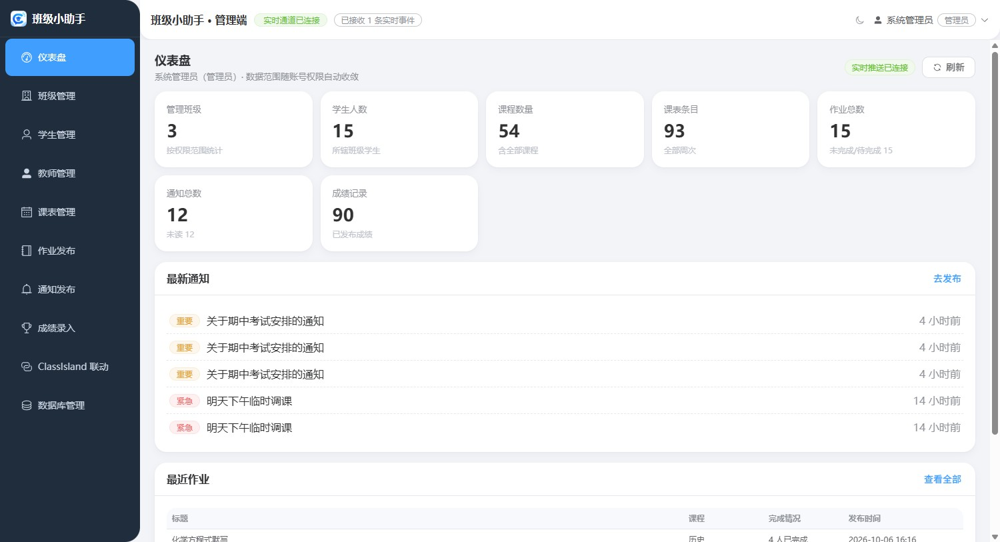

[](https://github.com/LoveChengke/ClassHelper/releases/latest)
[](https://github.com/LoveChengke/ClassHelper/releases)
[](https://github.com/LoveChengke/ClassHelper/issues)
<br/>


[](https://github.com/LoveChengke/ClassHelper)

ClassHelper是给中小学班级用的一套信息管理系统。<br/>
**老师发一条通知，教室那台机器上的灵动岛和 [ClassIsland](https://classisland.tech) 会同时弹出来**；<br/>
学生打开客户端就能看到当天的课表和作业。

#### [🚀 软件下载](https://github.com/LoveChengke/ClassHelper/releases/latest) | [📚 使用文档](docs/index.md) | [🧭 完整参考](docs/reference.md) | [💬 反馈问题](https://github.com/LoveChengke/ClassHelper/issues)

</div>

## 它由什么组成

一份代码，四个交付物：

| 装在哪                     | 是什么                                                                             | 谁在用                 |
| -------------------------- | ---------------------------------------------------------------------------------- | ---------------------- |
| 教师的电脑 / 学校服务器    | **服务端**（Express + Prisma + Socket.IO），同时托管 Web 管理端                     | 其它三端               |
| 浏览器（手机也行）         | **Web 管理端**（Vue 3 + Element Plus，PWA 可安装）                                  | 老师、班主任、管理员   |
| 教室那台机器 / 学生电脑    | **桌面客户端**（Electron + Vue 3），含「灵动岛」浮窗、托盘、离线缓存                | 教室大屏、学生         |
| 教室机器上的 ClassIsland   | **联动插件**（.NET 8 / C#），上报课表与上课状态、把老师的提醒弹到大屏上             | 教室机器               |

老师在 Web 端发布内容 → 服务端落库并按班级房间广播 → 客户端与灵动岛实时更新；
落到 ClassIsland 上的那部分走设备令牌的独立通道，教室网络不好也不影响。

## 功能

### Web 管理端（老师 / 管理员）

- [x] 仪表盘：本班人数、课程、课表、作业、通知、成绩一屏概览
- [x] 班级管理：建班自动生成班级码与班级密码，随时更换班主任、按科目配置各科任课老师
- [x] 学生 / 教师管理：单个录入或导入名单（xlsx / xls / csv / tsv）
- [x] 课表管理：按周排课、单双周，可直接从 ClassIsland 档案导入课表与节次时间
- [x] 作业发布：按「所属日期」归类，支持附件与未交名单
- [x] 通知发布：三档优先级；在**上课时段**发紧急通知会被拦下来并要求二次确认
- [x] 叫人：点名某位同学到办公室，分「普通」与「紧急」两级
- [x] 成绩录入：单条 / 批量 / 表格导入，带等级分布与得分率统计
- [x] ClassIsland 联动：签发设备令牌、下发提醒、把课表镜像回教室大屏
- [x] 数据库管理：连接体检、备份与恢复、SQLite ⇄ MySQL 一键切换
- [x] 手机小屏适配，可「添加到主屏幕」当应用用

### 教室里的桌面客户端

- [x] 班级码登录 —— 学生没有个人账号，一台教室机器代表一个班
- [x] 课表：「今天」时间轴（大时钟 + 正在上 / 下一节 + 距下课倒计时）与周视图
- [x] 作业看板：按科目分卡、可全屏铺满、字号可调，也能切回列表
- [x] 通知中心：未读红点、优先级标签、点击自动标为已读
- [x] 成绩总览：全班成绩表格 + 柱状图 + 等级分布
- [x] 教室机器可直接录入作业、勾选未交名单
- [x] 离线优先：断网回退 IndexedDB 缓存，恢复连接后自动同步
- [x] 浅色 / 深色主题，跟随系统

### 灵动岛（桌面通知浮窗）

- [x] 通知、新作业、叫人都会上岛：先是胶囊，点开是详情卡
- [x] 多条消息展开为竖排列表，按重要程度排序，放不下时提示去应用内看
- [x] **上课时段不打扰**：普通通知暂存到下课再弹；紧急通知与叫人立刻弹
- [x] 尺寸、圆角、字号、主题色、停靠位置（顶部 / 底部 × 左 / 中 / 右）都可以调
- [x] 纯黑 / 毛玻璃 / 主题色渐变三种底
- [x] 触摸屏（希沃白板这类一体机）也能点开

### ClassIsland 联动

- [x] 教室机器上报课表与上课状态，Web 端能看到「现在在上什么」
- [x] 老师发的提醒在教室大屏上全屏弹出，支持语音朗读，播完回执不重复弹
- [x] 可以把 ClassHelper排好的课表镜像回 ClassIsland，不影响老师原有的课表
- [x] 提醒弹在客户端还是 ClassIsland，由教室那台机器自己选

### 部署与运维

- [x] Windows 一键安装：内置 Node 运行时，双击安装、开机自启、自动建库建号
- [x] Linux 一键安装 + `classhelper` 运维命令（systemd 托管，升级 / 回滚 / 备份）
- [x] Docker Compose（MySQL 版与 SQLite 版各一份）
- [x] SQLite 与 MySQL 一键切换，备份与跨库迁移共用同一份 JSON 快照

## 软件截图

> 下面这些图都是脚本把程序真的跑起来截的（`node website/tools/capture-shots.mjs` 与客户端冒烟），不是示意图。

### Web 管理端

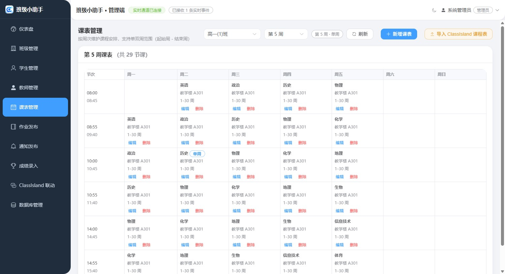

<details>
<summary>展开其余页面……</summary>

| 页面 | 截图 |
| --- | --- |
| 仪表盘 |  |
| 班级管理 | 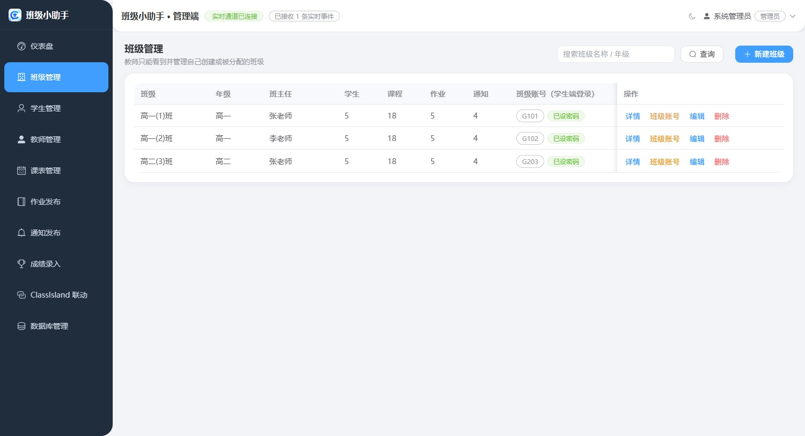 |
| 学生管理 | 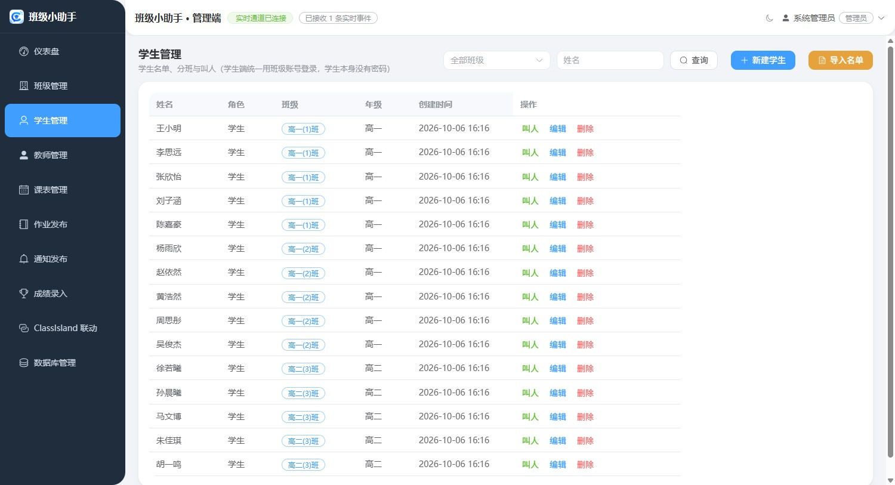 |
| 教师管理 | 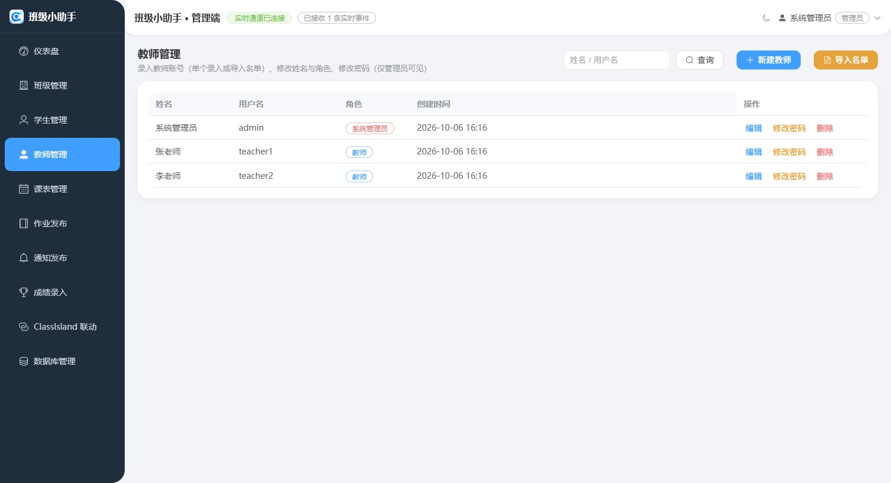 |
| 课表管理 |  |
| 作业发布 | 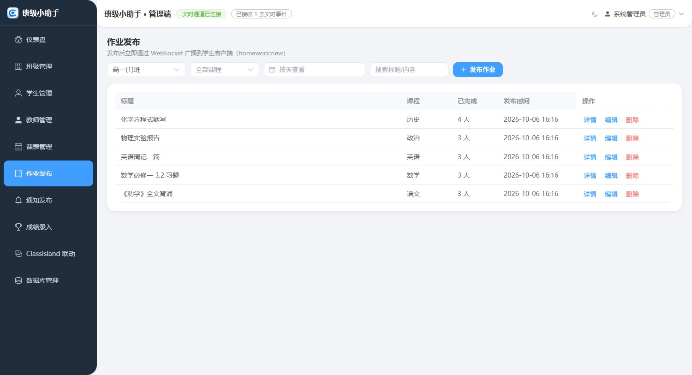 |
| 通知发布 | 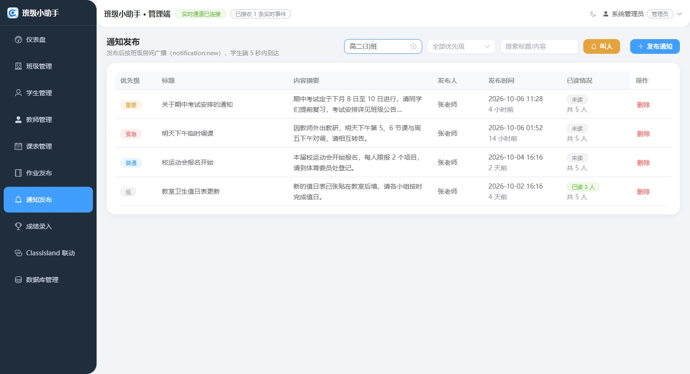 |
| 成绩录入 | 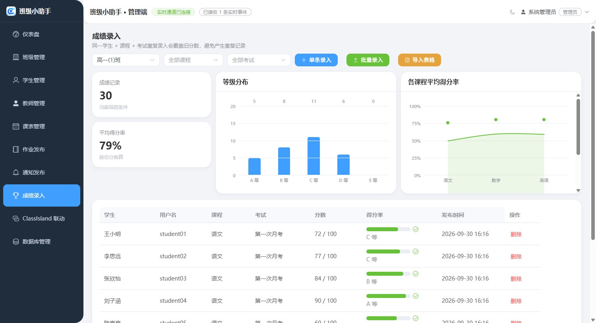 |
| ClassIsland 联动 | 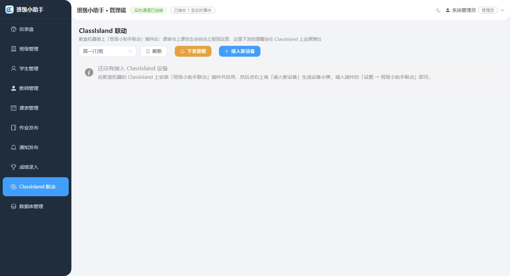 |
| 数据库管理 | 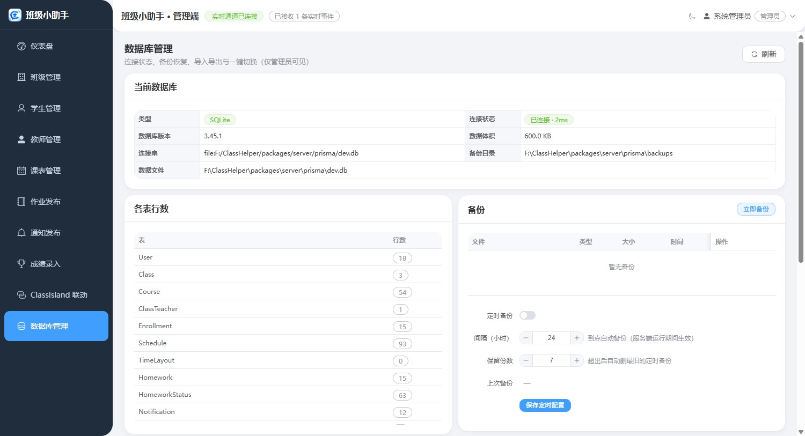 |

</details>

### 教室里的客户端

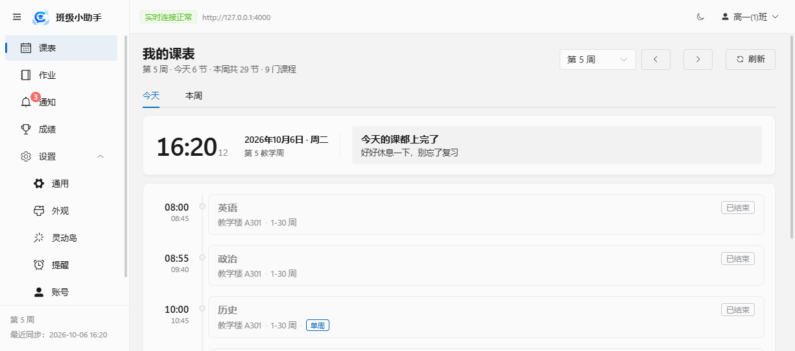

<details>
<summary>展开其余页面……</summary>

| 页面 | 截图 |
| --- | --- |
| 作业看板 | 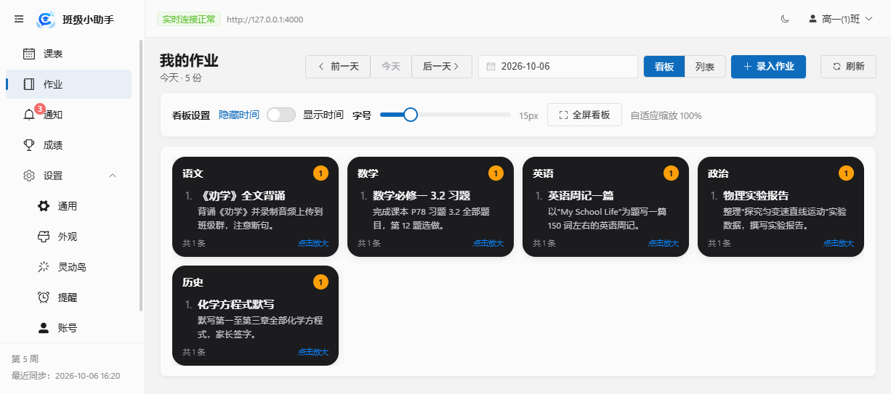 |
| 通知 | 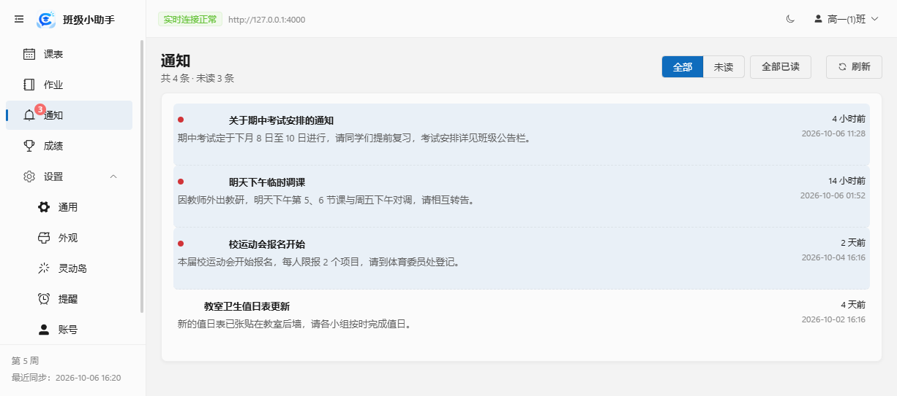 |
| 成绩 |  |
| 设置 · 灵动岛 | 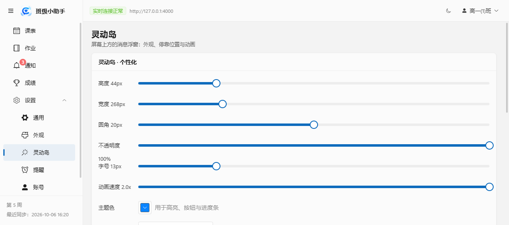 |
| 设置 · 外观（深色主题） | 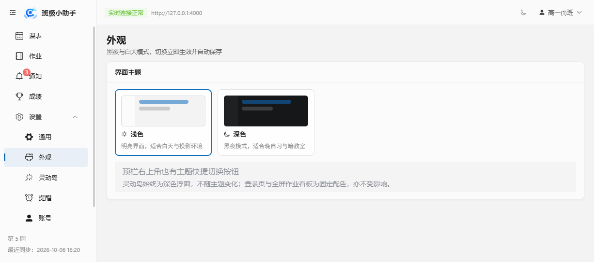 |

</details>

### 灵动岛

| 形态 | 截图 | 说明 |
| --- | --- | --- |
| 新消息胶囊 |  | 非上课时段直接出现，点一下展开 |
| 点开后的详情 | 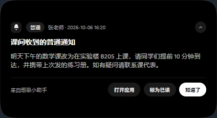 | 标题、内容、时间 + 打开应用 / 标为已读 / 知道了 |
| 多条消息列表 | 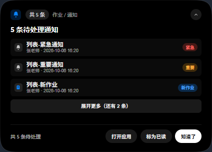 | 按重要程度排序，默认显示三条 |
| 上课期间的紧急通知 | 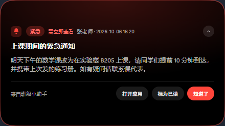 | 卡片内部红色呼吸光晕，无需点击 |
| 下课后补弹 | 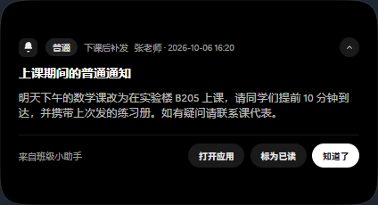 | 上课期间暂存的通知，下课后自动弹出来 |
| 老师叫人 | 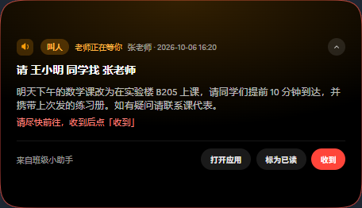 | 「请 XXX 同学找 XXX 老师」 |
| 新作业 | 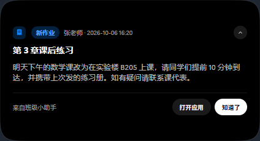 | 教室机器自己录的那条不会弹给自己 |

### 手机上

<details>
<summary>展开……</summary>

| 场景 | 截图 |
| --- | --- |
| 仪表盘 | 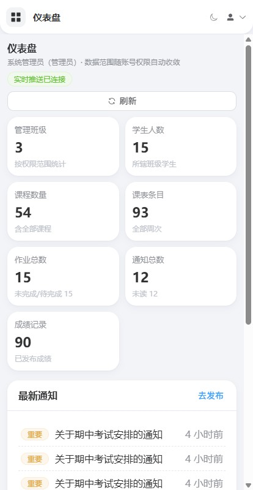 |
| 通知发布 | 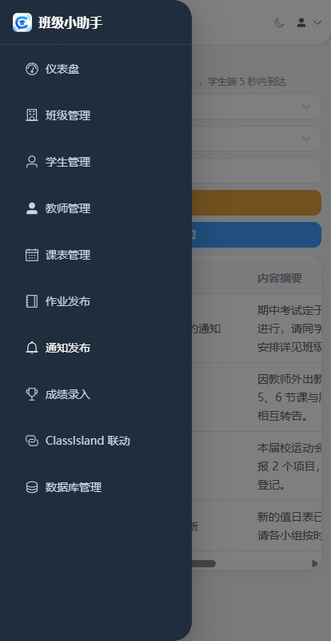 |

</details>

## 开始使用

| 装在哪                  | 装什么                                            | 从 Releases 里拿                                                            |
| ----------------------- | ------------------------------------------------- | --------------------------------------------------------------------------- |
| 教师的电脑 / 学校服务器 | **服务端**（内含 Web 管理端与 Node 运行时）        | `ClassHelper-<版本>-x64-server-setup.exe`                                    |
| 教室机器 / 学生电脑     | **学生客户端**                                    | `ClassHelper-<版本>-x64-client-setup.exe`，或 `-client-portable.exe` 免安装  |
| 教室机器的 ClassIsland  | **联动插件**                                      | `ClassHelper.ClassIslandPlugin.cipx`                                         |

也可以在官网的[下载页](https://lovechengke.github.io/ClassHelper/download.html)上挑：
选一个版本，四个包排成四张卡，文件名、体积与 SHA256 清单都在那儿 ——
那一页的清单是**当场**读 GitHub Releases 的，显示什么就能下什么。

服务端**装上就算跑起来了**：双击安装程序，建库、建号、开机自启都由它自己办，
装完在浏览器打开 `http://<服务器地址>:4000` 就能登录。教师的电脑、学校的服务器、
一台常年开机的机器都可以装。

Linux 服务器有更省事的路子，一行命令装成 systemd 服务，并带上 `classhelper` 运维命令：

```bash
curl -fsSL -o /tmp/classhelper-install.sh https://raw.githubusercontent.com/LoveChengke/ClassHelper/master/deploy/install.sh && sudo bash /tmp/classhelper-install.sh
```

先体检、不改动系统的话，在末尾加上 `--check`。也可以走 Docker Compose，
完整步骤见[部署指南](docs/management/production.md)与 [Linux 运维手册](docs/management/linux-deploy.md)。

## 获取帮助

- **使用文档**：[docs/](docs/index.md) —— 分四块：第一次装、已经在用了、负责运维、要改代码
- **完整参考**：[docs/reference.md](docs/reference.md) —— 功能口径、REST API、权限矩阵、验收证据
- **遇到问题 / 想提需求**：[提交 Issue](https://github.com/LoveChengke/ClassHelper/issues/new/choose)

## 开发

| 层             | 选型                                                                     |
| -------------- | ------------------------------------------------------------------------ |
| 后端           | Node.js ≥ 20.19 + Express 5 + Prisma 7（SQLite / MySQL）+ Socket.IO      |
| Web 管理端     | Vue 3 + Vite + Element Plus + Pinia                                      |
| 桌面客户端     | Electron 44 + Vue 3 + IndexedDB 离线缓存（含独立的灵动岛渲染进程）        |
| ClassIsland 插件 | .NET 8 / C# + Avalonia（ClassIsland 插件 API 2.0）                      |
| 共享契约       | `packages/shared`：类型、常量、权限矩阵、动效令牌                        |

```bash
pnpm install
cp packages/server/.env.example packages/server/.env   # 至少改 JWT_SECRET
pnpm db:generate
pnpm --filter @classhelper/server db:deploy            # 根 scripts 里没有 db:deploy
pnpm build:shared                                      # 三端与 seed 的前置产物
pnpm db:seed
pnpm dev                                               # 后端 4000 + Web 端 5173
```

`pnpm db:seed` 会写一套演示数据（1 管理员 / 2 教师 / 3 个班 / 15 名学生 / 课表 / 作业 / 通知 / 成绩）：

| 角色           | 账号            | 密码         |
| -------------- | --------------- | ------------ |
| 管理员         | `admin`         | `admin123`   |
| 教师           | `teacher1`      | `teacher123` |
| ClassHelper 班级端（班级） | 班级码 `G101`   | `123456`     |

- [AGENTS.md](AGENTS.md) —— 工程约定与本机踩坑，**改代码前先读它**
- [docs/reference.md](docs/reference.md) —— 完整参考（功能行为、接口、验收记录）
- [docs/dev/architecture.md](docs/dev/architecture.md) —— 架构总览

## 致谢

灵动岛的视觉与架构参考 [WinIsland](https://github.com/WinIslandProject/WinIsland)（Windows 上的动态岛）；
动效语言取自 [beUI](https://beui.dev)；产品官网的版式参考 [ClassIsland 官网](https://www.classisland.tech/)。
三端的深色主题、图标与动效令牌都是照这些参考自己实现的，没有引入它们的运行时依赖。

<div align="center">

如果这个项目对你有帮助，欢迎点亮 Star ⭐

</div>
