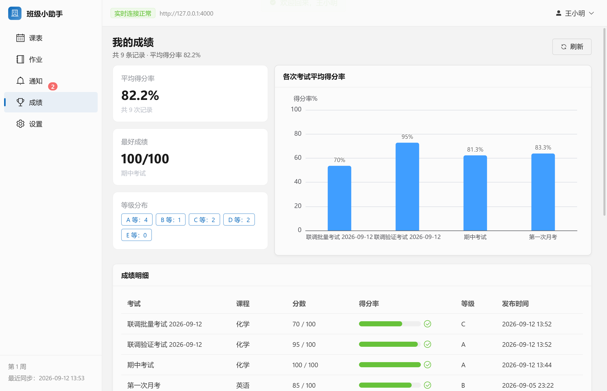

# 班级小助手（Class Helper）

班级信息管理系统。一个 pnpm monorepo，一份代码产出四个交付物：**后端服务**、**Web 管理端**（教师 / 管理员）、
**桌面客户端**（学生端 / 教室机器）与 **ClassIsland 联动插件**（装在教室的 ClassIsland 上）。**当前版本 1.1.2**。

核心链路：

```
教师在 Web 端发布内容
        │  REST API（JWT 鉴权）
        ▼
   后端服务（Express + Prisma）
        │  写库 + 按班级房间广播
        ▼
 Socket.IO ──►  class:{classId} 房间  ──►  学生桌面客户端实时更新 UI（含灵动岛）

ClassIsland（教室机器）──► 联动插件 ──► /api/integrations/classisland/*（设备令牌鉴权）
                                  ▲                            │
                                  └──── 老师下发的提醒 ◄────────┘
```

> 本文档是**产品说明书 + 验收对照表**：功能行为、接口契约与验收证据都在这里。
> 工程约定（改代码前必读）与本机踩坑在 [AGENTS.md](AGENTS.md)；生产部署在
> [docs/production.md](docs/production.md)；切换数据库在 [docs/mysql.md](docs/mysql.md)。
> **改动交付形态 / 新增功能后请一并更新本文**；文中计数均标注实测日期，条目数由脚本自行统计，
> 不要写死容易过期的总数。

## 目录

- [1. 组成部分](#1-组成部分)
- [2. 交付产物与部署形态](#2-交付产物与部署形态)
- [3. 快速开始](#3-快速开始)
- [4. 功能说明](#4-功能说明)
  - [4.1 Web 管理端](#41-web-管理端)
  - [4.2 桌面客户端](#42-桌面客户端)
  - [4.3 灵动岛](#43-灵动岛桌面通知浮窗)
  - [4.4 作业](#44-作业按天查看--教室机器录入)
  - [4.5 叫人](#45-叫人老师点名)
  - [4.6 上课时段策略](#46-上课时段策略)
  - [4.7 表格与 ClassIsland 导入](#47-表格与-classisland-导入)
  - [4.8 ClassIsland 联动](#48-classisland-联动)
  - [4.9 数据库管理](#49-数据库管理仅管理员)
  - [4.10 更新检查](#410-更新检查)
- [5. 技术参考](#5-技术参考)
  - [5.1 目录结构](#51-目录结构)
  - [5.2 技术栈](#52-技术栈)
  - [5.3 REST API 一览](#53-rest-api-一览)
  - [5.4 WebSocket 事件](#54-websocket-事件)
  - [5.5 角色与权限（RBAC）](#55-角色与权限rbac)
  - [5.6 模块化设计](#56-模块化设计)
  - [5.7 数据库与迁移](#57-数据库与迁移)
- [6. 验收](#6-验收)
- [7. 打包与交付](#7-打包与交付)
- [8. 常见问题](#8-常见问题)
- [9. 后续可选增强](#9-后续可选增强)

## 1. 组成部分

| 交付物               | 位置                          | 形态                                                                 | 谁在用                            |
| -------------------- | ----------------------------- | -------------------------------------------------------------------- | --------------------------------- |
| 后端服务             | `packages/server`             | Express 5 + Prisma 7 + Socket.IO，接口前缀 `/api`                    | 其它三端                          |
| Web 管理端           | `packages/web-admin`          | Vue 3 + Vite + Element Plus（构建后由后端托管，PWA 可安装）          | 教师、管理员（手机可用）          |
| 桌面客户端           | `packages/desktop-client`     | Electron + Vue 3，含「灵动岛」浮窗、托盘、离线缓存                   | 学生端 / 教室机器                 |
| 共享契约             | `packages/shared`             | 三端共用的类型 / 常量 / 权限矩阵 / 工具函数                          | 上面三个 + 插件                   |
| ClassIsland 联动插件 | `packages/classisland-plugin` | .NET 8 / C#，装在教室的 ClassIsland 上（上报课表与上课状态、弹提醒） | 教室机器（独立于 pnpm workspace） |
| 官网                 | `website/`                    | 纯 HTML / CSS / JS 的静态页面，**没有构建步骤**                              | 展示与说明（`node website/serve.mjs` 本地预览） |

**设计取舍（与原始提示词的两处偏差，已与用户确认）**：

1. 桌面客户端采用 **Electron + Vue 3**（而非 Avalonia/FluentAvalonia）——需求正文 90% 的内容
   （Socket.IO Client、Pinia、IndexedDB 离线缓存、electron-builder）都基于 Electron；
2. 数据库**先用 SQLite（libSQL 内嵌）跑通，并支持切到 MySQL**：`docs/mysql.md` 给出切换步骤，
   `deploy/` 同时提供 MySQL 版与 SQLite 版 Compose。

## 2. 交付产物与部署形态

| 产物                            | 产物文件位置（打包后）                                                          | 用途                                                                                      |
| ------------------------------- | ------------------------------------------------------------------------------- | ----------------------------------------------------------------------------------------- |
| **服务端 + Web 管理端安装程序** | `releases/server/<版本>/安装包/班级小助手服务端-<版本>-x64-setup.exe`           | 装到教师电脑 / 校服务器即完整系统，**内置 Node 运行时**，双击安装、开机自启、自动建库建号 |
| **服务端 Linux 安装包**         | `releases/server/<版本>/linux-x64/classhelper-server-linux-x64-<版本>.tar.gz`   | 给 `deploy/install.sh` 用（另见同名 `.sha256`）；由 Actions 在 Linux 上构建后挂 Release   |
| **学生客户端安装程序**          | `releases/client/<版本>/安装包/班级小助手-<版本>-x64-setup.exe`                  | 学生机安装（NSIS）                                                                        |
| **学生客户端单文件版**          | `releases/client/<版本>/安装包/班级小助手-<版本>-x64-portable.exe`               | 免安装直接运行（U 盘分发）                                                                |
| Web 管理端（PWA）               | 由服务端在 `/` 直接托管                                                         | 浏览器打开即用，可在 Edge/Chrome 中「安装为应用」；已适配手机小屏                         |
| **ClassIsland 联动插件**        | `releases/classisland-plugin/<版本>/安装包/ClassHelper.ClassIslandPlugin.cipx`  | 装在教室机器的 ClassIsland 上（也可把 `ClassHelper.ClassIslandPlugin/` 目录丢进 Plugins） |

> 这些产物**都不入库**（`releases/` 已 gitignore + eslint ignore）。三个打包脚本**直接输出**到
> `releases/<组件>/<版本>/`，每个版本目录下按 `安装包/`、`免安装/`、`构建中间/` 分层，
> 历史版本原样保留 —— 详见 [AGENTS.md](AGENTS.md) §4。

四种部署形态按场景选（Linux 完整步骤见 [docs/linux-deploy.md](docs/linux-deploy.md)，
其余见 [docs/production.md](docs/production.md)）：

| 场景                                | 形态                                                        | 入口                                                                                     |
| ----------------------------------- | ----------------------------------------------------------- | ---------------------------------------------------------------------------------------- |
| 学校机房 / 教师电脑（Windows 单机） | Windows 服务端安装程序（内置 Node，双击即用）               | `releases/server/<版本>/安装包/班级小助手服务端-<版本>-x64-setup.exe`                    |
| 云服务器 / 多终端共享（推荐长期）   | Docker Compose + MySQL（另有 SQLite 单容器版）              | `deploy/Dockerfile`、`deploy/docker-compose{,.sqlite}.yml`                               |
| 已有 Linux 服务器                   | **一键安装器 + `classhelper` 运维命令**（systemd / docker） | `sudo bash deploy/install.sh`（先 `--check` 体检）；运维见 `classhelper help`            |
| 自定义 / 已有 Node 环境             | 手动部署免安装目录                                          | `pnpm dist:server` → `releases/server/<版本>/免安装/`                                    |

**Linux 服务器最快路径是一行命令**：脚本会自己从 GitHub Release 取最新版服务端包、取发布页上的
`.sha256` 校验，再装成 systemd 服务并带上 `classhelper` 运维命令。完整步骤与验收清单见
[docs/linux-deploy.md](docs/linux-deploy.md)。

```bash
curl -fsSL -o /tmp/classhelper-install.sh https://raw.githubusercontent.com/LoveChengke/ClassHelper/master/deploy/install.sh && sudo bash /tmp/classhelper-install.sh
```

> 参数接在最后即可，例如先只体检（不需要 root、不改动系统）：把末尾换成
> `sudo bash /tmp/classhelper-install.sh --check`。
> **别写成 `bash -c "$(curl …)" --check`**：`bash -c '代码' 第一个参数` 里那个参数会变成 `$0`
> 而不是 `$1`，脚本收不到（实测踩到：想体检却走进了交互式安装）。

## 3. 快速开始

```bash
# 1. 安装依赖（Node >= 20.19，pnpm >= 10）
pnpm install

# 2. 准备环境变量（后端）
cp packages/server/.env.example packages/server/.env
#    → 至少修改 JWT_SECRET；TERM_START_DATE 设为当学期第 1 教学周的周一
#      （它决定"现在是第几教学周"，验证脚本的课表用例也依赖它）

# 3. 生成 Prisma Client、应用迁移、写入种子数据
pnpm db:generate
pnpm --filter @classhelper/server db:deploy   # 注意：根 scripts 里没有 db:deploy
pnpm build:shared                             # shared 是三端与 seed 的前置产物，必须先构建
pnpm db:seed

# 4. 启动（后端 4000 + Web 端 5173 一起启动）
pnpm dev
```

启动后访问：

| 服务                                       | 地址                             |
| ------------------------------------------ | -------------------------------- |
| Web 管理端（开发）                         | http://127.0.0.1:5173            |
| 后端服务首页（浏览器可读，列出已挂载模块） | http://127.0.0.1:4000            |
| 后端 API                                   | http://127.0.0.1:4000/api        |
| 健康检查（含版本号与已挂载模块）           | http://127.0.0.1:4000/api/health |

> 后端只提供 REST API 与 WebSocket，没有业务网页界面。直接访问 `http://127.0.0.1:4000/` 会返回服务首页
> （带 `Accept: application/json` 时返回结构化信息）；其它未匹配路径统一返回
> `{ "success": false, "code": "NOT_FOUND" }`。Web 管理端开发地址是 **5173**，构建后由后端在 4000 托管。
> 也可以分开启动：`pnpm dev:server`（仅后端）/ `pnpm dev:web`（仅 Web 端）。

### 启动客户端（学生端）

```bash
# 开发模式：自动构建主进程 + 启动 Vite 渲染进程(5174) + 打开 Electron 窗口（热更新）
pnpm dev:desktop

# 已构建产物的冒烟验证（不弹窗，跑完自动退出）
pnpm build:desktop
pnpm verify:desktop
```

> Electron 二进制**不会**随 `pnpm install` 自动下载，缺失时先手动装一次（见 [AGENTS.md](AGENTS.md) §7 第 5 条）。

客户端首次启动会带上默认服务器地址 `http://127.0.0.1:4000`，输入**班级码 + 班级密码**
（种子数据：`G101` / `123456`）即可进入班级。想验证「断网可查看缓存」：登录并浏览若干页面后停掉后端
（`Ctrl+C` 结束 `pnpm dev:server`），客户端顶部会提示「当前处于离线状态」并继续显示本地缓存数据，
重启后端后自动同步。

### 端口

| 端口 | 用途                                                       |
| ---- | ---------------------------------------------------------- |
| 4000 | 后端 REST + Socket.IO +（生产 / 构建后）Web 管理端静态托管 |
| 5173 | Web 管理端开发服务器（`/api`、`/socket.io` 代理到 4000）   |
| 5174 | 桌面客户端渲染进程开发服务器                               |

### 默认账号与种子数据

`pnpm db:seed` 会清空业务表并写入一套完整演示数据（计数由种子脚本自己打印，**2026-09-30 实测**：
用户 18（1 管理员 + 2 教师 + 15 名学生名单）/ 班级 3 / 课程 54（每班 18 科）/ 课表 93 / 作业 15 / 通知 12 / 成绩 90）：

| 角色   | 用户名        | 密码         | 说明                                       |
| ------ | ------------- | ------------ | ------------------------------------------ |
| 管理员 | `admin`       | `admin123`   | 可访问全部班级                             |
| 教师   | `teacher1`    | `teacher123` | 张老师：高一(1)班、高二(3)班班主任         |
| 教师   | `teacher2`    | `teacher123` | 李老师：高一(2)班班主任，高二(3)班协作教师 |
| 班级   | 班级码 `G101` | `123456`     | 高一(1)班（**学生端唯一登录方式**）        |
| 班级   | 班级码 `G102` | `123456`     | 高一(2)班                                  |
| 班级   | 班级码 `G203` | `123456`     | 高二(3)班（不是 `G103`）                   |

- 密码由**种子脚本硬编码**（`admin123` / `teacher123` / 班级 `123456`）；`.env` 的
  `DEFAULT_CLASS_PASSWORD` 只决定**新建**班级时的初始班级密码。
- **学生没有个人账号**（2026-10-01 起彻底清理）：学生只是名单记录（成绩 / 未交名单 / 已读人数 / 叫人都按名单），
  没有用户名密码、不能登录；学生端统一用班级码 + 班级密码。
- 教学周由 `TERM_START_DATE`（第 1 教学周的周一）换算，当前周次用于课表默认视图。

### 常用命令

| 命令                                          | 说明                                                                                |
| --------------------------------------------- | ----------------------------------------------------------------------------------- |
| `pnpm dev`                                    | 并行启动 shared(tsc watch) + 后端 + Web 端                                          |
| `pnpm dev:server` / `pnpm dev:web`            | 只启动后端 / 只启动 Web 端                                                          |
| `pnpm dev:desktop`                            | 启动客户端开发模式（Vite 5174 + Electron，热更新）                                  |
| `pnpm build`                                  | 构建 shared + 后端 + Web 端 + 客户端                                                |
| `pnpm build:shared`                           | 只构建 shared（改完 `packages/shared` 必须跑）                                      |
| `pnpm build:desktop`                          | 只构建客户端（esbuild 主进程 / preload + Vite 渲染进程，末尾跑产物凭据门禁）        |
| `pnpm build:classisland-plugin`               | 构建 ClassIsland 联动插件（.NET 8）                                                 |
| `pnpm dist:classisland-plugin`                | 打包插件为 `.cipx` 并归集到 `releases/classisland-plugin/<版本>/`                  |
| `pnpm icons`                                  | 从 `build/classhelper.png` 派生全部图标（PWA / favicon / 托盘 / 安装包 / 插件 / 官网 / 界面内品牌标） |
| `pnpm dist:server`                            | 打包服务端 + Web 管理端（免安装目录 + NSIS 安装程序，内置 Node）                    |
| `pnpm dist:dir`                               | 打包客户端免安装目录 `release/win-unpacked`（最快）                                 |
| `pnpm dist:win`                               | 打包客户端 nsis 安装包 + portable 单文件 EXE                                        |
| `pnpm dist:all`                               | 服务端安装程序 + 客户端安装包 + 插件一起打                                          |
| `pnpm verify:e2e`                             | 后端端到端验收（需服务端已启动）                                                    |
| `pnpm verify:web`                             | Web 管理端真实点击回归（Electron 驱动，需 Web 产物已构建）                          |
| `pnpm verify:desktop`                         | 客户端冒烟（Electron，无人工点击）                                                  |
| `pnpm verify:packaged`                        | 对打包后 / 已安装的客户端 EXE 跑同一套冒烟（`--exe` 指定路径）                      |
| `pnpm verify:classisland`                     | ClassIsland 联动链路（需服务端已启动）                                              |
| `pnpm verify:classisland-plugin`              | 插件静态契约校验（不需要服务端）                                                    |
| `pnpm typecheck`                              | 全仓库类型检查（含 `vue-tsc`）                                                      |
| `pnpm lint` / `pnpm lint:fix`                 | ESLint 检查 / 自动修复                                                              |
| `pnpm format` / `pnpm format:check`           | Prettier 格式化 / 检查（`format:check` 在 master 基线上本就失败，只检查改过的文件） |
| `pnpm db:generate`                            | 生成 Prisma Client（输出到 `packages/server/src/generated/prisma`）                 |
| `pnpm db:migrate`                             | 创建并应用迁移（`prisma migrate dev`；本机不可靠，用 db:deploy）                    |
| `pnpm --filter @classhelper/server db:deploy` | 应用已有迁移（**本机推荐**；根 scripts 里没有 `db:deploy`）                         |
| `pnpm db:seed` / `pnpm db:reset`              | 写入种子数据 / 重置并重播种子                                                       |
| `pnpm db:studio`                              | 打开 Prisma Studio                                                                  |
| `pnpm db:switch:mysql` / `db:switch:sqlite`   | 改写 `schema.prisma` 的 provider（无第二份 schema）                                 |

## 4. 功能说明

### 4.1 Web 管理端

布局沿用 **1Panel 风格**：固定深色侧边栏（`#1f2d3d` + 蓝色圆角选中态）+ 白色顶栏（当前页标题 / 连接状态 / 用户菜单）+
浅灰底 + 白色圆角卡片内容区。手机小屏下侧边栏收进抽屉，由顶栏汉堡按钮唤出。

页面（路由）共 12 个：登录、仪表盘、班级管理、学生管理、教师管理、课表管理、作业发布、通知发布、成绩录入、
ClassIsland 联动、数据库管理、页面不存在。其中**班级管理 / 学生管理 / 教师管理 / 数据库管理**为
`meta.roles: ['ADMIN']`（直接输网址会被挡回仪表盘，服务端同样拦），**ClassIsland 联动**为
`['ADMIN','TEACHER']`。前端隐藏 ≠ 权限：所有写入都由服务层再断言一次。

**新手引导（首次登录 + 随时重看）**：首次登录进入主布局后自动弹出聚焦式引导（Element Plus `el-tour`）：
欢迎页 → 侧边菜单（小屏为汉堡按钮，锚点不存在时卡片自动改为屏幕居中）→ 实时通道状态 → 账号菜单 → 完成。
走完或跳过（右上角 × / Esc）即记为「已看过」（localStorage `classhelper.onboarding`，值为引导版本号，
内容改版后 +1 可让老用户再看一次），之后不再自动弹出；**右上角头像菜单 →「使用引导」可随时重看**。

#### 通用设计令牌

全站圆角与柔和投影集中定义在 `packages/web-admin/src/styles/index.css` 的 `:root` 令牌里，组件层不写死数值；
Element Plus 也通过对齐它的 `--el-border-radius-*` 一并改造：

| 令牌                                | 用在哪                                                    |
| ----------------------------------- | --------------------------------------------------------- |
| `--ch-radius-xl / lg / md / sm`     | 弹窗与抽屉 22px / 卡片 18px / 下拉与提示 14px / 控件 10px |
| `--ch-radius-pill`（999px）         | 标签、开关、进度条、圆形按钮                              |
| `--ch-shadow-sm` / `--ch-shadow-md` | 卡片默认 / 悬停与弹窗                                     |

配套观感：卡片去掉 1px 灰边框（改用轻投影 + 悬停微浮起）、顶栏底部圆角、深色侧栏右侧圆角、
表头底色统一为 `#f7f9fc`、弹窗头尾留白加大。全部通过 CSS 变量与少量类选择器覆盖，未改组件源码。

#### 手机小屏适配

| 断点             | 布局行为                                                                                      |
| ---------------- | --------------------------------------------------------------------------------------------- |
| `> 992px` 桌面   | 常驻 210px 深色侧边栏 + 顶栏显示连接状态与「已接收 N 条实时事件」                             |
| `769–992px` 平板 | 保留侧边栏，内容区内边距压缩（14px）                                                          |
| `<= 768px` 手机  | 侧边栏**不渲染**，顶栏汉堡按钮 → 240px 深色抽屉菜单；顶栏显示当前页标题；用户菜单收成头像图标 |

手机端细节（控件纵向铺满、表格卡片内滚动、弹窗自适应）：抽屉点菜单项自动收起；页面工具栏选择器 / 搜索框 / 按钮
铺满整行；表格在卡片内横向滚动（`overflow-x: auto`）而不让页面横滚；弹窗宽度 `calc(100vw - 24px)`；
详情抽屉宽 86vw 且 `el-descriptions` 由 2~3 列降为单列；统计卡片两列。
实现位置：`src/composables/useResponsive.ts`、`src/layouts/AdminLayout.vue`、`src/styles/index.css`。

实拍（`pnpm verify:web` 自动留档到 `docs/screenshots/web-mobile/`）：

| 场景                                      | 截图                                                                  |
| ----------------------------------------- | --------------------------------------------------------------------- |
| 手机抽屉菜单                              |       |
| 手机通知页（工具栏铺满 + 表格卡片内滚动） |  |
| 手机弹窗自适应                            |           |

> 手机访问：与电脑同一局域网时用 `http://<主机IP>:4000` 打开管理端；支持「添加到主屏幕」（PWA）。

#### 人员与班级（仅管理员）

| 能力                     | 说明                                                                                                                                                  |
| ------------------------ | ----------------------------------------------------------------------------------------------------------------------------------------------------- |
| **教师管理**（独立页面） | 单个录入（姓名 / 用户名 / 初始密码 / 角色）＋导入名单（xlsx/csv）＋编辑（改名 / 改角色）＋修改密码＋删除                                              |
| 录入教师仅管理员         | 页面只对 `ADMIN` 显示，路由 `meta.roles=['ADMIN']`；服务端 `/api/teachers` 全量接口 `requireRole('ADMIN')`（教师调用 403）                            |
| 删除教师有护栏           | 四种情况一律 409：还是**班主任**、名下有课程 / 班级分配、**发布过作业或通知**（后两项也是级联删除，删账号会连带删掉他在各班发过的内容）               |
| 创建班级仅管理员         | `POST /api/classes` = `requireRole('ADMIN')`，教师（含班主任）403                                                                                     |
| **设置 / 更改班主任**    | 新建班级时可选班主任（默认自己）；班级详情顶部「更换班主任」下拉随时改（`PATCH /api/classes/:id/head-teacher`，仅管理员），原班主任仍留在协作教师名单 |
| 学生录入                 | 「学生管理」：单个新建（登录名自动生成）＋导入名单；学生端主体是班级账号                                                                              |

> 学生名单接口（`/api/students`）与教师全量接口（`/api/teachers`）都是 **`requireRole('ADMIN')`**；
> 「班级 → 学生名单」（`/api/classes/:id/students`）读接口对班级可见，写接口为 ADMIN/TEACHER（服务层再按班级角色兜底）。

#### 授课科目统一

全校固定科目目录定义在 `@classhelper/shared` 的 `SUBJECT_CATALOG`（共 18 科）：语文 / 数学 / 英语 / 政治 /
历史 / 物理 / 化学 / 地理 / 生物 / 信息技术 / 体育 / 美术 / 音乐 / 班会 / 早读 / 晚读 / 通用技术 / 听力。

- 课表「新增课表」与成绩「单条 / 批量录入」的**科目下拉直接列出这个统一目录**（该班还没有的科目显示在
  「统一科目（选中后自动建课）」分组里）；
- 选中后由前端自动为该班 `POST /api/courses` 建同名课程（已存在则复用），再写入课表 / 成绩 ——
  科任与班主任都不必先去「班级 → 课程」把科目建一遍；
- ClassIsland 课程表导入本来就会按导入内容自动补建课程，两者口径一致。

#### 登录页

管理端与客户端登录页都**不含任何示例 / 演示内容**（没有「演示账号点击填充」、没有示例班级码占位符、
不提示种子账号）；`verify:web` 与 `verify:desktop` 各自断言登录页正文与占位符里不出现
`演示 / 示例 / admin123 / teacher123 / G101` 等字样，防止以后又被加回去。

### 4.2 桌面客户端

#### 进程结构与安全基线

| 进程     | 文件                                  | 职责                                                                                                 |
| -------- | ------------------------------------- | ---------------------------------------------------------------------------------------------------- |
| 主进程   | `src/main/*` → `dist/main/index.js`   | 窗口 / 单实例锁、配置持久化（`safeStorage` 加密 token）、IPC、托盘、灵动岛、冒烟验证                 |
| 预加载   | `src/preload/*` → `dist/preload/*`    | 通过 `contextBridge` 暴露最小 API（配置读写 / 应用信息 / 灵动岛控制），**不暴露 `ipcRenderer` 本体** |
| 渲染进程 | `src/renderer/**` → `dist/renderer/*` | Vue 3 界面、Axios 请求、Socket.IO 实时、IndexedDB 离线缓存                                           |

- `contextIsolation: true`、`nodeIntegration: false`、`sandbox: true`、`webSecurity: true`；
  外部链接一律交给系统浏览器，禁止应用内导航到非本地地址（按**同源 / 同一文件**精确比对，不是 `startsWith`）。
- 渲染进程启用 **CSP**（`index.html` / `island.html` 的 `meta http-equiv`）：渲染进程能通过桥接拿到明文登录令牌，
  CSP 是唯一能拦住「加载并执行远程脚本」的那一层；灵动岛窗口另有独立导航防线（拒绝一切导航与新开窗口）。
- **主窗口初始尺寸与 ClassIsland 对齐（1242×582）**：数值是从运行中的 ClassIsland 主窗口实测来的，启动时居中显示；
  窗口底色按主题设置，避免深色下「先白后黑」。
- **产物里不得出现任何凭据**：`app.asar` 可直接解包，因此冒烟 / 自检用的账号口令一律由
  `scripts/smoke.mjs` / `scripts/verify-packaged.mjs` 通过环境变量（`ELECTRON_SMOKE_USER` /
  `ELECTRON_SMOKE_PASSWORD` / `..._CLASS_CODE` / `..._CLASS_PASSWORD`）注入；`pnpm build:desktop` 结尾会跑
  `check-bundle-secrets` 门禁，产物里一旦出现种子口令即构建失败。

#### 功能页面

| 页面 | 功能                                                                                                                                                                       |
| ---- | -------------------------------------------------------------------------------------------------------------------------------------------------------------------------- |
| 登录 | 服务器地址 + **班级码 + 班级密码**，附带「测试连接」；已登录但服务器不可达时可「离线进入」；下方有「查看使用引导」入口                                                     |
| 课表 | 按周展示 7 列课表（周次下拉 + 单双周标签），另有「今天」时间轴视图（大时钟 + 当前状态卡 + 已结束 / 正在上 / 下一节）                                                       |
| 作业 | **看板模式**（按科目卡片、全屏放大、显示时间开关、看板字号）＋列表模式、详情抽屉、附件链接（只接受 `http(s)://` 或站内相对路径）；教室设备可**录入作业**与勾选**未交名单** |
| 通知 | 未读红点（侧边栏徽标）、优先级标签、点击自动标为已读、全部已读、未读过滤、详情抽屉                                                                                         |
| 成绩 | 班级账号看到**全班成绩总览**：表格（分数 / 得分率 / 等级）+ 柱状图 + 等级分布 + 最近更新（图表为内置 HTML/SVG 实现，不引图表库）                                           |
| 设置 | 六个子页：通用、外观、灵动岛、提醒、账号、关于（见下）                                                                                                                     |

#### 设置改版：分组侧边栏 + 子页 + 深色模式 + 关于页

**侧边栏（ClassIsland 同款 NavigationView）**：主侧边栏是**四个一级项**（课表 / 作业 / 通知 / 成绩）
加上一个**可展开分组**「设置」（通用 / 外观 / 灵动岛 / 提醒 / 账号 / 关于，每个子项是独立路由
`/settings/*`）；顶部**汉堡按钮**把整栏收成 64px **图标导轨**（折叠状态持久化到主进程配置，重启仍记忆）。
收放是连续的 CSS 过渡（栏宽 + 文字收放 + 图标位移，260ms），全程没有结构切换；导轨里文字淡出、
分组子项与一级项都以图标列出、图标与汉堡按钮同一竖列，**整条导轨一眼看全、不出滚动条**
（页脚在折叠态连高度一起收掉）。红点徽标仍挂在「通知」项图标右上方。

**设置子页**：原单页设置按卡片拆为 6 个子页 —— 通用（服务器连接 + 离线缓存 + 作业录入短语 +「使用引导」）、
外观、灵动岛、提醒、账号、关于；`/settings` 重定向到 `/settings/general`。

**黑夜 / 白天模式**：外观子页选「浅色 / 深色」，顶栏右上角有日月快捷切换按钮；切换立即生效
（`html.dark` + Element Plus dark css-vars + 品牌变量覆盖）并写入主进程配置（`theme` 字段）。
颜色一律走 `--ch-*` / `--el-*` 变量；**灵动岛、登录页、全屏作业看板刻意固定深色**，不随主题变化。

**关于页**：应用信息（版本 / Electron / Chromium / Node / 常用链接）、诊断信息（服务器与连接状态、
缓存条目、数据目录、配置文件路径）、鸣谢。

#### 初次启动引导（六步向导，可重看）

客户端**首次启动**（配置里没有 `onboardingDone`）会在登录页上自动弹出六步向导：
欢迎 → 连接服务器 → 登录班级 → 登录之后（主界面与离线缓存）→ 灵动岛提醒 → 完成。
完成或跳过（右上角「跳过引导」/ Esc）都会把 `onboardingDone: true` 写入主进程配置，之后不再自动弹出；
**登录页「查看使用引导」与「设置 → 通用 → 使用引导」可随时重看**。引导是自绘遮罩 + `v-if`
（`renderer/components/OnboardingWelcome.vue`），关闭即从 DOM 卸载（不用 el-dialog，避免「关闭后 DOM 残留」
的断言陷阱）；显隐由 `stores/onboarding.ts` 承载，登录页 / 设置页 / App.vue 三处共用一个开关。

#### 作业看板（学生端）

默认按科目分卡片（每张卡列该科作业，条目可点开详情），工具栏可切「看板 / 列表」、开关「显示时间」、
拖「字号」（11–28px 即时生效），点卡片或「全屏看板」进入全屏放大视图；这些偏好写入客户端配置
（`homeworkBoard`），重启后仍生效。

| 需求                       | 实现                                                                                                                                                                                   |
| -------------------------- | -------------------------------------------------------------------------------------------------------------------------------------------------------------------------------------- |
| 只看当天的作业             | 工具栏「只看今天」开关（默认开）：按 `Homework.assignDate`（本地日期）过滤，昨天的作业不再混进看板                                                                                     |
| 作业要完整显示             | 卡片里同时渲染**标题 + 作业要求全文**（`white-space: pre-wrap`，不截断），列表模式也有「作业要求」列                                                                                   |
| 全部铺满屏幕、不用上下翻页 | 看板外层高度固定 + `overflow: hidden`，按「内容高度 / 可用高度」算缩放系数用 `transform: scale()` 整体缩到刚好放下（字号仍由滑块决定，工具栏显示当前缩放比例）                         |
| 全屏看板要自适应           | 全屏弹窗打开后按「可用宽 × 可用高」枚举 1..N 列，取**单卡面积最大且宽高比最接近 1.15** 的方案注入 `--board-cols`（`fitFullscreen()` 轮询等待弹窗挂载后再算）；列数变了再量一次缩放系数 |
| 当天时间显示在标题栏正中   | 全屏看板标题栏用 `#header` 插槽：标题左对齐、当天日期时间**绝对居中**显示（受「显示时间」开关控制，每分钟刷新）                                                                        |
| 未交名单                   | 作业列表 / 详情里点「未交名单」→ 勾选**没交作业**的同学 → 保存后其余同学自动标记为已完成（`PATCH /api/homeworks/:id/submissions`）；Web 管理端作业详情抽屉里同样可看可改               |

#### 界面风格（ClassIsland 同款 Fluent）

- 浅色 Mica 底（`#f3f3f3`）+ **半透明亚克力卡片**（`rgba(255,255,255,.7)` + `backdrop-filter: blur(20px)`）
- 强调色 `#0F6CBD`（悬停 `#115EA3`）；选中导航项 = 强调色淡底 + **左侧 3px 强调条**
- 圆角统一：卡片 8px / 控件 4px；描边用半透明黑（`rgba(0,0,0,.06)`）代替灰线；阴影极轻
- 字体 `Segoe UI Variable / 微软雅黑 UI`；表头无底色、行分隔为 1px 细线；滚动条改为细圆角
- Element Plus 变量（`--el-color-primary`、`--el-border-radius-base` 等）整体对齐上述规范

**课表「今天」时间轴（ClassIsland 标志性观感）**，`今天 / 本周` 双标签：

| 元素       | 说明                                                                                                                                                                |
| ---------- | ------------------------------------------------------------------------------------------------------------------------------------------------------------------- |
| 大时钟     | 时:分 大字 + 秒小字（每秒刷新）+ 日期 / 星期 / 第 N 教学周                                                                                                          |
| 当前状态卡 | 「正在上 XXX」+ 时段地点 + **距下课 X 分钟**；无课时显示「今天的课都上完了 / 今天没有课程安排」                                                                     |
| 时间轴     | 左侧时间栏（开始 / 结束）+ 竖向轨道与节点 + 右侧课卡：**已结束**（置灰）、**正在上课**（强调色实底 + 进度条 + 距下课倒计时）、**下一节**（橙色标记 + 还有多久开始） |
| 周视图     | 保留「节次 × 星期」表格（`本周` 标签）                                                                                                                              |

实拍（`docs/screenshots/client/`）：

| 页面                  | 截图                                                         |
| --------------------- | ------------------------------------------------------------ |
| 课表 · 今天（时间轴） |  |
| 作业                  |       |
| 通知                  |   |
| 成绩                  |          |
| 设置                  |        |

#### 个性化设置与系统托盘

| 设置项          | 区间 / 取值                                | 说明                                                                                                                                                               |
| --------------- | ------------------------------------------ | ------------------------------------------------------------------------------------------------------------------------------------------------------------------ |
| 灵动岛高度      | 36–72px                                    | 胶囊高度（默认 44）；展开卡按同差值联动                                                                                                                            |
| 灵动岛宽度      | 220–420px                                  | 默认 268；展开卡按差值联动                                                                                                                                         |
| 圆角            | 8–32px                                     | 默认 20；胶囊取 `min(圆角, h/2)`，展开卡取 `min(48×圆角/20, w/2, h/2)`                                                                                             |
| 不透明度        | 40%–100%                                   | 窗口整体不透明度（所有显示路径都会应用，含「隐藏后再弹出胶囊」）                                                                                                   |
| **字号**        | **11–20px**（默认 13）                     | **基础字号**：岛内所有文本 = 基础字号 × 排版系数（标题 1.08 / 正文 0.95 / 次要 0.78 / 徽标与按钮 0.76 / 胶囊标题 0.92 / 胶囊副题 0.74）                            |
| 动画速度        | 0.5×–2×                                    | 形变 / 淡入时长倍率                                                                                                                                                |
| 主题色          | 取色器（默认 Apple 系统蓝 `#0a84ff`）      | 用于高亮、按钮、进度条、主题色风格                                                                                                                                 |
| **视觉风格**    | **纯黑（默认）/ 毛玻璃 / 主题色渐变**      | 纯黑 = WinIsland `default`；毛玻璃 = **CSS 半透明深色卡**（`rgba(32,32,36,.804)`）。**不用** `setBackgroundMaterial()`：它是整窗系统材质，会把卡片外那一圈垫成白底 |
| **显示位置**    | **顶部 / 底部 × 左 / 中 / 右（6 个锚点）** | 默认「顶部居中」；按 `workArea` 计算，顶 / 底决定不动的是上边还是下边，左 / 中 / 右决定水平锚点                                                                    |
| 左右 / 上下边距 | 0–200px / 0–160px（默认都是 8px）          | 贴边距离。**左右边距只在「左 / 右停靠」时生效**：默认「顶部居中」的水平锚点就是屏幕中线，设置页会把该滑块置灰并说明                                                |
| 跟随鼠标屏幕    | 开 / 关                                    | 多显示器教室电脑：岛出现在鼠标所在那块屏                                                                                                                           |
| 动画开关        | 开 / 关                                    | 关闭后展开 / 收起瞬时生效（不再逐帧插值）                                                                                                                          |
| 始终置顶        | 开 / 关（默认开）                          | 对应 `setAlwaysOnTop`                                                                                                                                              |
| **空闲细缝**    | **开 / 关（默认关）**                      | 参考 WinIsland `hidden_width`：开启后没有消息时不再完全隐藏，而是留一条 6px 宽的竖条                                                                               |

- 越界值在**主进程**统一夹紧（`normalizeIslandAppearance`），用户填坏配置也不会让布局错乱。
- 「预览效果」按钮会本地推一条通知，立刻看到当前尺寸 / 配色 / 动画；预览走 `context.preview` 专用通道
  （示例岛直接展开、失焦不收起、30 秒后自行消失、点「知道了」不留残影）。
- 落盘位置：客户端 `config.json` 的 `island` 字段（旧配置没有该字段时自动补默认值，向后兼容）。
- **没有改密入口**（按用户要求主动移除）：班级密码由管理员在 Web 端「班级管理 → 修改班级账号」维护，
  教师 / 管理员本人密码在 Web 管理端顶栏下拉修改 —— 防止教室机器上误改班级密码后其他机器被锁在门外。

**系统托盘**：关闭主窗口不退出程序，而是隐藏到托盘后台继续接收通知；托盘图标（左键单击 / 双击）恢复主窗口，
右键菜单提供「显示主窗口 / 隐藏到托盘 / 退出班级小助手」。退出时统一清理：销毁托盘 → 销毁灵动岛
（含帧循环与定时器）→ 销毁全部窗口，并用 `app.exit(0)` 兜底，任务管理器中不留残留进程。

#### 离线缓存与自动同步

```
                     ┌────────────── 在线 ──────────────┐
请求 → fetchWithCache(store, key, loader, fallback)
                     └── 失败 → 读取 IndexedDB 缓存 → 返回旧数据（UI 标记"离线缓存"）
实时推送(notification:new / grade:updated ...) → 更新内存状态 + 写回 IndexedDB
服务器不可达 → 可达（health 轮询 20s 或任意请求成功）→ 触发 onServerRecovered → 各页自动重新拉取
```

- 缓存按业务域分为 6 个 object store：`profile` / `classes` / `schedules` / `homeworks` / `notifications` / `grades`。
- 缓存写入前统一做 JSON 纯化（Vue 响应式对象是 Proxy，直接写入 IndexedDB 会抛 `could not be cloned`）。
- 登录令牌由主进程用 Electron `safeStorage`（Windows 下为 DPAPI）加密后落盘，因此重启客户端可离线进入；
  令牌缺失 / 失效时保持缓存资料可见，恢复网络后自动刷新。

### 4.3 灵动岛（桌面通知浮窗）

客户端有一个独立于主窗口的**灵动岛**：无边框、透明、置顶、不占任务栏的窗口，是「消息到达」的第一现场。
视觉与架构参考 [WinIsland](https://github.com/WinIslandProject/WinIsland)（Rust/Direct2D 的 Windows 动态岛）：
连续圆角（超椭圆 squircle）而非 `border-radius`、纯黑 / 半透明毛玻璃 / 主题色三种底、Apple 系统色强调色、
白字 alpha 分级、所有文本 = 基础字号 × 排版系数、6 个停靠位、可选「空闲细缝」。
逐项 token 见 [docs/winisland-design-tokens.md](docs/winisland-design-tokens.md)。

**架构要点**（照搬 WinIsland 的做法，而不是「仿个外观」）：

- 窗口一次创建成**固定包围盒**（最大形态 + 阴影留白），开合过程中**一帧都不移动 / 缩放窗口**；
  形变全部发生在窗口内的渲染层，由 WinIsland 的弹簧驱动（`spring.ts`），并加**零过冲钳制**。
- 鼠标命中照搬 `set_cursor_hittest`：窗口默认 `setIgnoreMouseEvents(true, { forward: true })` 整块穿透，
  渲染层做命中测试后只在指针进入岛体时打开命中 —— 大窗口不会吞掉桌面点击；
  另有**双保险**：渲染进程上报岛体矩形，主进程每 120ms 用 `screen.getCursorScreenPoint()` 校正命中。
- **触摸屏（希沃白板等）走「触摸模式」**：上面两条链路都以「鼠标指针移动」为前提，而手指触摸既不产生
  mousemove 也不移动系统光标 ⇒ 窗口会永远停在穿透态、手指点不开岛。修法是渲染进程按
  `navigator.maxTouchPoints > 0` 上报触摸模式，主进程把窗口**贴合岛体**并**始终接收输入**
  （Windows 上唯一可行的办法，Electron 没有 `SetWindowRgn` 那种窗口区域能力）。
  三条护栏：变小要等岛真的收小、命中矩形按窗口实际尺寸算、失焦宽限期放宽到 1200ms。非触摸屏机器不走这条路。
- **卡片投影（CSS `filter`）必须常驻**，形态切换只改参数 —— 给元素增删 filter 会让 Chromium 重建渲染表面，
  首帧可能被当成空内容画出去（表现为开合瞬间底座闪一下）。

| 场景                              | 灵动岛行为                                                                                                                                              |
| --------------------------------- | ------------------------------------------------------------------------------------------------------------------------------------------------------- |
| 收到通知（非上课时段）            | **直接出现胶囊**（无入场动画）：`新消息 · 共 N 条` + 发送人 + `点击查看`                                                                                |
| 多条未处理消息                    | 胶囊标题汇总类型 `新消息：叫人/作业/通知（共 3 条）`，右侧附类型小标签                                                                                  |
| 点击胶囊（只有一条）              | 展开为**详情卡**：标题、内容、时间、`打开应用 / 标为已读 / 知道了`                                                                                      |
| **点击胶囊（多条）**              | 展开为**竖排列表**：按**重要程度**排序（紧急 > 重要 > 普通 > 低，同级按时间新的在前），默认**只显示前三条** + `展开更多（还有 N 条）`；列表只有一排按钮 |
| **点「展开更多」**                | 把放得下的通知都铺出来；铺到工作区下沿（任务栏）仍放不下时改成 `更多请前往应用内操作`（卡片高度始终 ≤ 可用高度）                                        |
| **多条时的「知道了 / 标为已读」** | 都是**整批**操作：`知道了` 整批关闭（通知中心仍为未读）、`标为已读` 把这一批全部标为已读并关闭；两者都是状态同步清空 + 窗口淡出隐藏                     |
| **上课时段的「普通叫人」**        | **不自动展开**（不打断课堂），但保留胶囊并**允许学生主动点开**；下课自动展开（`isOpenable`：紧急消息与任何叫人都可点开）                                |
| **收起后胶囊常驻**                | 自动 / 手动收起只把卡片回缩为胶囊，**有未处理通知时胶囊不会消失**；彻底消失只在「知道了 / 标为已读」、队列清空或进入上课时段                            |
| 点击卡片空白处 / 屏幕任意位置     | 回缩为**胶囊**（不直接消失，仍可再次点开）；展开时窗口临时可聚焦，点到别处即失焦收起                                                                    |
| **点「标为已读」**                | 通知中心同步标记已读、未读红点立即减少（多条时是整批）                                                                                                  |
| **新作业发布**                    | 也上岛：胶囊显示「新作业」（青蓝描边 + 书本图标），展开可见作业要求；**本机刚录入的那条不上岛**（自己通知自己没意义）                                   |
| **紧急叫人**（老师点名 · 紧急）   | **上课时段也立即展开**：琥珀金卡片、`叫人` 徽标、「请 XXX 同学找 XXX 老师」、按钮为「收到」                                                             |
| **普通叫人**（默认级别）          | 课间先显示 `叫人` 胶囊、点击展开；**上课时段只进队列**（不打断课堂），下课后自动弹出详情                                                                |
| 上课时间段收到普通通知            | **完全不显示**（窗口直接隐藏）并进入待发队列；下课后自动弹出详情 → 收起为胶囊                                                                           |
| 上课时间段收到**紧急**通知        | **无论是否上课立刻展开**（带内部红色呼吸光晕与「紧急」角标，无需点击），45 秒后收起                                                                     |
| 上课时间段内的任何点击            | 一律不显示（不会展开、也不会回缩出胶囊），只有紧急通知能出现在屏幕上                                                                                    |
| 退出 / 断开                       | 主窗口退出时灵动岛一并关闭；上课状态来自 `GET /api/schedules/current`                                                                                   |

- 动画：展开 300ms、收回 220ms，统一 `easeOutCubic` 且**单调不过冲**（早期用过冲弹簧，观感是「开合时震一下」，已移除）；
  形变由窗口内弹簧逐帧逼近目标尺寸 / 圆角，锚点取整数且与窗口尺寸无关，卡片宽度取偶数 —— 冒烟逐帧采样窗口矩形与卡片
  屏幕矩形，对「中心波动 = 0px、上边缘波动 = 0px、窗口全程冻结」做断言。
- 光晕：紧急形态的红色呼吸光晕**只用 inset 阴影**画在卡片内部（窗口比卡片只大 2~4px，向外的 box-shadow 会被裁成硬边）；
  冒烟有像素断言守着（截图最外圈偏红像素必须为 0）。
- 事件流：`notification:new` → `renderer/stores/realtime.ts` → `pushNotificationToIsland()` → 主进程
  `IslandController`（决定隐藏 / 胶囊 / 详情）→ 灵动岛渲染进程 `src/island/IslandApp.vue`。
- **多条通知的列表形态**：卡片高度、能显示几行、要不要「展开更多」由 `@classhelper/shared` 的 `islandListLayout()`
  统一算出 —— **主进程与渲染进程各算一次同一个数**（主进程据此把窗口包围盒长高，渲染进程据此排版）；
  改 `IslandApp.vue` 里列表相关 CSS 的尺寸必须同步改那份度量。
- **点「知道了 / 标为已读」后的收起**：状态**同步**落地（调用方与冒烟立刻看到清空），窗口随即淡出隐藏；
  **没有跨进程的收回握手**（早先自研的「缩回胶囊再淡出」快照动画因触摸屏上会露旧帧，已整体删除）。
- **本机录入的作业不上岛**：服务端是「先广播 `homework:new`、后回响应」的，因此 `renderer/island/bridge.ts`
  在**发请求之前**就按内容登记指纹（班级 + 日期 + 标题 + 正文），回执拿到 id 后再补记一次，投递前用 id / 指纹双重判定。
- 相关文件：`src/main/island.ts`（控制器 + IPC）、`src/preload/island.ts`、`src/island/{IslandApp.vue,spring.ts,squircle.ts}`、
  `src/renderer/island/bridge.ts`。

各形态实拍（由 `pnpm verify:desktop` 自动截取并归档到 `docs/screenshots/island/`，并做像素级校验）：

| 形态                     | 截图                                                                | 尺寸（逻辑 / 图片） | 说明                                              |
| ------------------------ | ------------------------------------------------------------------- | ------------------- | ------------------------------------------------- |
| 下课后自动弹出详情       |  | 424×230 / 848×460   | 上课期间暂存的通知，下课后自动弹出                |
| 上课期间紧急通知         |     | 440×246 / 880×492   | 卡片**内部**红色光晕 + 紧急角标，无需点击         |
| 非上课时段「新消息」胶囊 |             | 268×44 / 536×88     | 直接出现（无入场动画），点击后展开                |
| 点击胶囊后的详情         |          | 424×230 / 848×460   | 标题 / 内容 / 时间 + 打开应用 / 标为已读 / 知道了 |
| 新作业胶囊 / 叫人卡片    | `island-7-homework.png` / `island-8-call.png`                       | 424×230 / 456×262   | 作业与叫人各自的配色与徽标                        |

> 截图路径可用 `ISLAND_SHOTS_DIR` 覆盖（默认 `.cache/island-shots/`）。

### 4.4 作业（按天查看 · 教室机器录入）

作业以**所属日期**（`Homework.assignDate`，本地日期 `YYYY-MM-DD`）归类，而不是录入时间：
晚上 8 点留的作业算今天（`createdAt` 是 UTC，直接切片会算成明天）。

| 能力             | 客户端（教室机器）                                                | Web 管理端                     |
| ---------------- | ----------------------------------------------------------------- | ------------------------------ |
| 按天查看         | 日期选择器 + 前 / 后一天 + `?date=` 深链                          | 工具栏日期选择器（同一套接口） |
| 有作业的日期高亮 | ✅ 日期下带圆点（`GET /api/homeworks/days`）                      | ✅ 同上                        |
| 录入作业         | ✅ 教室机器直接录（班级账号可 `POST /api/homeworks`，归属班主任） | ✅ 发布时可选所属日期          |
| 未交名单         | ✅（班级设备）                                                    | ✅                             |

- 客户端作业模块**不再显示「已完成 / 待完成」**：完成状态是老师端与通知中心的概念，教室机器上只做「看作业 + 录作业」
  （服务端的完成数据与统计接口保持不变，Web 端照旧可用）。
- 可点**快捷短语**（默认 `P` / `大本` / `小本` / `卷子` / `背诵` / `默写` / `听写` / `预习` / `订正` / `读书`，
  定义在 `@classhelper/shared` 的 `HOMEWORK_PHRASE_DEFAULTS`），点一下追加到标题或内容；
  短语在客户端「设置 → 通用」里增删，存在本机配置里。
- 接口：`GET /homeworks?date=YYYY-MM-DD`（按天）、`GET /homeworks/days?classId=&from=&to=`（哪些天有作业）、
  `POST /homeworks`（附 `assignDate`；**班级账号也能调用**，用于教室机器录入）。
- **截止时间功能已下线**（接口不再返回 `dueAt`）。

### 4.5 叫人（老师点名）

老师在 **Web 管理端 → 学生管理 → 叫人**（或 **通知发布 → 叫人**）选中学生，配合**快捷短语**或**自定义消息**发送。
学生管理页是管理员专属，而班主任与科任老师都需要叫人，因此教师的叫人入口在「通知发布 → 叫人」。

| 级别         | 落库级别 | 学生端行为                                                                                                |
| ------------ | -------- | --------------------------------------------------------------------------------------------------------- |
| **普通叫人** | `HIGH`   | 课间：先显示「叫人」胶囊，点击展开；**上课时段：只进队列、不打断课堂**，下课后自动弹出详情（90 秒后收起） |
| **紧急叫人** | `URGENT` | **无视上课时段立即展开**（与紧急通知同待遇），上课时被收起后仍保留胶囊、可再次点开                        |

两档的卡片都是「请 XXX 同学找 XXX 老师」+ 具体事由，徽标 `叫人`、按钮「收到」（复用通知已读机制）。

| 位置       | 行为                                                                                                                                                          |
| ---------- | ------------------------------------------------------------------------------------------------------------------------------------------------------------- |
| 服务端     | `POST /api/calls`（教师 / 管理员）→ `urgent: true` 落库 `URGENT`，否则 `HIGH` + 广播 `notification:new`（班级房间）与 `call:new`（定向到被叫学生 / 班级设备） |
| 快捷短语   | `CALL_QUICK_PHRASES`（共享常量，8 条）：请到办公室 / 讲台 / 实验室 / 门卫处找我、请带上作业本 / 试卷找我、请到教室门口等我、请马上来一趟；点击选中，再点取消  |
| 自定义消息 | 输入框内容优先于快捷短语（最长 200 字），例如「带上昨天的数学作业到办公室」                                                                                   |
| 客户端     | `call:new` → 灵动岛 `kind=call`；**是否立即展开只由 `priority` 决定**，与普通通知共用同一条排队 / 隐藏 / 下课弹出路径                                         |
| 权限       | 学生调用被拒 403；教师只能叫自己班级的学生（跨班 / 不在本班返回 400 / 403）                                                                                   |

### 4.6 上课时段策略

「上课时段」由课表实时判定：`GET /api/schedules/current?classId=` 返回
`{ inClass, current, next, week, serverTime }`（`at` 参数可覆盖判定时刻，便于联调与测试）。

**服务端强制拦截**（不是只靠前端提醒）：

```
POST /api/notifications  { classId, title, content, priority: "URGENT" }      → 409 URGENT_DURING_CLASS
POST /api/notifications  { …, priority: "URGENT", confirmDuringClass: true }  → 201
POST /api/notifications  { …, priority: "NORMAL" }（上课时段）                 → 201（不受限）
```

409 响应体携带 `details: { classId, current, next, week, serverTime }`，前端据此渲染「正在上的课」。
这样即使有人绕过界面直接调接口，也一定会被拦下来。

**Web 管理端**：教师在通知发布弹窗选择「紧急」并提交时，先查询班级上课状态，命中则弹出**全屏二次确认**
（`packages/web-admin/src/components/UrgentClassWarning.vue`）：全屏遮罩 + 强警示配色，文案「现在为上课时间段……」+
正在上的课时段 + 待发布标题；确认按钮带 **3 秒倒计时**（圆环进度），倒计时结束前不可点击，防止误触；
取消则不发，确认后带 `confirmDuringClass: true` 重新提交；并发场景（提交瞬间刚好打铃）仍会收到 409，同样弹该警告。

**客户端**：上课时段非紧急通知自动隐藏、下课后自动弹出；紧急通知无论是否上课都立即展开（见 [4.3](#43-灵动岛桌面通知浮窗)）。
**ClassIsland 侧**同一套规则（见 [4.8](#48-classisland-联动)）。

### 4.7 表格与 ClassIsland 导入

四条导入链路都在服务端完成解析、校验与去重，前端只负责收集文件与展示结果，因此 Web 端、客户端与接口调用者
拿到的是**同一套规则与同一份结果统计**。

#### 1）成绩表格导入（管理员 / 本班班主任）

界面：Web 管理端 →「成绩录入」→「导入表格」（`components/TableImportDialog.vue`）。

1. **下载模板**：`GET /imports/template?kind=grades&format=xlsx|csv`
   模板列：`学生用户名 / 学生姓名 / 考试名称 / 分数 / 总分 / 课程`（CSV 带 BOM，Excel 直接双击不乱码）。
2. **上传预览**：`POST /imports/table/preview` → 列名、前 20 行、`totalRows`、**建议字段映射**与校验问题。
   - 支持 `.xlsx / .xls / .csv / .tsv`（SheetJS，自动识别分隔符），**表格文件上限 8MB**；
     文件以 base64 放进 JSON，请求体上限设为 12MB 才能让 8MB 文件真正传得进来；超限返回 413 `IMPORT_TOO_LARGE`。
   - 列名按同义词自动映射（如「学号→学生用户名」「得分→分数」「满分→总分」），也可手动改；
     缺必填列不会静默通过，直接给出「缺少必填列「…」」提示。
3. **确认导入**：`POST /imports/table/commit`，参数 `mapping`（规范字段 → 列名）+ `mode`：
   - `upsert`（默认）已存在则更新；`append` 已存在则跳过；
   - 成绩重复判定：**同班级 + 同学生 + 同考试 + 同课程**；学生按「用户名」优先、「姓名」兜底匹配；
   - 返回 `{ total, inserted, updated, skipped, failed, errors[], warnings[] }`，
     `errors[].row` 是 **Excel 视角的行号**（含表头），便于老师改完再导。

#### 2）学生名单导入（管理员）

界面：Web 管理端 →「学生管理」→「导入名单」（同一组件，`kind=students`）。模板列 `用户名 / 姓名`
（学生没有账号属性，**没有密码列**）；用户名必须匹配 `^[A-Za-z0-9_.-]{3,32}$`；重复按同一用户名
（`append` 跳过 / `upsert` 更新姓名与班级）；用户名被教师 / 管理员占用时该行进错误行，不会覆盖他人账号。

#### 3）教师名单导入（管理员）

界面：Web 管理端 →「教师管理」→「导入名单」（`kind=teachers`）。模板列 `用户名 / 姓名 / 初始密码 / 角色`；
角色取 `ADMIN` / `TEACHER`（留空按 `TEACHER`）；与新建教师同一套校验，导入后可直接登录。

#### 4）ClassIsland 时间配置导入（管理员 / 本班班主任）

界面：Web 管理端 →「课表管理」→「导入时间配置」（`components/TimeLayoutImportDialog.vue`）。
**课表页入口只保留一个**（「导入 ClassIsland 课程表」）：同一份档案 JSON 里的 `TimeLayouts` 已把节次时间带进来；
「导入时间配置」按钮已下线，组件与接口仍保留给旧脚本调用。

- **输入**：粘贴 JSON 或选择 ClassIsland 导出的 `.json` 文件；
- **真实档案形态**（`Profiles/<档案名>.json`，ClassIsland 2.x，字段为 PascalCase）：`TimeLayouts` 是
  `{ "<guid>": { Name, Layouts: [ { StartTime: "08:00:00", EndTime, TimeType } ] } }` 的字典，
  解析器会把所有时间表的 `Layouts` 合并后导入；同时兼容顶层数组、`{ TimeLayouts: [...] }`、
  `{ items | Items | Layouts | TimeLayout: [...] }` 与单时间表对象；
- **时间字段**：`StartTime`/`EndTime`（`"08:00:00"`）、旧版 `StartSecond`/`EndSecond`（ISO 字符串或秒数）、
  `"8:0"` / `"08:00"` 都能识别；
- **时间点类型**（`TimeType`）：`0=上课`、`1=课间`、`2=分割线`、`3=行动`，与 ClassIsland 一致；
- **校验**：时间无法解析、结束不晚于开始、空配置都会给出**逐条原因**；时间重叠、分割线无时间等只作 `warnings`；
- **写入模式**：`replace` 整体替换该班同名配置；`merge` 以**开始时间**为槽位标识合并（同槽位被导入项覆盖，
  其它旧节次全部保留，不静默丢数据）；
- **失败回滚**：解析有 `errors` 时返回 400 `IMPORT_INVALID` / `IMPORT_EMPTY`，**数据库完全不写入**。

#### 5）ClassIsland 课程表导入（支持单双周）

界面：Web 管理端 →「课表管理」→「导入 ClassIsland 课程表」（`components/ClassPlanImportDialog.vue`）。

- **输入**：同一份 ClassIsland 档案 JSON（含 `TimeLayouts` / `ClassPlans` / `Subjects` 三个 Guid 字典）；
- **单双周来源**：`ClassPlan.TimeRule.WeekCountDiv`（`0=每周`、`1=单周`、`2=双周`）＋ `WeekCountDivTotal`（默认 2），
  与 ClassIsland 源码一致的判定语义；3 周及以上轮换无法用单双周表达，会给出 `warnings` 并按每周处理；
- **节次对齐**：`ClassPlan.Classes[i]` 对应 `Layouts` 里**第 i 个 `TimeType === 0` 的点**（课间 / 分割线不占位）；
- **科目映射**：`Classes[i].SubjectId` → `Subjects[<guid>].Name`；班级里还没有的科目会**自动补建课程**
  （任课老师取该班班主任），预览里会提前列出「待补建科目」；
- **星期换算**：ClassIsland `WeekRule.WeekDay` 是 `0=周日 … 6=周六`，导入时换算成 `1=周一 … 7=周日`；
- **写入模式**：`replace`（清空该班课表后写入，事务内完成）/ `merge`（按 `星期 + 开始时间 + 单双周` 去重）；
- **接口**：`POST /api/imports/class-plan/preview`（只解析不写库）与 `POST /api/imports/class-plan`；
- **单双周字段**：`Schedule.weekParity = ALL | ODD | EVEN`，周视图 / 上课判定按「第 1 周 = 单周」过滤
  （`weekParityOf(week)`），历史数据默认 `ALL`；
- **课表来源字段**：`Schedule.source = manual | classisland`。插件全量上报时，服务端只清理「`source='classisland'`
  且本次未再上报」的行（老师在 ClassIsland 里删掉 / 挪动能真正同步下来），**老师在小助手这边手排的课一律不删**；
  `source` 只在 create 时确定，update 一律保持原值。

> **学期周数（管理员可调）**：`Class.termWeeks`（默认 20，上限 30）由管理员在「班级管理 → 编辑班级」设置，
> 上限与 `MAX_TERM_WEEK`、`weekNumberSchema` 三处一致；`GET /api/dashboard/term?classId=` 返回该班的 `maxWeek`。
>
> 手工覆盖 dist 部署（而非跑安装程序）时，已有数据库需要补列：
> `node packages/server/scripts/apply-column-migrations.cjs "<安装目录>/server/dist/lib/db.js"`；
> 安装程序覆盖升级会自动补迁移，仅空库首次启动会执行随包迁移 SQL。

### 4.8 ClassIsland 联动

课堂里真正「知道现在第几节、在上什么课」的是 [ClassIsland](https://classisland.tech)。本项目通过一个
**ClassIsland 插件**把两边接起来（源码在 `packages/classisland-plugin/`），三个方向各解决一件事：

| 方向                       | 做什么                                                                                                                   | 老师在哪看                             |
| -------------------------- | ------------------------------------------------------------------------------------------------------------------------ | -------------------------------------- |
| ClassIsland → 班级小助手   | 上报**课表 + 节次时间 + 上课状态**（现在上什么 / 下一节 / 本节起止时间），写入本班课表                                   | Web 端「ClassIsland 联动」实时状态卡片 |
| 班级小助手 → ClassIsland   | 老师在 Web 端发一条**提醒** → 落库 → 教室机器的插件取回 → ClassIsland 上**全屏弹出**（可语音朗读），播完回执、不会重复弹 | Web 端「ClassIsland 联动 → 下发提醒」  |
| （可选）班级 → ClassIsland | 把班级小助手上排好的课表**镜像**回 ClassIsland：新建一份 `班级小助手-<班级名>` 档案课表，不动老师原有的课表              | 同上页面的「开镜像」开关               |

#### 接入流程（三步）

1. **Web 端签发设备令牌**：管理员 / 本班班主任在「ClassIsland 联动」页点「接入新设备」，选择班级并生成令牌
   （形如 `chci_xxxxxxxx…`，**明文只显示这一次**，服务端只存 sha256）；
2. **教室机器填令牌**：在 ClassIsland 的「设置 → 班级小助手联动」里填入后端地址 + 令牌，点「立即上报」；
3. **验证**：页面顶部出现设备卡片与「在线」标记，说明链路通了 —— 之后课表与上课状态自动同步，
   老师发的提醒也会在这台机器上弹出来。

#### 通知从哪些入口发都会联动

三个发布入口共用同一份推送实现（服务端 `pushToClassIsland`），因此不存在「只有某个页面才联动」：

| 入口                                 | 说明                                                 |
| ------------------------------------ | ---------------------------------------------------- |
| 「通知发布」页                       | 与班级通知中心同一条记录，同时推给教室的 ClassIsland |
| 「叫人」                             | 老师点名让某位同学过去，教室大屏也会播报一条         |
| 「ClassIsland 联动」页的「下发提醒」 | 专门发给教室大屏的提醒（支持时长 / 语音 / 优先级）   |

#### 上课时段策略：与客户端同一套规则

老师在**上课时段**发通知时，教室里的两个端都遵守同一条规则（否则学生在客户端看不到、却在 ClassIsland 上被打断）：

| 提醒类型                                               | 上课时段                                      | 下课 / 放学 |
| ------------------------------------------------------ | --------------------------------------------- | ----------- |
| 通知类（`kind=notification`：通知发布页 / 联动页下发） | **暂存不弹**（客户端与 ClassIsland 都先收着） | 自动补弹    |
| **主动通知**：紧急提醒、**叫人**（`kind=call`）        | **立刻弹**（老师正在等学生）                  | 立刻弹      |

> ClassIsland 侧的暂存由插件实现：订阅课程服务，下课后把暂存的提醒补弹出来；未弹出前不回执，服务端会保留待提醒。

#### 两个方向各需要哪些开关

| 要同步的内容                     | 需要打开的开关                                                                                                                                                               |
| -------------------------------- | ---------------------------------------------------------------------------------------------------------------------------------------------------------------------------- |
| 服务端 → ClassIsland（镜像课表） | ① 插件设置「把班级课表镜像回 ClassIsland」+ ② Web 端该设备的「镜像课表」                                                                                                     |
| ClassIsland → 服务端（上报课表） | 插件设置「上报课表到班级小助手」（关着时日志会明说「仅状态（开关已关闭）」）；同步是**双向对齐**的：老师在 ClassIsland 里删掉 / 挪动的节次会一并清理，Web 端手排的课不会被删 |
| 提醒下发                         | ① 教室客户端「通知显示位置」不是「只在 ClassHelper」+ ② 插件「接收班级小助手提醒」                                                                                           |

#### 提醒弹在哪个端：由教室客户端自己选

教室机器的 ClassHelper 客户端「设置 → 提醒」里选（选择会同步到班级记录 `Class.notificationChannel`）：

| 选择                                      | ClassHelper 客户端             | ClassIsland |
| ----------------------------------------- | ------------------------------ | ----------- |
| `ClassHelper 与 ClassIsland 都弹`（默认） | 弹窗 + 灵动岛                  | 全屏提醒    |
| `只在 ClassHelper 客户端弹`               | 弹窗 + 灵动岛                  | 不推送      |
| `只在 ClassIsland 上弹`                   | 只进通知中心（不弹窗、不上岛） | 全屏提醒    |

服务端据此决定要不要推 ClassIsland —— 规则只有一条，**任何入口都遵守**（包括联动页的「下发提醒」，
此时会回一句「该班教室已设置为只在 ClassHelper 客户端显示」）。教师 / 管理员也可以通过
`PATCH /api/classes/:id/notification-channel` 改，但默认由教室机器自己定。

#### 插件为什么这样设计

- **不用 IPC，而是走 HTTP 上报**：ClassIsland 的跨进程 IPC 数据质量不足以还原课表，插件内部直接读
  `ILessonsService`（课程状态）与 `IProfileService`（档案课表）最准；与后端之间用「上报即拉取」
  （每次上报的返回值里顺带带一条待弹出的提醒），插件因此不需要 WebSocket 依赖，故障面更小 —— 上报间隔本身就是心跳。
  提醒是**轮询取回**的（默认最多 10 秒延迟，设置页「提醒轮询间隔」可调到 5 秒）。
- **单双周按 ClassIsland 的口径换算**：`WeekCountDiv/WeekCountDivTotal` ⇄ `ALL/ODD/EVEN` 走 `@classhelper/shared`
  的 `weekParityFromDiv` / `weekDivFromParity`（服务端与插件共用同一份语义）。
- **镜像时重建时间点**：ClassIsland 的 `ClassPlan.Classes[i]` 必须与时间表里**第 i 个上课点**对齐，因此镜像接口会带上
  每条课目的 `startTime`/`endTime`；少一个时间点整份课表就会错位，这是插件契约里最容易踩的坑。
  镜像进 ClassIsland 的课表还要**带课间**（每两节之间补一段，最后一节之后不补）。

### 4.9 数据库管理（仅管理员）

Web 管理端「数据库管理」页（`/database`，仅 ADMIN 可见，后端同样 `requireRole('ADMIN')`）把过去要手工完成的
数据库运维全部收进界面：

| 能力         | 说明                                                                                                                                                          |
| ------------ | ------------------------------------------------------------------------------------------------------------------------------------------------------------- |
| 连接状态检测 | 当前类型（SQLite/MySQL）、连通性与延迟、引擎版本、数据体积、14 张表行数、连接串（MySQL 密码脱敏）                                                             |
| 连接测试     | 任意目标库的连通性试连（切换前的第一步）                                                                                                                      |
| **一键切换** | SQLite ⇄ MySQL：自动「备份当前库 → 改写 schema provider → prisma generate / db push 建表 → 子进程迁移全部数据 → 改写 .env」，异步任务带步骤进度，失败自动回滚 |
| 备份 / 恢复  | gzip JSON 快照存 `<数据目录>/backups/`；手动备份 / 从备份恢复（整库覆盖）/ 删除                                                                               |
| 定时备份     | enabled + 间隔小时数 + 保留份数，存 `data/database-settings.json`；服务端每 10 分钟检查一次到点任务（进程不运行不补跑）                                       |
| 快捷导入导出 | 下载快照 JSON（跨库通用）/ 下载数据库文件（仅 SQLite）/ 导入快照（整库覆盖，base64 上传）                                                                     |

关键设计：**备份、导入导出、跨库迁移共用同一种「JSON 快照」**（`lib/snapshot.ts`，14 张表按拓扑序导出，
恢复时临时关外键检查 —— `User.classId` 与 `Class.teacherId` 互相引用），因此任意备份都能恢复回任意一种受支持的数据库。
MySQL 的连接测试 / 建表 / 写入依赖随包内置的 `@prisma/adapter-mariadb`（已在依赖里，不再是「切换时手动安装」）。

> 边界与须知：
>
> - **主库只支持 SQLite 与 MySQL**。Redis 是内存键值库，Prisma 不支持它作为主库（无法建表 / 迁移），接口层直接拒绝
>   （422，e2e 有断言）；PostgreSQL 暂未纳入。
> - **切换完成后必须重启服务端**（安装版运行 `restart.cmd`，开发模式重跑 `pnpm dev:server`）才会连接新库；
>   切换失败会自动回滚 `schema.prisma`，`.env` 只在数据全部迁移成功后才改写；**目标库必须为空**（有表即拒绝）。
> - 安装包体积因此增大（约 34MB → **62MB**）：切换需要随包内置 prisma CLI 与 TypeScript 编译器
>   （Prisma 7 的生成器产出 .ts 源码，切换后要在目标机编译进 dist）。
>   打包末尾会做一次**运行时裁剪**（删掉 Prisma 为其它数据库方言准备的查询编译器副本等死载荷，
>   见 `scripts/dist-server.mjs` 的 `pruneRuntime()`），免安装目录 469MB → 335MB。
> - 真实切换（SQLite→MySQL）已在本机用完整子进程链路实测（快照 728 行逐表一致）；e2e 只覆盖校验分支
>   （同库 400 / 非法 provider 422 / 目标库非空拒绝），避免测试改写 `.env`。

### 4.10 更新检查

交付物是通过 **GitHub Releases** 分发的（服务端 / 客户端安装包、便携版、插件 `.cipx`），
因此"有没有新版本"就是问那条 Release：拉 `releases/latest`（不含草稿与预发布）、
把 `tag_name` 与本机版本比一下，比本机新就提示并给一个「前往下载」。

| 端                  | 入口                                                            | 检查路径                                             |
| ------------------- | --------------------------------------------------------------- | ---------------------------------------------------- |
| 服务端 / Web 管理端 | 顶栏用户菜单 →「检查更新」                                      | 浏览器 **→ 服务端 `GET /api/update/check` → GitHub** |
| 桌面客户端          | 启动后自动一次（延迟 5 秒）+「设置 → 关于」里的「检查更新」按钮 | 主进程 **→ GitHub**（不经后端）                      |

两端的检查路径不同是**被约束逼出来的**，不是随手选的：

- **Web 端不能直连 GitHub**。服务端下发的 CSP（`middleware/security.ts`）里 `connect-src`
  只放行 `'self'` 与 WebSocket，浏览器发往 `api.github.com` 的请求会被直接拦掉。
  走服务端转发还有个好处：所有管理员共享同一份缓存（GitHub 匿名限流是 60 次/小时/IP）。
- **客户端在主进程做**。渲染进程的 CSP 与导航防线是安全模型里最要紧的一层，
  不让它去连外部域名、解析外部 JSON；主进程本来就在做网络与文件。

**"查不到"是设计内的结果，不是错误**：机房服务器与教室机器常常只有内网，请求会超时/失败。
此时接口返回 `ok: false` + 一句人话（「无法连接 GitHub，本机可能没有外网」），
界面按"暂时查不到更新"呈现并给重试入口，而不是弹红字报错。**失败结果同样进缓存**，
否则断网时每点一次按钮都要白等一个超时。

| 细节                 | 说明                                                                                                                                                                                                            |
| -------------------- | --------------------------------------------------------------------------------------------------------------------------------------------------------------------------------------------------------------- |
| 版本比较             | `@classhelper/shared` 的 `compareVersions` / `isNewerVersion`，三端共用一套口径（避免"客户端说有新版、服务端说没有"）。数字相同、只有后缀不同时**带后缀的算更新** —— 对应 `v0.1.0-fix` 这种"同版本号的修复发布" |
| 缓存                 | 两端各缓存 30 分钟；`?force=1` 绕过服务端缓存，但**仅管理员生效**（否则任意登录用户都能刷爆匿名限流）                                                                                                           |
| 权限                 | 任何已登录用户都能查（信息来自公开仓库）；`force` 除外                                                                                                                                                          |
| 提示一次就够         | 客户端启动检查发现新版才推提示；点「忽略此版本」记进 `config.json`，同一版本不再提示（「关于」页仍可手动查）                                                                                                    |
| 版本号单一来源       | 服务端版本由 `lib/version.ts` 读 package.json 得到（原先 `app.ts` 里硬编码了三处 `'1.0.0'`，与 5 份 package.json 一定会漂移）                                                                                   |
| **自动化里不查外网** | 冒烟模式跳过启动自动检查；`verify:e2e` / `verify:desktop` / `verify:web` 的断言都只验"结构完整 + 能降级"，**不断言"一定有新版本"**（那会把用例绑死在外网可达上）                                                |

只提示、不自动下载、不自动安装 —— 安装包仍由人从 Release 页取（`SHA256SUMS-<版本>.txt` 可核对）。

## 5. 技术参考

### 5.1 目录结构

```
class-helper/
├── package.json                 # 根脚本（dev / build / db:* / verify:* / dist:* / icons）
├── pnpm-workspace.yaml          # workspace 定义 + allowBuilds（pnpm 11 依赖构建白名单）
├── tsconfig.base.json           # 共享 TS 基础配置（ESM + NodeNext + strict）
├── eslint.config.mjs            # ESLint 扁平配置（TS + Vue）
├── .prettierrc.json             # 单引号 / 110 列 / LF / 尾逗号
├── .dockerignore                # 容器构建上下文排除项
├── build/classhelper.{png,ico}  # **图标源**（设计导出、手工放入）；pnpm icons 从它派生其余全部图标
├── scripts/
│   ├── use-database.mjs         # SQLite ⇄ MySQL provider 切换助手（改写 schema.prisma 的 provider）
│   ├── generate-icons.mjs       # 启动 Electron 跑 icons/render.cjs（= pnpm icons）
│   ├── icons/render.cjs         # 把 classhelper.png 重采样成各端图标（CommonJS）
│   ├── dist-server.mjs          # 服务端 + Web 管理端 打包（免安装目录 + NSIS 安装程序）
│   ├── verify-packaged.mjs      # 对打包后 / 已安装的客户端 EXE 复跑冒烟
│   ├── lib/electron-env.mjs     # 启动 Electron 的公共处理（清理 RUN_AS_NODE + 定位可执行文件）
│   ├── lib/node-runtime.mjs     # 定位真正的 node.exe（打包与 electron-builder 用）
│   ├── nsis/server-installer.nsi# 安装程序脚本模板（版本号由 dist-server 注入）
│   └── ui-smoke/                # Web 管理端 UI 真实点击回归（Electron 驱动 + 上课时段探针）
├── deploy/                      # 生产部署：Dockerfile / docker-compose{,.sqlite}.yml / nginx.conf
│   ├── install.sh               # Linux 一键安装器（TUI；native/docker 双形态；自带 --check 体检）
│   ├── install-linux.sh         # 兼容壳：转发到 install.sh（旧命令仍可用）
│   ├── classhelper              # 运维命令本体（装到 <安装目录>/bin，软链 /usr/local/bin/classhelper）
│   ├── verify-linux.sh          # Linux 安装/改密/备份/升级/回滚验收（自统计 N/N 项）
│   ├── tools/admin-cli.mjs      # 离线账号工具（改密、列账号、SQLite 一致性快照）
│   ├── profile.d/ logrotate.d/ systemd/   # /etc 下的环境变量、日志轮转、定时备份模板
│   ├── Dockerfile.linux-package # 安装包内那份 Dockerfile（--mode docker 用它构建镜像）
│   ├── classhelper.service      # systemd 单元模板（替换 __NODE__/__DIR__/__USER__/__CONFIG__）
│   ├── package.runtime.json     # 运行时依赖清单（安装包 / 容器 / Linux 部署共用）
│   └── .env.example / .env.sqlite.example
├── docs/
│   ├── linux-deploy.md          # Linux 部署与运维指南（安装/命令/升级回滚/备份/验收/安全清单）
│   ├── production.md            # 生产部署指南（四种形态 + Linux systemd + 运维 + 安全清单）
│   ├── mysql.md                 # MySQL 切换指南
│   ├── winisland-design-tokens.md  # 灵动岛照 WinIsland 提取的设计 token
│   └── screenshots/             # 回归测试自动留档的截图（island / client / web-mobile / classisland）
├── website/                     # 产品官网（纯静态，无构建；node serve.mjs 本地预览）
│   ├── index.html
│   └── assets/{styles.css,motion.js,main.js,icon.png,shots/}   # motion.js = beUI 动效 token 与弹簧引擎
└── packages/
    ├── shared/                  # 三端共享：类型契约、常量、权限矩阵、工具函数
    │   └── src/{types,constants,permissions,utils,index}.ts
    ├── server/                  # 后端服务
    │   ├── prisma/schema.prisma         # 数据模型（14 个 model）
    │   ├── prisma/migrations/           # 迁移历史（10 个）
    │   ├── prisma/seed.ts               # 种子数据（会清空业务表后重建演示数据）
    │   ├── prisma.config.ts             # Prisma 7 配置（schema / 迁移 / 种子 / 连接串）
    │   ├── prisma/backups/              # 备份快照与定时配置（运行期生成，已 gitignore）
    │   ├── scripts/verify-e2e.mjs       # 后端端到端验收脚本
    │   ├── scripts/verify-classisland.mjs  # 联动链路验收脚本
    │   ├── scripts/apply-column-migrations.cjs  # 旧库补列（手工覆盖 dist 部署时用）
    │   ├── tsconfig.generate.json       # 打包形态编译 Prisma 生成物用
    │   └── src/
    │       ├── app.ts                   # Express 装配（探针 + 限流 + 模块挂载 + 静态托管 + 兜底）
    │       ├── index.ts                 # 启动入口（自检 / 初始化 + HTTP + Socket.IO + 定时备份 + 优雅退出）
    │       ├── config/env.ts            # 环境变量校验（zod）+ 生产配置自检
    │       ├── lib/                     # access(RBAC) / class-account / session / db / db-bootstrap /
    │       │                            #   snapshot(全库 JSON 快照) / web-static / http / jwt / logger /
    │       │                            #   mappers / password / schemas / term / version(读 package.json)
    │       ├── tools/apply-snapshot.ts  # 跨库迁移的子进程入口（编译到 dist/tools/）
    │       ├── middleware/              # auth / error / validate / security(helmet+限流+耗时日志)
    │       ├── realtime/                # socket.ts + bus.ts（事件总线）
    │       └── modules/                 # 15 个功能模块 + registry.ts（模块注册表）
    │           ├── database/            # 数据库管理（状态/备份/导入导出/定时/一键切换，仅管理员）
    │           └── update/              # 更新检查（查 GitHub 最新 Release，服务端唯一出网请求）
    ├── classisland-plugin/      # ClassIsland 联动插件（.NET 8 / C#，独立于 pnpm workspace）
    │   ├── manifest.yml                 # 清单（id / version / apiVersion / entranceAssembly）
    │   ├── src/Plugin.cs                # 入口（读配置 → 注册提醒提供方 / 设置页 / 联动服务）
    │   ├── src/Models/PluginSettings.cs
    │   ├── src/Services/BridgeService.cs                    # 上报 / 接收 / 镜像主循环
    │   ├── src/Services/ScheduleMapper.cs                   # 课表与单双周映射
    │   ├── src/Services/ClassPlanWriter.cs                  # 镜像回 ClassIsland（含课间时间点）
    │   ├── src/Services/ClassHelperNotificationProvider.cs  # 把老师发的提醒显示到 ClassIsland 上
    │   ├── src/Views/BridgeSettingsPage.axaml(.cs)          # 「班级小助手联动」设置页（Avalonia）
    │   ├── src/Interop/ClassHelperClient.cs                 # 后端 HTTP 客户端 + 对齐服务端 zod 的 DTO
    │   └── scripts/{build,verify}.mjs   # 构建打包（.cipx）与静态契约校验
    ├── web-admin/               # Web 管理端（Vue 3 + Vite + Element Plus + PWA）
    │   ├── public/                      # manifest.webmanifest / sw.js / 图标与界面品牌标（由 pnpm icons 生成）
    │   └── src/{api,stores,router,layouts,views,components,composables,styles}
    └── desktop-client/          # 桌面客户端（Electron + Vue 3）
        ├── electron-builder.yml         # 打包配置（nsis 安装包 + portable 单文件）
        ├── build/classhelper.ico         # 应用 / 安装包图标（electron-builder 的 win.icon 显式指向它）
        ├── vite.config.mts              # 渲染进程构建（base: './'，hash 路由）
        ├── scripts/{build-main,dev,smoke,dist-win,check-bundle-secrets}.mjs
        └── src/
            ├── main/                    # 主进程：窗口 / 单实例 / 配置持久化(IPC) / 托盘 / 灵动岛 / 冒烟
            ├── preload/                 # contextBridge 安全桥（index.ts + island.ts）
            ├── island/                  # 灵动岛渲染进程（独立透明置顶窗口）
            ├── types/desktop.d.ts       # 主进程 <-> 渲染进程契约
            └── renderer/                # 渲染进程：api / stores / cache / router / layouts / views /
                                         #   components(OnboardingWelcome) / island(桥接) / settings 子页
```

### 5.2 技术栈

| 层        | 选型                                                                 | 版本（`package.json` 实际声明）                            |
| --------- | -------------------------------------------------------------------- | ---------------------------------------------------------- |
| 包管理    | pnpm workspace                                                       | 11.8.0                                                     |
| 语言      | TypeScript                                                           | 5.9.3（`typescript-eslint` 要求 < 6.1，因此未用 7.x）      |
| 后端      | Node.js + Express                                                    | ≥ 20.19（本机 24.19） / 5.2                                |
| ORM       | Prisma + driver adapter                                              | 7.10（+ `@prisma/adapter-libsql`，切 MySQL 用 `-mariadb`） |
| 实时      | Socket.IO                                                            | 4.8                                                        |
| 认证      | jsonwebtoken + bcryptjs                                              | 9.0 / 3.0                                                  |
| 校验      | zod                                                                  | 4.6                                                        |
| Web 端    | Vue + Vite + Element Plus + Pinia + Vue Router + Axios               | 3.5 / 8.3 / 2.14 / 4.0 / 5.3 / 1.20                        |
| 客户端    | Electron + Vue + Element Plus + Pinia + Socket.IO Client + IndexedDB | 44.3 / 3.5 / 2.14 / 4.0 / 4.8                              |
| 插件      | .NET 8 / C# + Avalonia（ClassIsland 插件 API 2.0）                   | net8.0（本机 SDK 8.0.425）                                 |
| 打包      | electron-builder（nsis / portable）+ NSIS                            | 26.15                                                      |
| Lint/格式 | ESLint 10 + typescript-eslint 8 + eslint-plugin-vue 10；Prettier 3   | —                                                          |

### 5.3 REST API 一览

统一响应体：`{ "success": true, "data": {}, "message": "" }`（错误为 `success:false` + `code`）。
所有接口前缀 `/api`，除登录 / 健康检查外均需 `Authorization: Bearer <token>`
（ClassIsland 设备接口用 `X-ClassIsland-Token`）。

| 方法                        | 路径                                                          | 权限                         | 说明                                                                             |
| --------------------------- | ------------------------------------------------------------- | ---------------------------- | -------------------------------------------------------------------------------- |
| POST                        | `/auth/login`                                                 | 公开                         | 登录（教师 / 管理员）；`role=STUDENT` 返回 403（学生只有名单，改用班级登录）     |
| POST                        | `/auth/class-login`                                           | 公开                         | **班级账号登录**：班级码 + 班级密码 → `classSession` 会话                        |
| GET                         | `/auth/me`                                                    | 登录                         | 当前用户（学生附带班级 / 年级）                                                  |
| PATCH                       | `/auth/password`                                              | 登录                         | 修改自己的密码（班级会话 → 班级密码）                                            |
| POST                        | `/auth/logout`                                                | 登录                         | 退出（无状态，客户端丢弃 token）                                                 |
| GET                         | `/classes`                                                    | 登录                         | 班级列表（按权限收敛）                                                           |
| GET                         | `/classes/:id`                                                | 班级可见                     | 班级详情（学生 / 课程 / 协作教师）                                               |
| POST                        | `/classes`                                                    | 管理员                       | 创建班级（自动生成班级码 = 班级账号，可指定班主任）                              |
| PATCH / DELETE              | `/classes/:id`                                                | 管理员 / 教师                | 编辑 / 删除班级                                                                  |
| PATCH                       | `/classes/:id/class-account`                                  | 管理员                       | 设置 / 重置班级账号（班级码 + 班级密码）                                         |
| PATCH                       | `/classes/:id/head-teacher`                                   | 管理员                       | 设置 / 更换班主任                                                                |
| GET                         | `/classes/:id/classisland-status`                             | 班级可见                     | 本班 ClassIsland 联动状态（教室客户端设置页用）                                  |
| GET                         | `/classes/:id/notification-channel`                           | 班级可见                     | 读取「通知显示到哪个端」                                                         |
| PATCH                       | `/classes/:id/notification-channel`                           | 班级账号 / 教师 / 管理员     | 设置「通知显示到哪个端」（默认由教室机器自己选）                                 |
| GET / POST                  | `/classes/:id/students`                                       | 班级可见 / ADMIN·TEACHER     | 学生名单 / 添加学生（已存在账号直接转入）                                        |
| DELETE                      | `/classes/:id/students/:userId`                               | ADMIN·TEACHER                | 移出学生                                                                         |
| POST / DELETE               | `/classes/:id/teachers[/:teacherId]`                          | ADMIN·TEACHER                | 分配 / 取消协作教师                                                              |
| GET / POST / PATCH / DELETE | `/courses`                                                    | 登录（写：班主任 / 管理员）  | 课程管理                                                                         |
| GET                         | `/schedules?classId=&week=&dayOfWeek=`                        | 登录                         | 课表列表（week 过滤周次范围）                                                    |
| GET                         | `/schedules/grid?classId=&week=`                              | 登录                         | 周视图（7 列结构，供客户端直接渲染）                                             |
| GET                         | `/schedules/current?classId=&at=`                             | 登录                         | 当前上课状态（`inClass` / `current` / `next`；`at` 为诊断用时间覆盖）            |
| POST / PATCH / DELETE       | `/schedules[/:id]`                                            | 班主任 / 管理员              | 课表增删改（广播 `schedule:updated`）                                            |
| GET                         | `/homeworks?classId=&courseId=&date=&pendingOnly=&keyword=`   | 登录                         | 作业列表（支持按所属日期；学生带完成状态，教师带完成人数）                       |
| GET                         | `/homeworks/days?classId=&from=&to=`                          | 登录                         | 哪些天有作业（日期高亮）                                                         |
| GET                         | `/homeworks/:id`                                              | 班级可见                     | 作业详情                                                                         |
| POST                        | `/homeworks`                                                  | 教师 / 管理员 / **班级账号** | 发布作业（附 `assignDate`；班级账号用于教室机器录入，归属班主任）                |
| PATCH / DELETE              | `/homeworks/:id`                                              | 教师 / 管理员                | 修改 / 删除（广播 `homework:new` / `homework:updated`）                          |
| PATCH                       | `/homeworks/:id/status`                                       | 登录                         | 标记完成 / 取消（广播 `homework:status`）                                        |
| GET / PATCH                 | `/homeworks/:id/submissions`                                  | 登录                         | 未交名单：读名单 / 回写全班完成状态                                              |
| GET                         | `/notifications?classId=&priority=&unreadOnly=&keyword=`      | 登录                         | 通知列表（带已读状态）                                                           |
| GET                         | `/notifications/unread-count`                                 | 登录                         | 未读数（红点）                                                                   |
| POST                        | `/notifications`                                              | 教师 / 管理员                | 发布通知（广播 `notification:new`）；上课时段发布紧急通知需 `confirmDuringClass` |
| POST                        | `/notifications/:id/read`、`/notifications/read-all`          | 登录                         | 标记已读（班级设备会写全班）                                                     |
| DELETE                      | `/notifications/:id`                                          | 教师 / 管理员                | 删除通知                                                                         |
| POST                        | `/calls`                                                      | 教师 / 管理员                | **叫人**（`urgent` 决定 URGENT / HIGH；广播 `notification:new` 与 `call:new`）   |
| GET                         | `/grades/my`                                                  | 登录                         | 个人成绩（班级会话 → 全班总览）                                                  |
| GET                         | `/grades?classId=&courseId=&userId=&examName=`                | 教师 / 管理员                | 班级成绩                                                                         |
| GET                         | `/grades/stats?classId=&courseId=&examName=`                  | 教师 / 管理员                | 等级分布 + 各课程平均得分率                                                      |
| POST                        | `/grades`、`/grades/bulk`                                     | 班主任 / 管理员              | 单条 / 批量录入（广播 `grade:updated`）                                          |
| PATCH / DELETE              | `/grades/:id`                                                 | 班主任 / 管理员              | 修改 / 删除成绩                                                                  |
| GET                         | `/students?classId=&keyword=`                                 | **管理员**                   | 学生名单                                                                         |
| POST / PATCH / DELETE       | `/students[/:id]`                                             | **管理员**                   | 学生名单增删改（无密码概念；重置密码接口已下线 → 404）                           |
| GET                         | `/teachers?keyword=`                                          | **管理员**                   | 教师列表                                                                         |
| POST / PATCH / DELETE       | `/teachers[/:id]`                                             | **管理员**                   | 新建 / 编辑 / 删除教师账号                                                       |
| POST                        | `/teachers/:id/reset-password`                                | **管理员**                   | 修改 / 重置教师密码（`newPassword` 可选，留空 = 默认初始密码）                   |
| GET                         | `/dashboard/summary` / `/dashboard/term`                      | 登录                         | 仪表盘汇总 / 学期周次                                                            |
| GET                         | `/imports/template?kind=&format=`                             | 管理员 / 班主任              | 导入模板下载（`csv` 走 JSON，`xlsx` 走二进制）                                   |
| POST                        | `/imports/table/preview`                                      | 管理员 / 班主任              | 上传表格（base64）解析预览：列名 + 前 20 行 + 校验问题 + 建议映射                |
| POST                        | `/imports/table/commit`                                       | 管理员 / 班主任              | 按字段映射与写入模式导入（成绩 / 学生名单 / 教师名单）                           |
| POST                        | `/imports/time-layout/preview`                                | 管理员 / 本班班主任          | 解析 ClassIsland 时间配置 JSON（只解析不落库）                                   |
| GET / POST / DELETE         | `/imports/time-layout[/:id]`                                  | 管理员 / 本班班主任          | 时间配置列表 / 导入（`replace` 覆盖、`merge` 合并）/ 删除                        |
| POST                        | `/imports/class-plan/preview`、`/imports/class-plan`          | 管理员 / 本班班主任          | ClassIsland 课程表解析预览 / 导入（支持单双周）                                  |
| GET / POST / PATCH / DELETE | `/integrations/devices[/:id]`                                 | 管理员 / 教师                | ClassIsland 联动设备管理（令牌只存 sha256，令牌前缀用于人眼识别）                |
| POST                        | `/integrations/devices/:id/token`                             | 管理员 / 教师                | 重置设备令牌（旧令牌立即失效，明文只返回一次）                                   |
| POST                        | `/integrations/classisland/notify`                            | 管理员 / 教师                | 下发提醒到该班 ClassIsland 设备（广播 `classisland:notification`）               |
| GET                         | `/database/status`                                            | **管理员**                   | 数据库状态（连接 / 版本 / 体积 / 14 张表行数 / 备份列表 / 定时配置）             |
| POST                        | `/database/test-connection`                                   | **管理员**                   | 测试任意目标库连通性（provider 仅 sqlite / mysql）                               |
| GET / POST                  | `/database/backups`                                           | **管理员**                   | 备份列表 / 立即备份（gzip JSON 快照，存 `<数据目录>/backups/`）                  |
| POST / DELETE               | `/database/backups/:name/restore` · `/database/backups/:name` | **管理员**                   | 从备份恢复（整库覆盖）/ 删除备份                                                 |
| GET                         | `/database/export`、`/database/sqlite-file`                   | **管理员**                   | 下载 JSON 快照 / 下载数据库文件（后者仅 SQLite）                                 |
| POST                        | `/database/import`                                            | **管理员**                   | 导入快照（base64，整库覆盖；可在 SQLite/MySQL 之间互迁）                         |
| GET / PUT                   | `/database/backup-schedule`                                   | **管理员**                   | 定时备份配置（enabled/intervalHours/keepCount）                                  |
| POST / GET                  | `/database/switch`、`/database/switch/jobs/:id`               | **管理员**                   | **一键切换数据库**（异步任务：备份→建表→迁数据→改 .env）/ 轮询进度               |
| POST                        | `/integrations/classisland/report`                            | **设备令牌**                 | 插件上报状态 + 课表 + 节次时间（`X-ClassIsland-Token`，非 JWT）                  |
| GET                         | `/integrations/classisland/pending`                           | **设备令牌**                 | 插件拉取尚未确认的提醒（离线期间老师发的通知，重连后补齐）                       |
| POST                        | `/integrations/classisland/ack`                               | **设备令牌**                 | 插件确认提醒已弹出（确认后不再补发）                                             |
| GET                         | `/integrations/classisland/class-plan`                        | **设备令牌**                 | 插件拉取本班课表（开启镜像时）用于写回 ClassIsland                               |
| GET                         | `/update/check`                                               | 登录                         | 更新检查（服务端代查 GitHub 最新 Release；`?force=1` 绕过缓存仅管理员生效）      |
| GET                         | `/health`                                                     | 公开                         | 健康检查（含版本号与已挂载模块）；另有 `/healthz` 存活与 `/readyz` 就绪探针      |

### 5.4 WebSocket 事件

连接方式：`io(url, { auth: { token } })`，握手阶段用 JWT 鉴权。事件名定义在 `@classhelper/shared` 的
`SOCKET_EVENTS`（**不要手写字符串**）。

| 事件                                  | 方向            | 载荷                                             |
| ------------------------------------- | --------------- | ------------------------------------------------ |
| `connected`                           | 服务端 → 客户端 | `{ userId, role, rooms }`                        |
| `notification:new`                    | 服务端 → 客户端 | `NotificationDto`                                |
| `homework:new`                        | 服务端 → 客户端 | `HomeworkDto`                                    |
| `homework:updated`                    | 服务端 → 客户端 | `HomeworkDto & { deleted?: boolean }`            |
| `homework:status`                     | 服务端 → 客户端 | `HomeworkStatusDto & { classId }`                |
| `grade:updated`                       | 服务端 → 客户端 | `GradeDto`                                       |
| `schedule:updated`                    | 服务端 → 客户端 | `{ classId, action, schedule? }`                 |
| `class:updated`                       | 服务端 → 客户端 | `{ classId, action }`                            |
| `call:new`                            | 服务端 → 客户端 | 叫人消息（定向到 `user:{studentId}` / 班级设备） |
| `classisland:state`                   | 服务端 → 客户端 | `ClassIslandStateEvent`（教室现在上什么课）      |
| `classisland:notification`            | 服务端 → 客户端 | `ClassIslandNotificationEvent`（提醒已下发）     |
| `class:join` / `class:leave` / `ping` | 客户端 → 服务端 | 手动订阅班级（服务端二次校验权限）               |

房间规则（`@classhelper/shared` 的 `SOCKET_ROOMS`）：`class:{classId}`、`user:{userId}`、`teacher:{teacherId}`、
`role:{role}`、`students`、`teachers`。**新增实时事件要同时改三处**：服务端 bus/socket、Web 端订阅、客户端订阅
（灵动岛也依赖它）。客户端断线由 Socket.IO 自动重连。

### 5.5 角色与权限（RBAC）

班级内的角色由「账号角色 + 与该班级的关系」共同决定，前后端共用同一份矩阵
（`packages/shared/src/permissions.ts`，后端 `lib/access.ts` 复用，前端用它隐藏入口）：

| 角色               | 判定方式                       | 可见范围                   |
| ------------------ | ------------------------------ | -------------------------- |
| `ADMIN` 管理员     | `User.role = ADMIN`            | 全部班级                   |
| 班主任 `HEAD`      | `Class.teacherId === 当前用户` | 本班                       |
| 科任老师 `SUBJECT` | `ClassTeacher` 中存在当前用户  | 被分配的班级               |
| 学生 `STUDENT`     | `User.classId` / 班级账号      | 自己的班级（只读业务数据） |

**权限矩阵**（`PERMISSION_MATRIX`，验收脚本按此逐条断言）：

| 操作                                               | 管理员 |    班主任    | 科任老师 |
| -------------------------------------------------- | :----: | :----------: | :------: |
| 班级创建 / 修改 / 删除                             |   ✅   |      ❌      |    ❌    |
| 分配班主任与科任老师                               |   ✅   |      ❌      |    ❌    |
| 学生名单管理（增删 / 导入）                        |   ✅   |      ❌      |    ❌    |
| 教师录入（新建 / 导入名单 / 修改密码）             |   ✅   |      ❌      |    ❌    |
| 数据库管理（备份 / 导入导出 / 一键切换）           |   ✅   |      ❌      |    ❌    |
| 课表管理（增删改 / 时间配置导入）                  |   ✅   | ✅（仅本班） |    ❌    |
| 布置作业                                           |   ✅   |      ✅      |    ✅    |
| 叫人                                               |   ✅   |      ✅      |    ✅    |
| 发布通知                                           |   ✅   |      ✅      |    ✅    |
| 成绩录入 / 修改 / 导入（仅本班）                   |   ✅   | ✅（仅本班） |    ❌    |
| 班级密码维护（`PATCH /classes/:id/class-account`） |   ✅   |      ❌      |    ❌    |

实现要点：

- `src/middleware/auth.ts`：JWT 校验后**回查数据库**，班级 / 角色变更立即生效（班级会话回查 `Class` 表）。
- `src/lib/access.ts`：`resolveUserClassRole()` 解析班级内角色；`assertCanManageClasses` / `assertCanAssignTeachers` /
  `assertCanManageRoster` / `assertCanManageSchedule` / `assertCanPublishContent` / `assertCanManageGrades`
  在**服务层**断言（路由只做角色过滤）。
- `resolveClassScope()` 收敛列表数据（`classId in [...]`），单条接口直接断言；越权一律 `403`。
- 前端按同一矩阵隐藏入口：教师端侧边栏不显示「班级管理 / 学生管理 / 教师管理 / 数据库管理」，
  课表页的增删改按钮仅对「管理员或本班班主任」显示，成绩页的录入 / 删除按钮管理员与班主任可用。
- 成绩相关写入按「老师端可用 + 不越权」实现（需求 6 / 7 口径）：录入 / 修改 / 删除成绩与成绩模板下载 / 预览 / 导入
  都是「管理员 + 本班班主任」，学生名单模板与导入仅管理员，班科任老师一律 403 —— 服务层兜底，前端只是按同一矩阵隐藏。

### 5.6 模块化设计

后端每个功能是一个独立目录，统一契约 `ApiModule = { name, basePath, router, enabled? }`：

```ts
// packages/server/src/modules/registry.ts（当前 15 个模块）
export const apiModules: ApiModule[] = [
  authModule,
  classesModule,
  coursesModule,
  schedulesModule,
  homeworksModule,
  notificationsModule,
  callsModule,
  importsModule,
  integrationsModule, // ← ClassIsland 联动
  gradesModule,
  studentsModule,
  teachersModule,
  dashboardModule,
  databaseModule, // ← 数据库管理（仅管理员）
  updateModule, // ← 更新检查（查 GitHub 最新 Release）
].filter((module) => module.enabled !== false);
```

- **新增模块**：新建 `modules/<name>/`（`*.schemas.ts` 校验、`*.service.ts` 业务、`*.module.ts` 路由），
  在 registry 里加一行即可，`app.ts` 无需改动。
- **移除 / 下线模块**：删掉对应行，或把 `enabled` 置为 `false`，其接口立即从路由表消失。
- **实时推送解耦**：业务模块只调用 `realtime/bus.ts` 的 `emitToClass/emitToUser`，不直接依赖 Socket.IO 实例。
- **共享契约**：所有 DTO 与类型集中在 `@classhelper/shared`（改完要 `pnpm build:shared`），三端共用，避免契约漂移。

### 5.7 数据库与迁移

- 默认：SQLite（Prisma 7 的 libSQL driver adapter，数据文件 `packages/server/prisma/dev.db`）。
- 模型设计为跨库通用（无 enum、无 `@db.*` 原生类型），**切换到 MySQL 只需改 provider + 连接串**
  （`schema.prisma` 只有一份，`scripts/use-database.mjs` 会就地改写它的 `provider`）：

```bash
pnpm db:switch:mysql
# 修改 packages/server/.env 的 DATABASE_PROVIDER / DATABASE_URL
pnpm db:generate && pnpm --filter @classhelper/server db:deploy && pnpm db:seed
```

> MySQL 驱动适配器 `@prisma/adapter-mariadb` **已随包内置**（数据库管理模块的连接测试 / 迁移需要），无需手动安装。

数据模型共 **14 张表**：`User` / `Class` / `ClassTeacher` / `Enrollment` / `Course` / `Schedule` / `Homework` /
`HomeworkStatus` / `Notification` / `NotificationRead` / `TimeLayout` / `Grade` / `IntegrationDevice` / `ClassIslandPush`。
其中 `Class.code` / `Class.passwordHash` 是班级账号字段；`Class.notificationChannel` 决定提醒弹在哪端；
`Homework.assignDate` 是作业的「所属日期」；`Schedule.weekParity` 是单双周；`Schedule.source` 是课表来源；
`ClassIslandPush.kind` 区分通知类与叫人。

迁移历史（**10 个**，按时间顺序）：`init` → `add_time_layout` → `add_class_account` → `add_schedule_week_parity` →
`add_class_term_weeks` → `add_classisland_integration` → `add_class_notification_channel` →
`add_homework_assign_date` → `add_push_kind` → `add_schedule_source`。

**启动时迁移（安装版自动升级）**：`src/lib/db-bootstrap.ts` 用一张账本表 `_ch_migrations` 记录已执行的迁移目录名 ——
全新安装依次执行全部迁移并创建初始管理员；覆盖安装只补跑账本里没有的迁移（已存在的表 / 索引自动跳过），
因此新增表无需用户手动执行 `prisma migrate deploy`；已是最新则不做任何写操作。日志会明确写出
「全新安装 / 升级安装」、应用了几个迁移、跳过了几个已存在对象。

### 5.8 动效层

两端的动画与过渡统一走一套自研的动效语言，**移植自 [beUI](https://beui.dev) 的 `lib/ease.ts`**
（beUI 的组件本身是 React，无法直接用于本项目的 Vue 两端，但它的动效语言与框架无关）。

- **令牌单一来源**：`packages/shared/src/motion.ts`。三组缓动曲线（`EASE_OUT` / `EASE_IN_OUT` /
  `EASE_DRAWER`）与六组具名弹簧（`SPRING_PRESS` / `SWAP` / `PANEL` / `LAYOUT` / `MOUSE` / `GLIDE`）。
  弹簧由**数值积分**求出落定时间，再生成 CSS `linear()` 缓动字面量 —— 于是弹簧可以纯 CSS 驱动，
  不必给每个组件挂一个 rAF 循环去逐帧改样式。
- **运行时注入**：两端的 `main.ts` 在 `app.mount()` **之前**把令牌写进 `:root` 的自定义属性
  （`--ch-ease-*` / `--ch-spring-*` / `--ch-dur-*`）。CSS 里只引用变量，不抄数值 —— 抄了必漂。
- **两端各一份组合式函数**：`packages/{web-admin/src,desktop-client/src/renderer}/composables/motion.ts`
  （`useReducedMotion` / `useHoverCapable` / `useCountUp` / `useStaggerIn`）。与 `ScoreBarChart.vue`
  一样，两端各一份是仓库既有做法。

落地到界面上的动效：

| 位置 | 动效 |
| ---- | ---- |
| Element Plus 全站过渡 | 时长 300/200ms → 200/140ms，缓动换成 `EASE_OUT`（改写 `--el-transition-*` 变量，不动组件源码） |
| 弹窗 / 抽屉 / 浮层 / 消息条 | 面板走 `SPRING_PANEL` / `SPRING_SWAP` 弹簧；**退出一律比入场快**（用户已经决定关掉它了） |
| 按钮 | 按下 90ms 直落（跟手）、抬起走 `SPRING_PRESS` 弹回 |
| 侧栏激活项 | 单个"底片"在菜单项之间**滑过去**（`SPRING_LAYOUT`），取代"每项各画一块底色" |
| 页面内容 | `.page > *` 按块错峰浮现（30ms 一档，封顶 180ms） |
| 统计数字 | 0 → 实际值滚动（`useCountUp`） |
| 主题切换（两端） | View Transition API：从点击位置扩散的圆整页换肤 |
| 灵动岛 | **刻意只有单调缓动**（曲线取自同一套令牌，但不用弹簧）：岛的形变由主进程缓动窗口尺寸，任何过冲都会让"开合"看起来在震动（冒烟逐帧断言）。悬停微交互关在 `@media (hover: hover)` 里，避免触摸屏上"幽灵 hover"粘住按钮 |
| 降低动态效果 | 全站 `prefers-reduced-motion` 降级（**加载指示旋除外** —— 停掉会让界面看着像卡死） |

三条**别踩**的约定（都对应实测过的坑，详见 [AGENTS.md](AGENTS.md) §5 第 61 条）：
路由层**不要**包 `<transition mode="out-in">`；Vue 的 `<transition>` 一律显式给 `:duration`；
`position: fixed` 的整屏层与"自己量尺寸"的元素不要叠位移类动画。

### 5.9 主题（浅色 / 深色）

**两端都有深色主题，机制完全一致**：在 `<html>` 上挂 `.dark` 类，由各自 `styles/index.css` 的
`html.dark` 块覆盖**语义色令牌**，Element Plus 的 `theme-chalk/dark/css-vars.css` 提供 `--el-*` 的深色默认。
两端的 `main.ts` 都在 `app.mount()` **之前**落主题，深色用户首帧才不会看到"先白后黑"闪一下。

- **语义色令牌**：`--ch-surface` / `--ch-surface-alt` / `--ch-surface-sunken` / `--ch-surface-hover` /
  `--ch-text` / `--ch-text-secondary` / `--ch-text-muted` / `--ch-text-placeholder`。
  组件里**一律引用这些，不要写死颜色**；`html.dark` 只覆盖颜色，**不动圆角与动效令牌** ——
  两套主题的几何必须完全一致，否则切换时会看到布局跳一下。
- **默认跟随系统**（`prefers-color-scheme`，且系统改了就跟着变）；用户一旦手动点过切换按钮，
  就以用户的选择为准（系统的偏好是默认值，不是命令）。
- **切换入口**：客户端在顶栏（`[data-test="theme-toggle"]`），Web 管理端同样在顶栏。
  两边都走 `useThemeReveal()`（见 [5.8](#58-动效层)）——**从点击位置扩散的圆整页换肤**。
- **刻意不随主题的区域**：登录页的深色渐变底、桌面端的启动过渡页与全屏作业看板、
  灵动岛自身、Web 管理端的侧栏（本来就是深色）、以及深色底上的白色文字。
- Web 端还会同步 `<meta name="theme-color">`，并设 `color-scheme` 让**原生控件**
  （滚动条、日期选择器弹层、自动填充底色）也跟着走 —— 只改 CSS 变量的话它们会仍是刺眼的浅色。

> ⚠️ 改令牌时**只改值**。别对样式表跑"把 `#303133` 全量替换成 `var(--ch-text)`"这类批量替换 ——
> 它会把令牌**定义本身**也换掉（`--ch-text: #303133` → `--ch-text: var(--ch-text)`），
> 自定义属性一旦自引用就整条失效、解析成空串，全站文字颜色静默回落成继承色（实测踩过）。

## 6. 验收

### 6.1 验收标准对照

| 验收项                                                        | 结果 | 证据                                                                                                                                                                                                                                                                                                                                                                                                                                                  |
| ------------------------------------------------------------- | ---- | ----------------------------------------------------------------------------------------------------------------------------------------------------------------------------------------------------------------------------------------------------------------------------------------------------------------------------------------------------------------------------------------------------------------------------------------------------- |
| 教师 Web 端发布通知，学生端 5 秒内收到                        | ✅   | `verify:e2e`：`notification:new` 实测 30–50ms 到达（要求 < 5 秒）                                                                                                                                                                                                                                                                                                                                                                                     |
| 教师发布作业，学生能查看并标记完成                            | ✅   | `homework:new` 实时到达，`PATCH /homeworks/:id/status` 200 且列表回显 `completed=true`                                                                                                                                                                                                                                                                                                                                                                |
| 教师录入成绩，学生能查看个人成绩                              | ✅   | `grade:updated` 实时到达，`/grades/my` 返回记录；批量录入与统计接口通过                                                                                                                                                                                                                                                                                                                                                                               |
| 学生能查看课表，支持按周切换                                  | ✅   | `/schedules/grid?week=1` 返回周视图条目，`week` 过滤 `weekStart ≤ week ≤ weekEnd`，单双周按第 1 周 = 单周过滤                                                                                                                                                                                                                                                                                                                                         |
| 断网后客户端可查看缓存数据                                    | ✅   | 客户端冒烟：`断网时回退到本地缓存 → fromCache=true`；离线横幅 + 缓存统计页可用                                                                                                                                                                                                                                                                                                                                                                        |
| 权限隔离：学生不能访问其他班级数据                            | ✅   | e2e 中 10 余项越权断言全部 403/401（学生跨班 / 跨班作业 / 跨班课表、教师跨班发布、未登录访问…）                                                                                                                                                                                                                                                                                                                                                       |
| 上课时段发布紧急通知必须二次确认                              | ✅   | 服务端 409 `URGENT_DURING_CLASS`（`confirmDuringClass` 后 201）；Web 端全屏警告 + 3 秒倒计时                                                                                                                                                                                                                                                                                                                                                          |
| 客户端灵动岛：上课隐藏 / 下课弹出 / 紧急立即展开              | ✅   | `verify:desktop` 状态断言 + 像素级截图（`docs/screenshots/island/`）                                                                                                                                                                                                                                                                                                                                                                                  |
| 灵动岛：收回无「方框」闪烁 / 点击任意处收回                   | ✅   | 逐帧采样卡片尺寸恒定（窗口固定包围盒）+ 失焦自动收回                                                                                                                                                                                                                                                                                                                                                                                                  |
| 灵动岛「标为已读」同步通知中心                                | ✅   | 真实链路：点击后 `read=false → true`、未读数减少                                                                                                                                                                                                                                                                                                                                                                                                      |
| **多条通知展开为竖排列表**                                    | ✅   | `verify:desktop`：按重要程度排序、默认 3 行 + `展开更多（还有 N 条）`、卡片高度与 `islandListLayout()` 一致；放不下时提示 `更多请前往应用内操作`                                                                                                                                                                                                                                                                                                      |
| **多条通知的整批操作**                                        | ✅   | `verify:desktop`：`知道了` 整批关闭且状态同步清空、窗口随后淡出隐藏；`标为已读` 经真实链路把两条通知都标为已读                                                                                                                                                                                                                                                                                                                                        |
| **本机录入的作业不再上岛**                                    | ✅   | `verify:desktop`：按 id 与内容指纹双重判定，投递后灵动岛状态不变；别的作业照常上岛                                                                                                                                                                                                                                                                                                                                                                    |
| 作业发布也上岛（「新作业」胶囊）                              | ✅   | `kind=homework` + 展开显示作业要求；**截止时间功能已下线**（接口不再返回 `dueAt`，e2e 有断言）                                                                                                                                                                                                                                                                                                                                                        |
| **灵动岛收起后始终可再次打开**                                | ✅   | `verify:desktop`：收起后胶囊常驻、「收起态点击可再次展开」、「空闲细缝态保持可交互」                                                                                                                                                                                                                                                                                                                                                                  |
| **触摸屏触摸灵动岛可展开（希沃白板）**                        | ⏳   | 触摸模式下窗口贴合岛体 + 始终接收输入；`verify:desktop` 断言「窗口 = 岛体 + 2×阴影留白、`interactive=true`、退出后恢复固定包围盒」。**真机（触摸屏）需人工复验**                                                                                                                                                                                                                                                                                      |
| 叫人（老师点名，分紧急 / 普通两级）                           | ✅   | `verify:e2e` 8 项（普通 HIGH / 紧急 URGENT）+ `verify:desktop`「紧急叫人上课也立即展开」「普通叫人上课只进队列、下课弹出」                                                                                                                                                                                                                                                                                                                            |
| 成绩 / 名单表格导入（xlsx·xls·csv）                           | ✅   | 模板下载 + 预览映射 + 重复处理 + 行号级错误：`verify:e2e` 覆盖 20 余项，`verify:web` 弹窗实测                                                                                                                                                                                                                                                                                                                                                         |
| ClassIsland 时间配置导入（覆盖 / 合并 / 回滚）                | ✅   | 合法 200、非法 400 `IMPORT_INVALID` 且原配置仍在、merge 覆盖与保留行为符合预期                                                                                                                                                                                                                                                                                                                                                                        |
| 安装版覆盖升级自动补迁移                                      | ✅   | 真实旧库升级日志：`升级安装：已应用 N 个迁移文件，跳过 M 个已存在对象`，新表自动建好                                                                                                                                                                                                                                                                                                                                                                  |
| 学生端主体 = 班级（班级码 + 班级密码登录）                    | ✅   | `verify:e2e` 班级账号 19 项：登录 / 错误密码 401 / 跨班 403 / 发布 403 / 班级码重复 400 / 密码重置 / 班级码用后还原                                                                                                                                                                                                                                                                                                                                   |
| 班级设备代全班操作（已读 · 完成 · 成绩总览）                  | ✅   | 标记已读写入全班、教师端 `readCount` = 班级学生数、`completedCount` 一致、`/grades/my` 返回全班成绩                                                                                                                                                                                                                                                                                                                                                   |
| 客户端只保留班级登录入口                                      | ✅   | `verify:desktop`：导航「成绩」标题变为「本班成绩」；个人学生登录 403                                                                                                                                                                                                                                                                                                                                                                                  |
| **教师录入（仅管理员）**                                      | ✅   | `verify:e2e`：教师读 / 建教师 403、管理员建 201 → 编辑 → 重置密码（新密码 200 / 旧密码 401）→ 删除（有职责 409 / 无职责 200）；`verify:web`：管理员真人点「教师管理 → 新建教师 → 保存 → 列表出现 → 删除」                                                                                                                                                                                                                                             |
| **教师名单表格导入（仅管理员）**                              | ✅   | `verify:e2e`：教师预览 403、管理员预览 / 提交 200（`inserted=1`）、导入账号可登录；模板列＝用户名 / 姓名 / 初始密码 / 角色                                                                                                                                                                                                                                                                                                                            |
| **教师修改密码（管理员）**                                    | ✅   | 服务端 `POST /teachers/:id/reset-password` 收可选 `newPassword`，界面「修改密码」填了就设成填的值、留空才是默认初始密码（`123456`）。**学生没有账号，`POST /students/:id/reset-password` 已下线（404，e2e 有负断言）**                                                                                                                                                                                                                                |
| **客户端不提供改密入口（有意为之）**                          | ✅   | 按用户要求移除：防教室机器误改班级密码把其他机器锁在门外。`verify:desktop` 断言账号页「修改密码」按钮不存在、只有「退出登录」；班级密码由管理员在 Web 端维护                                                                                                                                                                                                                                                                                          |
| **创建班级仅管理员 + 设置 / 更改班主任**                      | ✅   | `verify:e2e`：教师建班 403；管理员建班可带 `teacherId`、`PATCH /classes/:id/head-teacher` 落库生效；`verify:web`：教师直接访问 `/teachers` 被挡回仪表盘                                                                                                                                                                                                                                                                                               |
| **授课科目统一（18 科固定目录）**                             | ✅   | `verify:web`：新增课表的科目下拉出现「统一科目（选中后自动建课）」，选中 → 自动建课 → 写入课表成功（收尾删除该条课表）                                                                                                                                                                                                                                                                                                                                |
| **登录页无示例内容**                                          | ✅   | `verify:web`（管理端）与 `verify:desktop`（客户端）都断言登录页正文 / 占位符不含 `演示 / 示例 / admin123 / teacher123 / G101`                                                                                                                                                                                                                                                                                                                         |
| **新手引导（首启弹出 + 随时重看）**                           | ✅   | Web 管理端：首次登录弹出 `el-tour` 聚焦引导，头像菜单「使用引导」重看（`verify:web`）；客户端：首启六步向导，登录页 / 设置页可重看（`verify:desktop`）                                                                                                                                                                                                                                                                                                |
| **客户端设置改版（分组侧栏 / 深色模式 / 关于页）**            | ✅   | `verify:desktop`：「侧边栏点击导航」适配「学习 / 设置」分组；「主题切换与侧边栏折叠（真实点击、写回配置）」——`html.dark` 翻转 + 折叠宽度 200→64 + 双双落盘；「关于页渲染」含 configPath                                                                                                                                                                                                                                                               |
| **数据库管理（仅管理员：状态 / 备份 / 导入导出 / 一键切换）** | ✅   | `verify:e2e` 13 项：状态与 14 表行数、教师全端点 403、连接测试（当前库可达 / 不可达 MySQL ok=false）、**Redis 主库 422**、切换校验分支（同库 400）、备份 → 快照导入 → 备份恢复 roundtrip（临时数据被清除）、定时配置校验、SQLite 文件下载；**切换子进程链路真机实测**：快照 728 行 → generate → db push → apply-snapshot 逐表一致；`verify:web`：数据库管理页（仅管理员）状态卡与备份表渲染                                                           |
| **更新检查（服务端 / Web 端 / 客户端）**                      | ✅   | `verify:e2e` 4 项：未登录 401、管理员结构完整且本机版本取自 package.json、教师可查但 `force` 仅管理员生效、健康检查暴露版本号与 15 个模块；`verify:desktop` 4 项：IPC 返回结构正确（无外网时降级 `ok=false` 且带原因）、结果带缓存、冒烟模式跳过启动自动检查、关于页出现「检查更新」；`verify:web`：「顶栏用户菜单 → 弹窗给出结论并可关闭」。**真机联网实测**：`GET /api/update/check` → `ok=true`、`latestVersion=1.0.0`、5 个附件、更新说明 1358 字 |
| **其他页面发通知也会联动 ClassIsland**                        | ✅   | `verify:classisland`：「通知发布页发的通知也会推送」「叫人也会推送」；真机实测截图 [03-from-notify-page](docs/screenshots/classisland/03-from-notify-page.png)                                                                                                                                                                                                                                                                                        |
| **作业按天查看（日期选择器 + 有作业日期高亮）**               | ✅   | `verify:e2e`：`assignDate` 默认服务器当天、`?date=` 只返回该天、`/homeworks/days` 返回有作业日期、非法日期 422                                                                                                                                                                                                                                                                                                                                        |
| **支持在客户端录入作业（含自定义快捷短语）**                  | ✅   | `verify:e2e`：班级账号录入 201（归属班主任）、跨班 403；客户端录入弹窗 + 「设置 → 通用」管理短语                                                                                                                                                                                                                                                                                                                                                      |
| **提醒弹在哪个端由客户端自行选择**                            | ✅   | 客户端「设置 → 提醒」三选一（`verify:desktop`：设置页真实点击 → 写回本地配置）；服务端按班级设置决定是否推送（`verify:classisland`：`client` 时通知与联动页下发都被跳过）                                                                                                                                                                                                                                                                             |
| **班级小助手能读取 ClassIsland 的课表**                       | ✅   | `verify:classisland`：插件上报课表 → 本班课表新增 / 更新（重复上报幂等）、节次时间写入、设备状态快照可在 Web 端展示；`verify:web`：教师在「ClassIsland 联动」页真实签发设备令牌                                                                                                                                                                                                                                                                       |
| **用户可选择通知是否在 ClassIsland 上显示**                   | ✅   | 插件设置页开关「接收班级小助手提醒」（本机总闸）+ Web 端「下发提醒」（标题 / 内容 / 时长 / 优先级 / 语音朗读 / 是否同步通知中心）；`verify:classisland`：提醒落库 → 待提醒 → 回执 → 确认后不补发                                                                                                                                                                                                                                                      |
| 能成功打包 Windows EXE                                        | ✅   | `-x64-setup.exe` / `-x64-portable.exe` / `win-unpacked/*.exe`（见 [7. 打包与交付](#7-打包与交付)）                                                                                                                                                                                                                                                                                                                                                    |
| 提供完整 README（启动、构建、打包、默认账号）                 | ✅   | 本文档含快速开始、命令表、API、WebSocket、RBAC、模块化、数据库、打包与常见问题                                                                                                                                                                                                                                                                                                                                                                        |

### 6.2 最近一次实测

| 验证                                                                                         | 结果                                                                                         |
| -------------------------------------------------------------------------------------------- | -------------------------------------------------------------------------------------------- |
| `pnpm verify:e2e`（后端 + 实时 + RBAC + 上课时段 + 导入 + 班级账号 + 数据库管理 + 更新检查） | **190/190** ✅（2026-10-05 实测）                                                            |
| `pnpm verify:desktop`（客户端冒烟，不弹窗）                                                  | **107/107** ✅ + **89/89** ✅（2026-10-06 实测，0 失败）                                     |
| `pnpm verify:web`（Web 管理端真实点击回归）                                                  | **32/33**（2026-10-06 实测；未过的 1 项是既有脆弱用例「课表科目为全校统一目录」，见下）      |
| `pnpm verify:classisland`（设备令牌 / 上报 / 提醒下发与回执 / 镜像契约）                     | **42/42** ✅（2026-10-05 实测）                                                              |
| `pnpm verify:classisland-plugin`（插件静态契约）                                             | **68/68** ✅                                                                                 |
| `pnpm typecheck` / `pnpm lint` / `pnpm check:icons`                                          | 全过 ✅（lint 0 error **0 warning**）                                                        |
| `pnpm build:desktop`（含产物凭据门禁 `check-bundle-secrets`）                                | 通过 ✅（61 个产物文件里无种子凭据字面量）                                                   |
| `pnpm verify:packaged --exe …`（对打包副本复验）                                             | **105/105** ✅ + **89/89** ✅（2026-10-05 实测，0 失败）                                     |
| 裁剪后的服务端运行时（起服务 → 登录查表 → `prisma generate` → `tsc` → `db push`）            | 通过 ✅（2026-10-05 实测，建出 14 张表；详见 AGENTS.md §8）                                  |
| 插件 `dotnet` 编译（`pnpm build:classisland-plugin`）                                        | 0 错误 ✅（1 条预期内的 Avalonia `AVLN3001` 警告）                                           |
| 数据库切换子进程链路（快照 → generate → db push → 写入目标库）                               | ✅ 实测：728 行逐表一致（users / schedules / grades 抽查一致）                               |
| `pnpm dist:server`（服务端安装包 + Web 端）                                                  | ✅ 打出 ~62MB 安装程序（随包内置切换链路所需的 prisma CLI 与 tsc，并在打包末尾做运行时裁剪） |
| 安装程序完整生命周期（静默安装 → 启动 → 卸载）                                               | 通过 ✅（安装到 `%LOCALAPPDATA%\Programs`，卸载干净）                                        |
| 便捷版（单文件）解包启动                                                                     | 通过 ✅（wrapper + 多个进程，主窗口正常）                                                    |
| Docker / Nginx 部署样例                                                                      | 文件已提供；本机无 Docker 未实测 ⚠️                                                         |
| Linux 一键安装 + `classhelper` 运维命令（`deploy/install.sh` / `deploy/classhelper` / `pnpm dist:server:linux`） | 脚本与文档已交付，本地静态检查通过（`bash -n`、ESLint 0 error）；**Linux 实机验收待做** ⚠️（清单见 [linux-deploy.md](docs/linux-deploy.md) §10，`deploy/verify-linux.sh` 可自动跑）。2026-10-06 用交叉构建出了 1.1.2 的包并核对过内容（sha256 自洽、顶层目录与 `--strip-components=1` 对得上、`.cross-built` 标记在位、包内是新图标），但**没在 Linux 上跑过** —— 正式发布仍走 CI |

### 6.3 已知的时序 / 环境相关用例

这些用例**不是回归**，遇到时先看条件，别急着改代码（完整清单见 [AGENTS.md](AGENTS.md) 的「已知脆弱用例」表）：

- **`verify:desktop` 的「真实通知链路」「灵动岛标为已读」等 3 项**：要求**当前不在上课时段**。
  若种子课表恰有课正在进行，客户端会**正确地**把普通通知暂存到下课（见 [4.6](#46-上课时段策略)），
  这三项就会红（日志里会写 `客户端判定上课中=true` / `正在上 XXX`）。2026-10-02 那次 99/102 即为此因，
  2026-10-06 09:27（种子里的「政治 08:55–09:40」正在上）那次 104/107 同因。
- **`verify:e2e` 的「上课状态接口（at=周一 08:10）」**：种子把周一第 1 节限制在第 1 周，且用例把 `2026-09-07`
  当第 1 周 —— `.env` 的 `TERM_START_DATE` 对齐到 `2026-09-07` 即全绿。
- **`verify:web` 的「课表科目为全校统一目录」**：种子给每个班建满了全部科目，下拉里没有可自动建课的「统一科目」分组。
- **灵动岛交互 / 动画 / 截图留档几个用例在 AI 会话里会间歇性失败**：置顶透明小窗的 rAF 被限流、形变采样抓不到帧，
  属时序敏感；**先原样重跑一次再动手改代码**。
- **跑验证脚本大面积报「登录失败 / 401」**：先核对本机 `teacher1` 的密码 —— 本机实测被改成了 `123456`，
  不是种子默认的 `teacher123`（原因见 AGENTS.md §7 第 51 条）。三套脚本各有各的传参方式：

  | 脚本              | 覆盖凭据的方式                                                                                            |
  | ----------------- | --------------------------------------------------------------------------------------------------------- |
  | `verify:desktop`  | `set "ELECTRON_SMOKE_USER=teacher1" && set "ELECTRON_SMOKE_PASSWORD=123456" && pnpm verify:desktop`       |
  | `verify:packaged` | 同上（`ELECTRON_SMOKE_*`）                                                                                |
  | `verify:web`      | `set "UI_SMOKE_USER=teacher1" && set "UI_SMOKE_PASS=123456" && pnpm verify:web`（另有 `UI_SMOKE_ADMIN*`） |
  | `verify:e2e`      | **不支持环境变量**（口令硬编码在脚本里），需先确认本机种子口令或用临时副本（见 AGENTS.md §7 第 51 条）    |

## 7. 打包与交付

### 体积与性能（2026-10-05 优化后实测）

| 产物 / 指标                         | 优化前               | 优化后       | 做了什么                                                                                                                                  |
| ----------------------------------- | -------------------- | ------------ | ----------------------------------------------------------------------------------------------------------------------------------------- |
| 客户端渲染产物 `dist/renderer`      | 3.2MB                | **2.1MB**    | 成绩页图表从 echarts 全量（1.12MB，占 35%）换成内置 HTML/SVG 组件；Element Plus 图标从全量注册 293 个改为按需 42/33 个                    |
| 客户端主进程产物体积                | 242KB                | 242KB        | 未变（冒烟代码拆分会重复 `island`/`config` 单例，esbuild 的 CJS 打包无法代码分割，故保留）                                                |
| 客户端 `win-unpacked`               | 372MB                | **323MB**    | `electronLanguages: [zh-CN]`，只留中文语言包（其余 54 个 `locales/*.pak` 共 48MB）                                                        |
| 客户端 `setup.exe` / `portable.exe` | 107MB                | **98MB**     | 同上。**安装包有硬底**：`班级小助手.exe`（electron.exe）压缩后本身就有 85~90MB，60MB 不可达                                               |
| 服务端 `dist`                       | 3.8MB                | **0.6MB**    | `tsconfig.build.json` 关掉 `declaration`/`declarationMap`/`sourceMap`（占原体积 82%）                                                     |
| 服务端免安装目录                    | 436MB                | **335MB**    | 打包末尾的运行时裁剪：删掉 Prisma 为 postgresql/cockroachdb/sqlserver 准备的查询编译器副本、`*.map`、文档与测试夹具（共 2329 项 / 101MB） |
| 服务端安装程序                      | 71MB                 | **62MB**     | 同上                                                                                                                                      |
| Web 端前端产物                      | 3.3MB                | **2.1MB**    | 同样是 echarts → 内置 SVG/CSS 图表 + 图标按需                                                                                             |
| 灵动岛主进程常驻开销                | 每 60ms 2 次系统调用 | 每 60ms 1 次 | 光标位置每跳只读一次（命中判定与"跟随鼠标屏幕"共用）；窗口不可见时整跳                                                                    |

> 没有做的事，以及为什么：Element Plus 仍全量引入（按需引入要改所有视图的样式引入方式与 locale 配置，
> 收益约 200 到 350KB JS，风险不成比例）；服务端静态资源不做预压缩；客户端不再删 GPU 回退组件
> （dxcompiler / swiftshader / d3dcompiler，共约 37MB 未压缩，教室老显卡与虚拟机靠它们）。
> 详见 [AGENTS.md](AGENTS.md) 的 §5 第 53 至 56 条与 §7 第 23 条。

### 客户端（Windows EXE）

```bash
pnpm dist:dir     # 免安装目录：releases/client/<版本>/免安装/班级小助手.exe
pnpm dist:win     # nsis 安装包 + portable 单文件（需联网下载 NSIS 工具，可用镜像）
```

打包脚本 `packages/desktop-client/scripts/dist-win.mjs` 做了几件事以规避常见问题：复用本地已解压的 Electron
（`--config.electronDist`，不重复下载 150MB+）；默认走国内镜像（`ELECTRON_MIRROR`、
`ELECTRON_BUILDER_BINARIES_MIRROR`，可用环境变量覆盖）；构建缓存固定到仓库内 `.cache/`；
用 `--config.directories.output` 把输出目录覆盖成 `releases/client/<版本>/`，打包成功后再把
electron-builder 的原始布局整理成 `安装包/`、`免安装/`、`构建中间/`；
收尾把交付物完整性标签改成 Medium（Low 标签会导致装不上 / 双击没反应，见 [8. 常见问题](#8-常见问题)）。

产物结构：`免安装/班级小助手.exe`（Electron 运行时）+ `resources/app.asar`
（仅含 `dist/` 与 `package.json`，运行时不需要 node_modules）。

> **把修复交付到「已安装的客户端」**：`pnpm dist:win` 只产出 `releases/client/<版本>/`。
> 若学生机上是**安装版**（例如装在 `D:\class\@classhelperdesktop-client`），只更新 release 而不同步安装目录，
> 用户打开的还是旧 `resources/app.asar`，会出现「改了但界面不生效」。覆盖升级（用户配置在 `%APPDATA%`，不受影响）：
>
> ```powershell
> # 1) 先退出客户端（托盘右键退出；有进程残留就精确结束 PID）
> # 2) 用新产物覆盖安装目录（不删 Uninstall 等安装器文件，所以不加 /MIR）
> robocopy "packages\desktop-client\release\win-unpacked" "D:\class\@classhelperdesktop-client" /E /NFL /NDL /NJH /NJS /R:2 /W:1
> # 3) 实测**那个副本**真的带上了修复（packaged=true）
> pnpm verify:packaged --exe "D:\class\@classhelperdesktop-client\班级小助手.exe"
> ```

最近一次打包实测（产物不入库）：

| 产物                                   | 大小   | 冒烟结果                                                             |
| -------------------------------------- | ------ | -------------------------------------------------------------------- |
| 服务端安装程序（内置 Node + Web 端）   | ~62MB  | ✅ 静默安装（升级保留 `.env` 与数据库）→ 自动建库建号 → 服务就绪     |
| `releases/client/<版本>/免安装/班级小助手.exe`  | ~235MB | ✅ 打包版冒烟全绿，`packaged: true`，退出码 0                        |
| `releases/client/<版本>/安装包/…-portable.exe` | ~98MB  | ✅ 打包后冒烟全绿，`packaged: true`，退出码 0                        |
| `releases/client/<版本>/安装包/…-setup.exe`    | ~98MB  | ✅ 构建成功，已嵌入自定义图标                                        |
| `releases/classisland-plugin/<版本>/…cipx`     | ~88KB  | ✅ 全量编译通过（1 警告 0 错误），包内 DLL 哈希与 `bin/Release` 一致 |

### ClassIsland 插件

```bash
pnpm build:classisland-plugin    # 编译（.NET 8，缓存与临时目录自动指到仓库内 .cache/）
pnpm dist:classisland-plugin     # 打包 .cipx 并归集到 releases/classisland-plugin/<版本>/
pnpm verify:classisland-plugin   # 静态契约校验（不需要 .NET，不需要服务端）
```

编译需要 **.NET 8 SDK**（判据看 `dotnet --list-sdks` 有没有输出）。全量编译会有 **1 个预期内的警告
`AVLN3001`**（设置页只有 DI 构造函数、无公开无参构造）—— 本插件走编译期 XAML + ClassIsland DI 实例化，
别为了消警告加无参构造函数。部署到教室机器（先退出 ClassIsland 再覆盖 DLL，别覆盖 `Settings.json`）的步骤
见 [AGENTS.md](AGENTS.md) §7 第 12 条与 §8。

### 官网（`website/`）

产品介绍页，纯静态、**没有构建步骤**，也不进 pnpm workspace：

```bash
node website/serve.mjs        # http://127.0.0.1:5180，只是本地预览用
```

发布时把 `website/` 整个目录丢给任意静态托管 / Nginx 即可（`index.html` 是唯一入口，无路由）。

**动效层（`assets/motion.js`）的参数逐条取自 [beUI](https://beui.dev/components/motion) 的开源 token**——
曲线（`EASE_OUT` = `cubic-bezier(0.16, 1, 0.3, 1)` 等）、弹簧（`SPRING_PRESS` 500/30/0.6、`SPRING_LAYOUT` 360/32/0.6、
`SPRING_GLIDE` 700/50/0.5 ……）、时长口径，以及各个组件源码里的具体写法。没有引 React 那套依赖，
是自己写的一个小引擎（`Spring` 类 + 一个自续 rAF 循环 + `duration/bounce` 反解刚度的求解器）。

| 页面上的动效 | 对着 beUI 的哪个组件写的 |
| --- | --- |
| 标题逐字上浮（位移用弹簧、透明度 0.7s、去模糊 0.9s、逐字 0.03s 错开） | `motion/text-animation` 的 `TextReveal` |
| 首屏那个**灵动岛** | `blocks/dynamic-island` |
| 胶囊文案交换（scale 0.94 + 模糊 8px，0.2s） | `motion/action-swap` 的 blur 变体 |
| 铃铛从铰链上摆一下 | motion guide「Semantic icon motion」 |
| 顶栏悬停胶囊滑移 | `motion/shared-layout-bg` |
| 顶部 2px 阅读进度条 | `motion/scroll-animation` 的 `ScrollProgressBar` |
| 按钮按压 0.93 / 悬停 1.02 | `motion/button` |
| 验收数字滚动（0–9 竖排滚轮） | `motion/number` 的 `NumberTicker` |
| 上课时段滑块的把手 | `motion/range-slider` |
| 复制按钮文案滚上来 | `motion/action-swap` 的 roll 变体 |
| 实机图库的分段控件（指示器滑移） | `motion/tabs` 的 `layoutId` 指示器 |
| 切分组换图（旧的走得比新的快，±4px） | motion guide「Content swap」 |
| 点缩略图放大（从原位置长成大图） | `motion/image-viewer` 的 `morphing-lightbox` |

灵动岛保持**产品的几何**（连续圆角 squircle、真实尺寸 胶囊 268×44 / 展开 424×230 / 叫人 456×262），
换成 beUI 的**动效语言**：壳用 Apple 的 `duration 0.8s + bounce 0.2`、内容层 `bounce 0.35`，
圆角是常数 24（由 `min(圆角, w/2, h/2)` 钳制，胶囊态自动成为满圆角），内容进出带 scale + 位移 + 模糊。
少动效下只保留透明度：位移、缩放、模糊、回弹全部去掉。

**版式照 [ClassIsland 官网](https://www.classisland.tech/) 写**（它是教室大屏那套东西，读者是同一批人，
两边看起来像一套更省事）：

| 版式 | 来自 ClassIsland 的哪一处 |
| --- | --- |
| 分幕标题（居中大标题 + 中间一段渐变填色） | `.headline-feature` + `.gradient-base` |
| 特性单元：`#彩色标签` → 粗体短标题 → 一句说明 | `#主界面` / `#提醒` … 那一组 |
| 首屏左文右块、文字收成一条窄列 | `.introduction-col`（`flex-basis: 480px`） |
| 首屏逐项错峰入场（`.72s` EASE_OUT、延迟 150/200/250ms） | `.intro-seq` + `--intro-delay` |
| 末尾一整块收尾 CTA | 「更多功能留给您自行探索！」那一屏 |

> 有意思的是 ClassIsland 用的曲线 `cubic-bezier(.16, 1, .3, 1)` 和 beUI 的 `EASE_OUT` **是同一条**，
> 所以两套参考并不打架。

> 标题与引文用的是楷体（优先加载霞鹜文楷 Screen，失败回落到系统 `KaiTi` / `STKaiti`），
> 正文用产品自己那套 UI 字体。字体是 CDN 引入的，**断网时会自动回落，不影响阅读**。

#### 采集实机图（`website/assets/shots/`）

官网上那一栏实机截图**不是画的示意**，是脚本真的把程序跑起来截的。要重新采集：

```bash
pnpm dev:server                                    # 后端（同时托管 Web 管理端）
node website/tools/capture-shots.mjs               # → web-*.jpg / mobile-*.jpg

# 客户端页面 + 灵动岛各形态（跑一遍客户端冒烟，顺便留档）
ISLAND_SHOTS_DIR=F:/ClassHelper/.cache/island-shots \
ELECTRON_CLIENT_SHOTS_DIR=F:/ClassHelper/.cache/client-shots \
ELECTRON_SMOKE_ISLAND_ACCENT='#0a84ff' ELECTRON_SMOKE_ISLAND_STYLE=black \
ELECTRON_SMOKE_USER=teacher1 ELECTRON_SMOKE_PASSWORD=123456 \
  node packages/desktop-client/scripts/smoke.mjs
```

两个环境变量在 `smoke.ts` 里是**默认值为洋红**的开关：冒烟平时故意用洋红主题色把验证实例的岛
和用户自己的岛区分开（见 AGENTS.md §5 第 38 条），采集留档图时才换成产品默认外观。
指向 `website/assets/shots/` 的那两个目录变量不在 `website/`，要自己拷过去。

> 采集脚本会把窗口**真的弹在屏幕上**（和 `verify:web` / `verify:desktop` 一样），跑的时候别动键鼠。
> 客户端留档会**临时停掉 CSS 动画**再截图：窗口被遮挡时 Chromium 冻结动画，页面入场动画的起始帧是
> `opacity: 0`，不停掉的话截出来是**整片空白**（DOM 里文本齐全，只有图是空的）。
> `capture-shots.mjs` 自带 `UnknownVizError` 重试与空内容跳过，偶发失败不会毁掉整轮。

## 8. 常见问题

**开发环境的坑请直接看 [AGENTS.md](AGENTS.md) §7「本机环境已知坑」** —— 那里是本仓库唯一维护这些内容的
地方（含命令坑、代理与 TLS、Low 完整性标签、makensis 临时目录、ClassIsland 路径与日志编码、AI 会话里跑
Electron 验证等）。这里只列最常被问到的几条：

1. **客户端装不上 / 便捷版双击没反应 / 应用一闪就没（0x80000003）**
   现象：安装程序报「拒绝访问」，便捷版双击毫无反应，装上了也启动即退且不写日志。
   原因：**交付物被打了 Low 完整性标签**（本仓库目录树带此标签、可继承，在仓库内构建就会继承）——
   带 Low 标签的 exe 会被 Windows 降级运行，写不进 `%LOCALAPPDATA%` / `%TEMP%`；即使装上，Chromium 的
   子进程（AppContainer，完整性更低）也读不到这些文件而秒崩。
   处置：`pnpm dist:win` 收尾已自动改成 Medium；手工补救与排查命令见 [AGENTS.md](AGENTS.md) §7 第 7 条。
   **别把安装测试装进仓库目录里**（会在那儿又继承 Low，看起来像「装完还是坏的」）。

2. **文件传输 / 上传报「服务器内部错误：request entity too large」？**
   表格导入的文件上限是 **8MB**（请求体 12MB），超限应返回 413 `IMPORT_TOO_LARGE` 与中文提示。
   若看到英文的英文兜底错误，说明该异常没被 `middleware/error.ts` 映射，属 bug。

3. **`pnpm db:deploy` 在根目录不存在**
   根 `package.json` 只声明了 `db:generate / db:migrate / db:seed / db:reset / db:studio`。
   正确写法：`pnpm --filter @classhelper/server db:deploy`。

4. **`pnpm db:seed` 报 `Cannot find module '.../@classhelper/shared/dist/index.js'`**
   `packages/shared` 还没构建（它产出 `dist`，三端与 seed 都依赖）。先 `pnpm build:shared`。

5. **后端改了代码不生效？** `tsx src/index.ts` 不热载 —— 用 `pnpm dev:server`（watch），或重启服务端。
   切换数据库之后**必须重启**才会连新库。

## 9. 后续可选增强

1. 代码签名证书（消除 SmartScreen 提示）。
2. 客户端「提交类操作离线队列」（当前离线为只读，联网后自动同步读取的数据）。
3. Socket.IO 多实例广播（引入 `@socket.io/redis-adapter`）与 CI 流水线。
4. 灵动岛在「跟随鼠标屏幕」之外，支持记住每块屏幕各自的外观偏好。
5. 触摸版灵动岛在真实触摸屏机器上的人工复验（希沃白板）。
